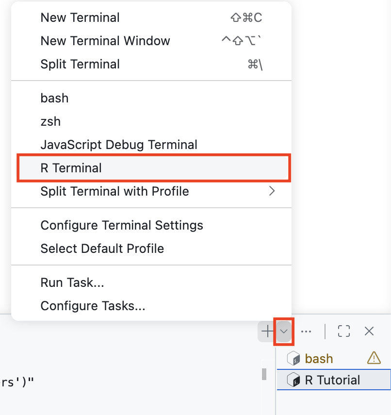
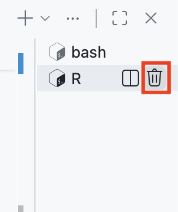
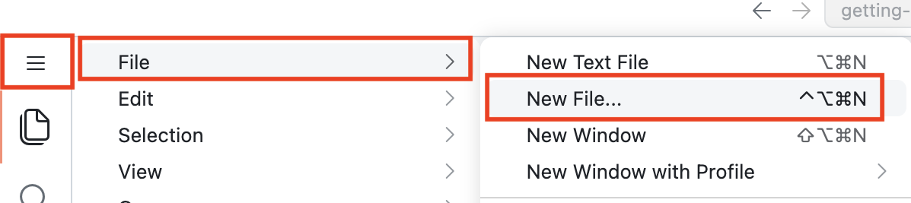
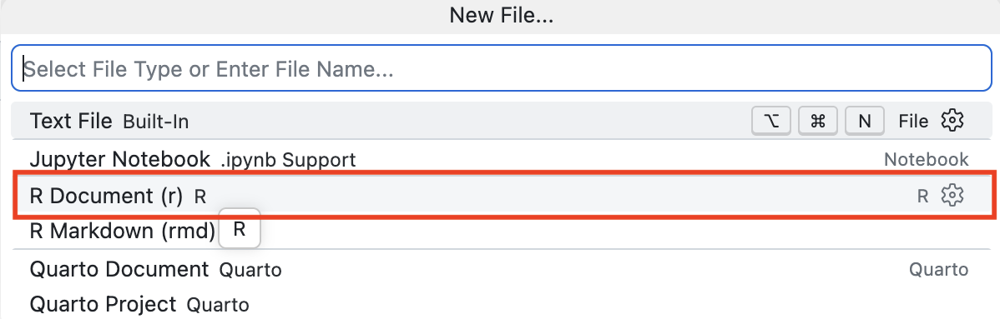
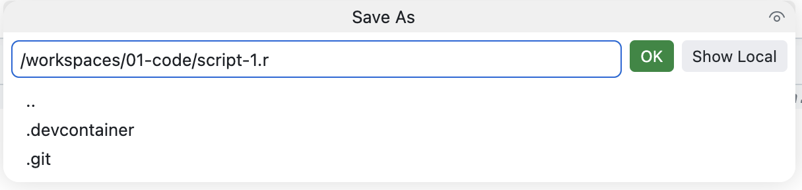
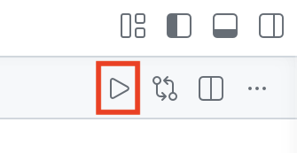

```{r setup, include = FALSE}
library(learnr)
library(tutorial.helpers)
library(tidyverse)
library(knitr)

knitr::opts_chunk$set(echo = FALSE)
knitr::opts_chunk$set(out.width = '90%')
options(tutorial.exercise.timelimit = 60,
        tutorial.storage = "local")
```

```{r info-section, child = system.file("child_documents/info_section.Rmd", package = "tutorial.helpers")}
```

<!-- DK: There are no projects. Really there are just folders (or directories) and you already get a directory for free when you start in GitHub! And also here. How did the student start this tutorial? By creating (with a template) a repo named after the tutorial. Is that well-defined? Small caps? hyphens in place of spaces. So, they should be in a repo called `01-code`. Summary: Just save script-1.R and friends in the folder in which you are in, which is 01-code, which is a git repo, but we have not learned how to use git yet, which is OK.  

AR: shared repo is now codespace-starter - should students create a subdirectory for each tutorial's files?

-->

## Introduction
###

This tutorial teaches you how to use [**Codespaces**](https://github.com/features/codespaces) with [**R**](https://www.r-project.org/about.html) scripts. It assumes two things:

 * You have completed the "Getting Started" tutorial from the [**tutorial.helpers**](https://ppbds.github.io/tutorial.helpers/) package.

 * You have some knowledge of R code, perhaps at the level of the "Introduction to R" tutorial from the [**tutorial.helpers**](https://ppbds.github.io/tutorial.helpers/) package.

This tutorial includes some information from [*R for Data Science (2e)*](https://r4ds.hadley.nz/) by Hadley Wickham, Mine Çetinkaya-Rundel, and Garrett Grolemund.

###

After starting the tutorial, your R Terminal is "busy" running the tutorial.

You will want to run R commands while completing the tutorial. You can do this in a second R Terminal. Click the small down arrow in the top right of the Terminal panel, next to the + button. From the drop-down menu, select "R Terminal."

```{r}

```

Now, you have a fresh R Terminal where you can run commands. You can switch between terminals by clicking the tab names in the Terminal panel, such as "bash" or "R Tutorial," to bring a different terminal into view.

## Checking your setup
###

Again, you should have completed the "Getting Started" tutorial from the [**tutorial.helpers**](https://ppbds.github.io/tutorial.helpers/) package. If not, this section may be difficult.

### Exercise 1

At the R Terminal, type `show_file()`. CP/CR.

```{r checking-your-setup-1}
question_text(NULL,
	answer(NULL, correct = TRUE),
	allow_retry = TRUE,
	try_again_button = "Edit Answer",
	incorrect = NULL,
	rows = 3)
```

###

Your answer should look like this:

````
> show_file()
Error in `show_file()`:
! could not find function "show_file"
````

Going forward, we will not include boilerplate like "Your answer should look like this." Instead, you can assume that any quote directly after a question is our answer to the question.

In this case, the error occurs because we have not yet loaded the **tutorial.helpers** package, where `show_file()` is located. If we had specified the package as part of the function call, as with `tutorial.helpers::show_file()`, R would have found the function.

### Exercise 2

Load the **tutorial.helpers** package into your R Terminal using the `library()` function.

Run `search()` in the R Terminal to see the libraries that you have currently loaded.

CP/CR.

```{r checking-your-setup-2}
question_text(NULL,
	answer(NULL, correct = TRUE),
	allow_retry = TRUE,
	try_again_button = "Edit Answer",
	incorrect = NULL,
	rows = 5)
```

###

````
R 4.5.3> library(tutorial.helpers)
R 4.5.3> search()
 [1] ".GlobalEnv"               "package:tutorial.helpers" "tools:vscode"             "package:stats"            "package:graphics"
 [6] "package:grDevices"        "package:utils"            "package:datasets"         "package:methods"          "Autoloads"
[11] "package:base"
R 4.5.3>
````

The string "package:tutorial.helpers" should be in the output. Don't worry if your answer does not match our answer exactly, either in this question or in any other question.

### Exercise 3

At the R Terminal, run:

````
show_file(file.path(R.home(), "COPYING"), end = 7)
````

```{r checking-your-setup-3}
question_text(NULL,
	answer(NULL, correct = TRUE),
	allow_retry = TRUE,
	try_again_button = "Edit Answer",
	incorrect = NULL,
	rows = 8)
```

###

````
R 4.5.3> show_file(file.path(R.home(), "COPYING"), end = 7)
                    GNU GENERAL PUBLIC LICENSE
                       Version 2, June 1991

 Copyright (C) 1989, 1991 Free Software Foundation, Inc.
                       51 Franklin St, Fifth Floor, Boston, MA  02110-1301  USA
 Everyone is permitted to copy and distribute verbatim copies
 of this license document, but changing it is not allowed.
R 4.5.3>
````

###

This command would have failed if we had not loaded the **tutorial.helpers** package already.

### Exercise 4

To restart R, close the current R Terminal by pressing the trash icon in the menu sidebar. Then, open a new R Terminal.

```{r}

```

CP/CR the top of the restarted R Terminal.

```{r checking-your-setup-4}
question_text(NULL,
	answer(NULL, correct = TRUE),
	allow_retry = TRUE,
	try_again_button = "Edit Answer",
	incorrect = NULL,
	rows = 3)
```

###

````
# arf console v0.3.1
# Edit mode: emacs
# R 4.5.3 is ready.
# Type :cmds for meta commands list, Ctrl+D to exit.
R 4.5.3>
````

As always, it is not important that your answer looks *exactly* like our answer.

### Exercise 5

Let's run this command again:

````
show_file(file.path(R.home(), "COPYING"), end = 7)
````

CP/CR.


```{r checking-your-setup-5}
question_text(NULL,
	answer(NULL, correct = TRUE),
	allow_retry = TRUE,
	try_again_button = "Edit Answer",
	incorrect = NULL,
	rows = 3)
```

###

````
R 4.5.3> show_file(file.path(R.home(), "COPYING"), end = 7)
Error in show_file(file.path(R.home(), "COPYING"), end = 7) :
  could not find function "show_file"
✗ R 4.5.3>
````

It failed, even though it had just worked before. The reason is that, whenever you restart R, you get a "clean slate," with nothing but the default packages loaded.

### Exercise 6

In the R Terminal, run `library(tutorial.helpers)` again. CP/CR.

```{r checking-your-setup-6}
question_text(NULL,
	answer(NULL, correct = TRUE),
	allow_retry = TRUE,
	try_again_button = "Edit Answer",
	incorrect = NULL,
	rows = 3)
```

###

````
R 4.5.3> library(tutorial.helpers)
R 4.5.3>
````

Loading some packages prints a bunch of messages to the R Terminal. But most packages, like **tutorial.helpers**, print nothing.

### Exercise 7

Load the **tidyverse** package into your R Terminal using the `library()` function.

CP/CR.

```{r checking-your-setup-7}
question_text(NULL,
    answer(NULL, correct = TRUE),
    allow_retry = TRUE,
    try_again_button = "Edit Answer",
    incorrect = NULL,
    rows = 12)
```

###

````
R 4.5.3> library(tidyverse)
── Attaching core tidyverse packages ───────────────────────────────────────────────────────────────────────────────────────────────────────── tidyverse 2.0.0 ──
✔ dplyr     1.2.0     ✔ readr     2.2.0
✔ forcats   1.0.1     ✔ stringr   1.6.0
✔ ggplot2   4.0.2     ✔ tibble    3.3.1
✔ lubridate 1.9.5     ✔ tidyr     1.3.2
✔ purrr     1.2.1
── Conflicts ─────────────────────────────────────────────────────────────────────────────────────────────────────────────────────────── tidyverse_conflicts() ──
✖ dplyr::filter() masks stats::filter()
✖ dplyr::lag()    masks stats::lag()
ℹ Use the conflicted package (<http://conflicted.r-lib.org/>) to force all conflicts to become errors
R 4.5.3>
````

The **tidyverse** package is warning us about various conflicts. Don't worry about those conflicts for now.

## Script 1
###

So far, we have only worked in the R Terminal, but it is difficult to type more than a few lines of code into the R Terminal at once. One solution is to use [R scripts](https://r4ds.hadley.nz/workflow-scripts.html#scripts), files that contain a permanent copy of our code.

### Exercise 1

Create a new file by clicking the Activity Bar icon with three horizontal bars in the top left of the VS Code window. This opens the Application Menu. Then, select `File -> New File ...`.

```{r}

```

This opens a drop-down menu from which you select `R Document`.

```{r}

```

In VS Code running in Codespaces, the Application Menu is a drop-down menu with options like `File`, `Edit`, and `View`. Unlike a regular app installed on your computer, which has a built-in menu bar, Codespaces puts these options in a drop-down menu because it runs in a web browser.

###

Type `5 + 5` into your R script file. Save the file. Name it `script-1.r`.

```{r}

```

###

The default directory that VS Code suggests for saving a file is not necessarily where you should save it. Be intentional. In this tutorial, we save all files at the top level of the project, in the `codespace-starter` directory.

###

In the R Terminal, run:

````
tutorial.helpers::show_file("script-1.R")
````

CP/CR.

```{r script-1-1}
question_text(NULL,
	answer(NULL, correct = TRUE),
	allow_retry = TRUE,
	try_again_button = "Edit Answer",
	incorrect = NULL,
	rows = 3)
```

###

You might have gotten this warning:

````
Warning message:
In readLines("script-1.R") : incomplete final line found on 'script-1.R'
````

This means that your file needs a blank line at the end. As a rule of thumb, it is always a good idea to have the last line of any text file be blank.

R scripts are permanent copies of your code. You can save them and also work with them interactively.

### Exercise 2

Note the "Source" button, which is in the top-right corner of the Editor.

```{r}

```

If you hover your cursor over it, you will see "Run Source." Press the Source button. (We will sometimes shorten the instruction "press the Source button" to just "source" the script.)

Note what happens in the R Terminal. CP/CR.


```{r script-1-2}
question_text(NULL,
    answer(NULL, correct = TRUE),
    allow_retry = TRUE,
    try_again_button = "Edit Answer",
    incorrect = NULL,
    rows = 2)
```

###

Your answer should look like this:

````
R 4.5.3> source("/workspaces/codespace-starter/script-1.r", encoding = "UTF-8")
````

###

Whenever you run an R script file by pressing the "Source" button, VS Code will send all the code in the file to the R Terminal.


### Exercise 3

There are often keyboard shortcuts that perform the same task as clicking a button. Placing your cursor inside the R script window and using the keyboard shortcut `(Cmd/Ctrl) + Shift + (Return/Enter)` sources the file, as above, and adds the option `echo = TRUE`.

Note that `Return` is the name of a Mac key and `Enter` is the name of the corresponding Windows key, just like `Cmd` ("Command") is a Mac key and `Ctrl` ("Control") is the equivalent Windows key. In other words, on the Mac, we press `Cmd + Shift + Return`, while on Windows we press `Ctrl + Shift + Enter`. However, typing `Return/Enter` when writing these tutorials is annoying, so, going forward, we will just use `Enter`. Mac users are expected to remember that this means the `Return` key.

Try it now. CP/CR.

```{r script-1-3}
question_text(NULL,
    answer(NULL, correct = TRUE),
    allow_retry = TRUE,
    try_again_button = "Edit Answer",
    incorrect = NULL,
    rows = 2)
```

###

```
R 4.5.3> source("/workspaces/codespace-starter/script-1.r", encoding = "UTF-8", echo = TRUE)

> 5 + 5
[1] 10
R 4.5.3>
```

The file is sourced, as before. This time, each line in the file is "echoed," meaning we see both the code, `5 + 5` in this case, and the return value, if any, which is `10`.

Using keyboard shortcuts is quicker and more professional than clicking buttons.

### Exercise 4

In your R script, type `6 * 3` in the line after `5 + 5`. Save the file with `Cmd/Ctrl + S`.

Source this file with echo. CP/CR.

```{r script-1-4}
question_text(NULL,
    answer(NULL, correct = TRUE),
    allow_retry = TRUE,
    try_again_button = "Edit Answer",
    incorrect = NULL,
    rows = 2)
```

###

The answer is what you might expect:

````
R 4.5.3> source("/workspaces/codespace-starter/script-1.r", encoding = "UTF-8", echo = TRUE)

> 5 + 5
[1] 10

> 6 * 3
[1] 18
````

###

Each line is *echoed*. Each line is *executed*. The results of each line, if there are any, are printed.

The output you see is the same as what would happen if you copied each line to the R Terminal and hit `Enter` after each one.

### Exercise 5

Instead of sourcing the entire file, we can execute (or "run") a single line. In `script-1.R`, place your cursor on the same line as `6 * 3` and press `Cmd/Ctrl + Enter`. CP/CR.

```{r script-1-5}
question_text(NULL,
    answer(NULL, correct = TRUE),
    allow_retry = TRUE,
    try_again_button = "Edit Answer",
    incorrect = NULL,
    rows = 2)
```

###

You should get:

````
R 4.5.3> 6 * 3
[1] 18
R 4.5.3>
````

###

Instead of both lines in the script executing, only the second line does. This process has nothing to do with the entire script. **Run is not the same thing as Source.** With Run, you are just copying and pasting some of the lines from the script to the R Terminal at a time. With Source, you are copying and pasting *all* lines from the script.

### Exercise 6

`Cmd/Ctrl + Enter` handles both single-line and multi-line commands. In your R script, highlight both lines and press `Cmd/Ctrl + Enter`. CP/CR.

```{r script-1-6}
question_text(NULL,
    answer(NULL, correct = TRUE),
    allow_retry = TRUE,
    try_again_button = "Edit Answer",
    incorrect = NULL,
    rows = 2)
```

###

````
R 4.5.3> 5 + 5
+  6 * 3
[1] 10
[1] 18
R 4.5.3>
````

`Cmd/Ctrl + Enter` is "smart" in two ways. First, if you highlight more than one line of code, it will execute all the code in that area. Second, even if nothing is highlighted, if the line with the cursor is part of a block of code that extends over multiple lines --- like creating a plot --- it will execute all the code in that block.

### Exercise 7

Go back to the first line in your R script. Change `5 + 5` to `x <- 5 + 5`, thereby creating an object named `x` with a value of 10. Save the file. Click the "Source R File with Echo" option. CP/CR.

```{r script-1-7}
question_text(NULL,
	answer(NULL, correct = TRUE),
	allow_retry = TRUE,
	try_again_button = "Edit Answer",
	incorrect = NULL,
	rows = 3)
```

###

Your answer should look like this:

````
> source("/workspaces/codespace-starter/script-1.R", echo=TRUE)

> x <- 5 + 5

> 6 * 3
[1] 18
>
````

###

Note how the `x <- 5 + 5` is executed (and echoed) but nothing is printed. The assignment operator, `<-`, does not generate a return value.

<!-- Being a little sloppy in using the (correct?) term "return value" here but not above. -->

### Exercise 8

In the R Terminal, run `ls()`. CP/CR.

```{r script-1-8}
question_text(NULL,
    answer(NULL, correct = TRUE),
    allow_retry = TRUE,
    try_again_button = "Edit Answer",
    incorrect = NULL,
    rows = 2)
```

###

````
R 4.5.3> ls()
[1] "env"  "prev" "x"
R 4.5.3>
````

###

`ls()` returns a list of objects present in your environment.


In this case, the object `x`, which has a value of 10, exists in your workspace. You can confirm this by typing `x` at the R Terminal and pressing `Enter`.

````
> x
[1] 10
>
````

## Script 2
###

Let's create a plot like this one:

```{r diamond-hist}
hist_p <- ggplot(data = diamonds,
                 mapping = aes(x = carat)) +
  geom_histogram(bins = 100,
                 color = "white") +
  scale_y_continuous(labels = scales::comma_format()) +
  labs(title = "Histogram of Carat (Weight) among 50,000 Diamonds",
       subtitle = "Carats just at or above meaningful numbers are very common",
       x = "Carat",
       y = "Number",
       caption = "diamonds dataset from ggplot2 package")

hist_p
```

### Exercise 1

Click `File -> New File ... -> R File`. At the top of the Editor, the file should be called *`Untitled-1`* (or something similar).

###

Use the shortcut `Cmd/Ctrl + S` to save the script. Let's call this file `script-2.R`. The `.R` suffix is not always added automatically. Make sure it is there.

In the R Terminal, run `list.files()`. CP/CR.

```{r script-2-1}
question_text(NULL,
    answer(NULL, correct = TRUE),
    allow_retry = TRUE,
    try_again_button = "Edit Answer",
    incorrect = NULL,
    rows = 2)
```

###

````
> list.files()
[1] "script-1.R" "script-2.R"
````

Save your scripts, with informative names, in the folder. Edit them and run them line by line or in their entirety. Restart R frequently to make sure you have captured everything in your scripts.


### Exercise 2

Restart your R session by deleting your current R Terminal and opening a new one.

From the R Terminal, run `list.files()`. CP/CR.

```{r script-2-2}
question_text(NULL,
	answer(NULL, correct = TRUE),
	allow_retry = TRUE,
	try_again_button = "Edit Answer",
	incorrect = NULL,
	rows = 3)
```

###

```
R 4.5.0 exited (preparing for restart)
R 4.5.0 restarted.
> list.files()
[1] "script-1.R" "script-2.R"
>
```

The two files we had from before --- `script-1.R` and `script-2.R` --- still exist. Our work, if we have saved it, is preserved even when R or the Codespace restarts.

### Exercise 3

From the R Terminal, run `ls()`. CP/CR.

```{r script-2-3}
question_text(NULL,
	answer(NULL, correct = TRUE),
	allow_retry = TRUE,
	try_again_button = "Edit Answer",
	incorrect = NULL,
	rows = 3)
```

###

````
> ls()
character(0)
>
````

`x` is gone! The environment --- the place in the computer where R creates and uses objects --- is cleaned, by default, each time R restarts. This is a good thing. For our work to be "reproducible," we want to be able to start from nothing except our code and raw data.

### Exercise 4

At the top of `script-2.R`, type

````
library(tidyverse)
````

You will see, in the top bar of the Editor, that the file name `script-2.R` has a black dot next to it. This indicates that there are unsaved changes in the file.

###

Run the entire file with `Cmd/Ctrl + Enter`. Note how much material --- the "Attaching core tidyverse packages" and so on --- is produced in the R Terminal.

###

Run `search()` in the R Terminal. CP/CR.

```{r script-2-4}
question_text(NULL,
    answer(NULL, correct = TRUE),
    allow_retry = TRUE,
    try_again_button = "Edit Answer",
    incorrect = NULL,
    rows = 2)
```

###

This function returns a list of loaded packages. This should include the string `package:tidyverse`.

### Exercise 5

Skip a line and add the following comment to the file:

````
# This is an example of a code comment within an R script.
````

Save the file.

In the R Terminal, run:

````
tutorial.helpers::show_file("script-2.R")
````

CP/CR.


```{r script-2-5}
question_text(NULL,
    answer(NULL, correct = TRUE),
    allow_retry = TRUE,
    try_again_button = "Edit Answer",
    incorrect = NULL,
    rows = 2)
```

###

Did you remember to have a blank line at the end of the file? If not, you got a warning. Always have a blank line at the end of any text file.

###

Comments begin with a hash (also known as a "pound sign"): `#`. R will ignore everything on the line to the right of the hash when running the code.

Comments are an extremely useful tool when writing code. If they are placed well, comments make it much easier to *debug* (find and fix mistakes) when something goes wrong.

There are a few guidelines for writing comments:

  - Comments should be used sparingly.
  - Comments are unnecessary and in fact distracting if they state the obvious.
  - Comments that contradict the code are worse than no comments. Always make a priority of keeping the comments up-to-date when the code changes!

Typically, when reading code, you should be able to answer three questions fairly easily for every line:

  - **What** is this code doing,
  - **How** is it doing it, and
  - **Why** is it being done.

The **what** and **how** can be deduced from the code itself. The **why**, though, is a bit trickier. Use comments to make it easier to tell **why** something is being done.

````
# This is an example of a poor comment:
...
x <- x + 1    # Increment x
...

# This is an example of a good comment:
...
x <- x + 1    # Account for borders
...
````

### Exercise 6

Change the code comment in `script-2.R` from "This is an example of a code comment within an R script." to a one-sentence description of one of your recent meals. Save the file.

In the R Terminal, run:

````
tutorial.helpers::show_file("script-2.R")
````

CP/CR.


```{r script-2-6}
question_text(NULL,
    answer(NULL, correct = TRUE),
    allow_retry = TRUE,
    try_again_button = "Edit Answer",
    incorrect = NULL,
    rows = 2)
```

###

Get in the habit of adding comments.

Figuring out *why* something was done is much more difficult than understanding *how* it was done. For example, `geom_smooth()` has an argument called `span`, which controls the smoothness of the curve. Larger values yield a smoother curve. Suppose you decide to change the value of `span` from its default of 0.75 to 0.9. It is easy for a future reader to understand what is happening, but unless you note your thinking in a comment, no one will understand *why* you changed from the default.


### Exercise 7

<!-- At this stage, we could just copy/paste in all the code. Or even ask AI for the code? We are no longer in the business of asking students to add one line of code at a time. -->

Skip a line after your comment. Call `ggplot()`, setting `data` to `diamonds` and mapping `x` to `carat` within `aes()`.

Run the entire file again. Note the sloppiness of the word "run" in this instruction. It is not always clear what "run" means. In general, "run" means to execute all the code in the file, most commonly by using `Cmd/Ctrl + Enter` line by line, using `Cmd/Ctrl + Enter` for the whole file at once, or pressing the "Source" button.

###

This should generate a blank plot in the Plots tab at the bottom of the Secondary Side Bar.

###

In the R Terminal, run:

````
tutorial.helpers::show_file("script-2.R")
````

CP/CR.


```{r script-2-7}
question_text(NULL,
    answer(NULL, correct = TRUE),
    allow_retry = TRUE,
    try_again_button = "Edit Answer",
    incorrect = NULL,
    rows = 2)
```

###

`ggplot()` will generate a blank plot, at least until a `geom` layer is added.


### Exercise 8

Add a layer with `geom_histogram()`. Change the border color in our graph by setting `color` to `"white"` within `geom_histogram()`, and change the number of columns in our plot by setting the `bins` argument to `100`. Remember that, to connect the `ggplot()` call to `geom_histogram()`, we need a `+`.

Run the file. Again, to "run" a script generally means to execute it, meaning to send it to the R process. We have learned two easy ways to execute an entire file: pressing the "Source" button or pressing the associated keyboard shortcut, `Cmd/Ctrl + Enter`. In interactive work, however, the most common approach is to use `Cmd/Ctrl + Enter` and go through the file line by line, while also occasionally restarting the R Terminal.

###

This should generate bars on your plot. Did you remember to place a `+` after the `ggplot()` call and before the `geom_histogram()` layer?

###

In the R Terminal, run:

````
tutorial.helpers::show_file("script-2.R")
````

CP/CR.


```{r script-2-8}
question_text(NULL,
    answer(NULL, correct = TRUE),
    allow_retry = TRUE,
    try_again_button = "Edit Answer",
    incorrect = NULL,
    rows = 5)
```

###

The `color` argument used here modifies the *border* color of our columns. To change the *fill* color, use the `fill` argument.

### Exercise 9

It would be nice if the numbers on the y-axis were formatted better, for example with commas. The easiest way to do that is to add this line to the script.

````
scale_y_continuous(labels = scales::comma_format())
````

Do so. Run the file. You do not need to save the file first. If you execute a file using either the "Source" button or `Ctrl + Shift + Enter`, VS Code will save the file automatically.

Don't forget that you will need a `+` after the call to `geom_histogram()`.

In the R Terminal, run:

````
tutorial.helpers::show_file("script-2.R")
````

CP/CR.

```{r script-2-9}
question_text(NULL,
	answer(NULL, correct = TRUE),
	allow_retry = TRUE,
	try_again_button = "Edit Answer",
	incorrect = NULL,
	rows = 3)
```

###

If the histogram in the plot window has not been updated, make sure the completed `ggplot()` call is the last expression executed.

We use `scale_y_continuous()` (and `scale_x_continuous()`) to modify the labels and breaks in numeric axes. The **scales** package provides a variety of useful formatting tools, including `comma_format()`, `dollar_format()`, and others.


### Exercise 10

Now let's make our graph look a little nicer by adding a `labs()` layer with an appropriate title, subtitle, and axis labels.

As a reminder, this is what our graph should look like:

```{r}
hist_p
```

Run your R script to see your completed plot. Again, note the wording here! In casual language, we use the word "run" to mean "Tell the computer to execute the commands in this file." We do not necessarily care how that is achieved.

###

In the R Terminal, run:

````
tutorial.helpers::show_file("script-2.R")
````

CP/CR.

```{r script-2-10}
question_text(NULL,
    answer(NULL, correct = TRUE),
    allow_retry = TRUE,
    try_again_button = "Edit Answer",
    incorrect = NULL,
    rows = 8)
```

###

Good coding style is like correct punctuation: you can manage without it, but it sure makes things easier to read. Even as a very new programmer, it is a good idea to work on your code style. Using a consistent style makes it easier for others, including future-you, to read your work. It is particularly important if you need to get help from someone else.

Note the nice formatting. After the `ggplot()` call, the next two commands --- `geom_histogram()` and `labs()` --- are both indented the same amount. Similarly, arguments to a given function --- like `bins` and `color` --- are lined up with each other.


### Exercise 11

Now we have the code that creates a plot in `script-2.R`. How do we use this plot for other things? Right now, we have to run `script-2.R` every time we want to see the plot, which is inconvenient.

###

We can use the `ggsave()` function. Type `?ggsave` in the R Terminal. This will open the help page for `ggsave()`. Copy and paste the description from the help page into the space below.

```{r script-2-11}
question_text(NULL,
    answer(NULL, correct = TRUE),
    allow_retry = TRUE,
    try_again_button = "Edit Answer",
    incorrect = NULL,
    rows = 5)
```

`ggsave()` is used to save a plot as an individual file that is separate from the code that created the plot. In this case, we will use the PNG format.

### Exercise 12

We want to save our entire graph to an object. We can do this by assigning our plot to a variable. Call this variable `hist_p`.

Now, using the `ggsave()` function, we can save our plot as a PNG file. In `ggsave()`, set `plot` to `hist_p` and `file` to `"diamonds.png"`.

Your entire file should look like:

````
library(tidyverse)

# Had an OK filet mignon at Cheesecake Factory.
hist_p <- ggplot(data = diamonds,
                 mapping = aes(x = carat)) +
  geom_histogram(bins = 100,
                 color = "white") +
  scale_y_continuous(labels = scales::comma_format()) +
  labs(title = "Histogram of Carat (Weight) among 50,000 Diamonds",
       subtitle = "Carats just at or above meaningful numbers are very common",
       x = "Carat",
       y = "Count",
       caption = "diamonds dataset from ggplot2 package")

ggsave(plot = hist_p, file = "diamonds.png")
````

Run your code. CP/CR.

```{r script-2-12}
question_text(NULL,
	answer(NULL, correct = TRUE),
	allow_retry = TRUE,
	try_again_button = "Edit Answer",
	incorrect = NULL,
	rows = 3)
```

###

Your answer should look something like:

```
> source("/workspaces/codespace-starter/script-2.R", echo = TRUE)

> library(tidyverse)

> # Had an OK filet mignon at Cheesecake Factory.
>
> hist_p <- ggplot(data = diamonds,
+                  mapping = aes(x = carat)) +
+   geom_histo .... [TRUNCATED]

> ggsave(plot = hist_p, file = "diamonds.png")
Saving 3.33 x 3.33 in image
>
```

You are witnessing a conversation between your script and R. Your script tells R to do this, then do that, and then do this other thing. R does those things, occasionally providing a response or update.


### Exercise 13

In the R Terminal, run `list.files()`. CP/CR.

```{r script-2-13}
question_text(NULL,
    answer(NULL, correct = TRUE),
    allow_retry = TRUE,
    try_again_button = "Edit Answer",
    incorrect = NULL,
    rows = 2)
```

###

````
> list.files()
[1] "diamonds.png" "script-1.R"   "script-2.R"
>
````

###

You should see the `diamonds.png` file, which contains your plot. Click the Explorer button on the Activity Bar on the left to see all the files in the `codespace-starter` directory. Click `diamonds.png` to open your plot in the Editor.

If the title text flows out of the image, you might want to modify the `scale` argument in `ggsave()` to find a better image size. `scale` is set to 1 by default.

## Script 3
###

### Exercise 1

Create a script that we will use to make our plot.

In the Application Menu at the top left of the screen, select `File -> New File ...`, then select `R File` from the drop-down menu. Type `5 + 5` and a newline into the file, then press `Cmd/Ctrl + S` to save it. Save it as `script-3.r`.

In the console, run `list.files()`. CP/CR.

```{r script-3-1}
question_text(NULL,
	answer(NULL, correct = TRUE),
	allow_retry = TRUE,
	try_again_button = "Edit Answer",
	incorrect = NULL,
	rows = 3)
```

###

````
> list.files()
[1] "script-1.r", "script-2.r", "script-3.r"
>
````

### Exercise 2

Go back to editing `script-3.r`. Remove `5 + 5`. Open the chat sidebar on the right and ask the AI to make a nice-looking plot using data from the **tidyverse** package. Tell it to write the code in `script-3.r`.

Run the script interactively, line by line, using `Cmd/Ctrl + Enter`. If there are problems, ask the AI for help. It will probably take several iterations to get something you like.

Advice you should feel free to give to the AI:

* Begin the script with `library(tidyverse)` at the top.

* The `title` should mention the key variables. Those are, after all, the subjects of the plot.

* The `subtitle` should provide the key takeaway, the one sentence that you want viewers to remember.

* The `caption` should mention the data source.

* Include an empty line at the end of the file.

When you have something that looks nice, save it in `script-3.R`.

###

Back in the R Terminal, run `tutorial.helpers::show_file('script-3.r')`. CP/CR.

```{r script-3-2}
question_text(NULL,
	answer(NULL, correct = TRUE),
	allow_retry = TRUE,
	try_again_button = "Edit Answer",
	incorrect = NULL,
	rows = 3)
```

###

In many ways, the `subtitle` is the most important part of any graphic. People are busy. You cannot expect them to study your plot closely. Help them by highlighting the one key lesson, the one fact that you hope people will remember. Spell it out clearly.


## Summary
###


This tutorial taught you how to use [**Codespaces**](https://github.com/features/codespaces) with [**R**](https://www.r-project.org/about.html) scripts. It assumed that you have some knowledge of R code, perhaps at the level of the "Introduction" tutorial from the [**r4ds.tutorials**](https://ppbds.github.io/r4ds.tutorials/) package. It included some information from [*R for Data Science (2e)*](https://r4ds.hadley.nz/) by Hadley Wickham, Mine Çetinkaya-Rundel, and Garrett Grolemund.


```{r download-answers, child = system.file("child_documents/download_answers.Rmd", package = "tutorial.helpers")}
```
