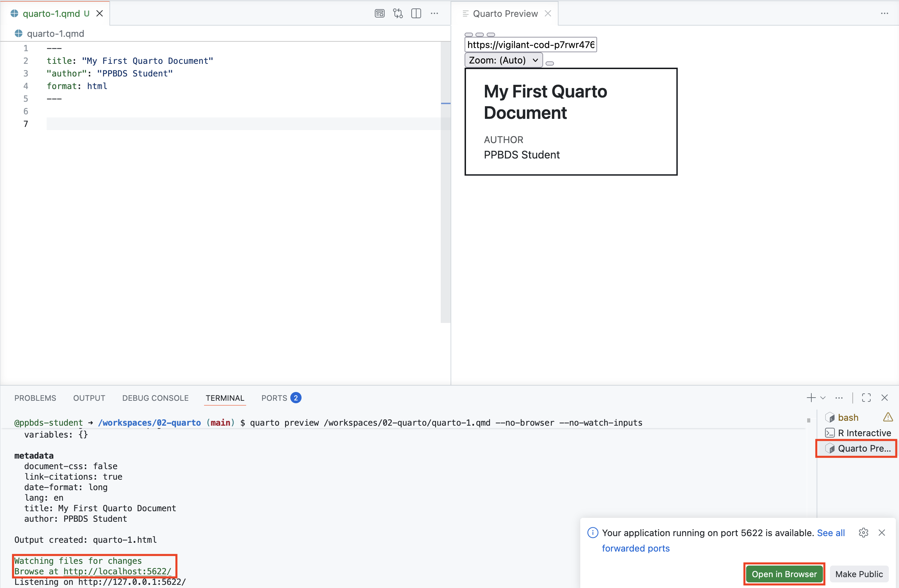
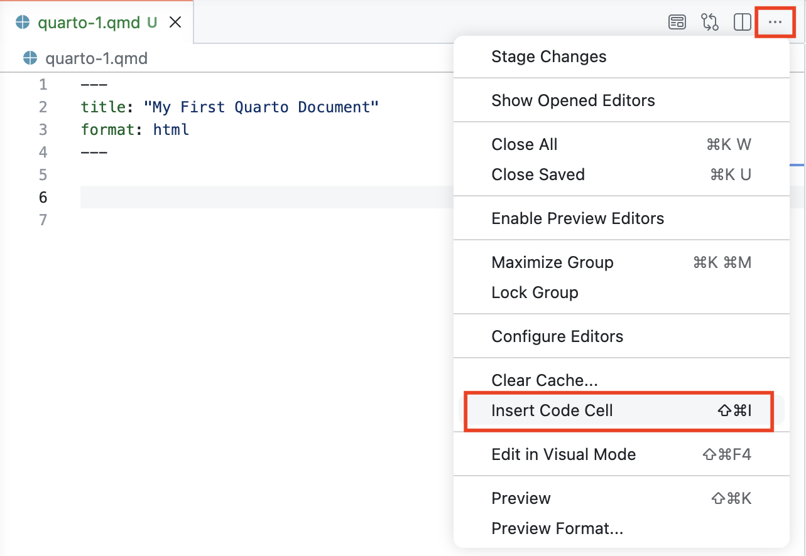
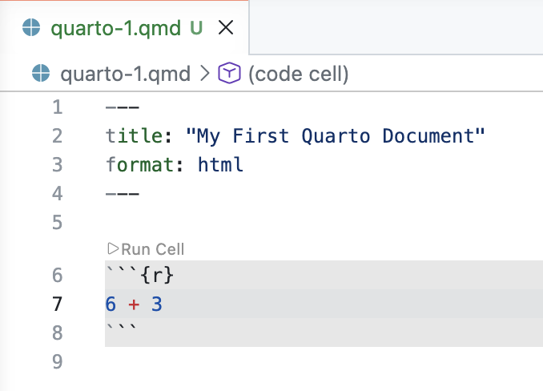
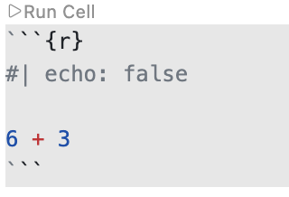

```{r setup, include = FALSE}
library(learnr)
library(tutorial.helpers)
library(tidyverse)
library(knitr)
knitr::opts_chunk$set(echo = FALSE)
knitr::opts_chunk$set(out.width = '90%')
options(tutorial.exercise.timelimit = 60, 
        tutorial.storage = "local")
```


```{r info-section, child = system.file("child_documents/info_section.Rmd", package = "tutorial.helpers")}
```

## Introduction
### 

This tutorial covers how to create Quarto documents using [GitHub Codespaces](https://github.com/features/codespaces). Some material is from [*R for Data Science (2e)*](https://r4ds.hadley.nz/) by Hadley Wickham, Mine Çetinkaya-Rundel, and Garrett Grolemund.

This tutorial assumes that you are working inside a GitHub Codespace running VS Code in the browser. For help with setting this up, see the [Getting Started](https://ppbds.github.io/primer/getting-started.html) chapter.

## Quarto 1
### 

Quarto is a file format for making dynamic documents with R and other languages, like Python. To learn more about Quarto and how to use it, check out the [official webpage](https://quarto.org/). Quarto is the successor technology to [R Markdown](https://rmarkdown.rstudio.com/). This section introduces Quarto documents.


### Exercise 1

Click `File -> New File ...` in the Application Menu (the three-horizontal-line icon) at the top left of your screen. Select `Quarto Document` from the drop-down menu.

The top of the new document is called the YAML header. It should look like:

```
---
title: "Untitled"
format: html
---
```

Change the title to “My First Quarto Document”.

Run `list.files()` in the R Terminal. CP/CR.

```{r quarto-1-1}
question_text(NULL,
    answer(NULL, correct = TRUE),
    allow_retry = TRUE,
    try_again_button = "Edit Answer",
    incorrect = NULL,
    rows = 2)
```

### 

````
> list.files()
character(0)
>
````

Since we have not saved the file yet, it does not appear in this listing.

Quarto is a command line interface tool, not an R package. Therefore, its commands are largely run in a bash terminal. As you work through this tutorial, and use Quarto in the future, you should refer to the [Quarto documentation](https://quarto.org/). Of course, in the modern world, we can also ask an AI when we have a problem.

### Exercise 2

Save the Quarto document with `File -> Save`. You can also use the shortcut `Cmd/Ctrl + S`.

Name the file `quarto-1.qmd`.

Now that the document is saved, run `list.files()`. CP/CR.

```{r quarto-1-2}
question_text(NULL,
    answer(NULL, correct = TRUE),
    allow_retry = TRUE,
    try_again_button = "Edit Answer",
    incorrect = NULL,
    rows = 2)
```

### 

A Quarto file uses `qmd` as its extension, where those initials stand for **Q**uarto **M**arkdown **D**ocument. When referring to a Quarto document, we will often use *QMD* to describe it, in the same way that we use *PNG* to refer to some image files.

### Exercise 3

In the R Terminal, run:

````
tutorial.helpers::show_file("quarto-1.qmd", end = 4)
````

CP/CR.

```{r quarto-1-3}
question_text(NULL,
	answer(NULL, correct = TRUE),
	allow_retry = TRUE,
	try_again_button = "Edit Answer",
	incorrect = NULL,
	rows = 6)
```

### 

The argument `end = 4` to `show_file()` causes just the first four lines of `quarto-1.qmd` to be printed.

Again, there is no necessary connection between the **title** of a Quarto document --- “My First Quarto Document” in this case --- and the **name** of the file, which here is `quarto-1.qmd`.

### Exercise 4

Here is an example of a Quarto file:


````
---
title: "My First Quarto Document"
author: "Your Name"
format: html
---

## Quarto

Quarto enables you to weave together content and executable code into a finished document. To learn more about Quarto, see <https://quarto.org>.

## Running Code

When you click the **Render** button, a document will be generated that includes both content and the output of embedded code. You can embed code like this:

<pre><code>```{r}
1 + 1
```</code></pre>

You can add options to executable code like this:

<pre><code>```{r}
#| echo: false
2 * 2
```</code></pre>

The `echo: false` option disables the printing of code (only output is displayed).
</code></pre>
````

### 

As you can see, a lot of the text is regular plain text, not code. However, there are code chunks (denoted by triple backticks on both ends, \`\`\`[code here]\`\`\`) that allow us to execute code when the document is "rendered." To "render" a Quarto document is to transform it into an HTML, PDF, DOCX, or other output file format while also running any embedded code. Here's an example of an R code chunk:

<pre><code>```{r}
1+1
```</code></pre>

Quarto documents use Markdown, an easy-to-write plain text format that can contain chunks of embedded code. These code chunks can be written in many languages, including R and Python. Code chunks allow you to use a programming language to create plots and other graphics.

### 

The [YAML header](https://bookdown.org/yihui/rmarkdown-cookbook/rmarkdown-anatomy.html) is everything between the dashed lines at the top of the file, including the dashed lines themselves. Copy-and-paste the YAML header from the example file above.

```{r quarto-1-4}
question_text(NULL,
    answer(NULL, correct = TRUE),
    allow_retry = TRUE,
    try_again_button = "Edit Answer",
    incorrect = NULL,
    rows = 4)
```

### 

````
---
title: "My First Quarto Document"
author: "Your Name"
format: html
---
````

The YAML header includes "metadata" about the document itself, things like the title and the author. In this case, `format: html` means that the document will be rendered as an HTML file.

### Exercise 5

<!-- DK: Remove the above call to the shell. Just teach the short cut. Maybe mention, in the knowledge drop, that short cuts call underlying commands.

AR: Done.
-->

To "render" our Quarto document, use the shortcut `Cmd/Ctrl + Shift + K`. Your screen should look something like this:

```{r}

```

This command splits the Editor and opens a new tab titled "Quarto Preview" on the right. This displays the rendered document. It's often better to preview the document in a separate browser window. To do this, either click the green "Open in Browser" button in the bottom right, or `Cmd/Ctrl + click` the green URL in the bottom left. You can close the "Quarto Preview" viewer in the editor and still view the preview in the browser, if you prefer.

###

Professionals don't click buttons. They save time by using keyboard shortcuts!

Under the hood, this shortcut opens a new bash terminal titled "Quarto Preview". There, it executes the `quarto preview` command. You don't need to worry about this now; just use `Cmd/Ctrl + Shift + K` to preview your Quarto documents.

###

Run `list.files()`. CP/CR.

```{r quarto-1-5}
question_text(NULL,
	answer(NULL, correct = TRUE),
	allow_retry = TRUE,
	try_again_button = "Edit Answer",
	incorrect = NULL,
	rows = 3)
```

### 

```
R 4.5.3> list.files()
[1] "quarto-1_files" "quarto-1.html"  "quarto-1.qmd"  
R 4.5.3> 
```

In the Explorer, you should see a new file, `quarto-1.html`. This is the file created by rendering. The Browser/Viewer tab in the Secondary Side Bar should also display the file.

### 

You should also see a new directory: `quarto-1_files`. Anytime you render a Quarto document, you create a directory like this, with the same name as the file, without the extension, plus `_files`. Quarto uses this directory to store intermediate work products associated with the creation of the associated output file.

### Exercise 6

The HTML document created from a QMD file will, by default, show both the code and the results generated by that code. This is the magic of Quarto. We can easily document and reproduce our work.

Add a couple of blank lines to the bottom of `quarto-1.qmd`. Then, add an R code chunk by selecting the `More Actions ...` button --- the three dots in the top-right of the editor. 

```{r}

```

Then, choose `Insert Code Cell`, selecting `r` from the list of options. Within the code cell, add `6 + 3`.

```{r}

```

You can also insert a code cell with the shortcut key: `Cmd/Ctrl + Shift + i`. 

Save the file. Render it again.

In the R Terminal, run:

````
tutorial.helpers::show_file("quarto-1.qmd", pattern = "6")
````

CP/CR.


```{r quarto-1-6}
question_text(NULL,
	answer(NULL, correct = TRUE),
	allow_retry = TRUE,
	try_again_button = "Edit Answer",
	incorrect = NULL,
	rows = 17)
```

### 

This should return a single character vector with `"6 + 3"`, the line that you added to the code cell.

Strictly speaking, you did not need to save the file before rendering it. The `preview` command saves the file automatically. Nevertheless, you should make a habit of saving your work before running it. (If you come across some software that *doesn't* autosave upon running, you'll be running old code and wondering why something still doesn't work when you just fixed it.)

###

If you can no longer see the preview file, you can usually view it by checking the text that was printed in the Terminal when you rendered the QMD. That text will include something like this:

````
Watching files for changes
Browse at http://localhost:3807/
````

Paste that URL into a browser, or `Cmd + click` it, and you will be able to see the HTML. In my case, the URL is `http://localhost:3807/`; yours will be different.

### Exercise 7

Delete the first code cell. Add `This is my first Markdown text.` two lines below the YAML header. Save the file.

In the R Terminal, run:

````
tutorial.helpers::show_file("quarto-1.qmd")
````

CP/CR.

```{r quarto-1-7}
question_text(NULL,
	answer(NULL, correct = TRUE),
	allow_retry = TRUE,
	try_again_button = "Edit Answer",
	incorrect = NULL,
	rows = 3)
```

### 

This should return your entire Quarto document. If you do not have an empty line at the end of your file, you will get a warning message like this:

<span style="color: red;">
Warning message:
In readLines("quarto-1.qmd") :
  incomplete final line found on 'quarto-1.qmd'
</span>

The solution is to add an empty line to the end of the file. This is (almost) always a good idea! Don't be stingy with whitespace.

### Exercise 8

Render the document. It is good to get in the practice of using the shortcut key `Cmd/Ctrl + Shift + K` instead of the "Preview" button. Efficient people use shortcut keys. They don't press buttons.

This will rewrite the current `quarto-1.html` file in both the current directory and the Viewer pane.

###

Strictly speaking, the HTML file is being changed. This is the file that your Viewer pane (or your browser) is looking at. Depending on your computer settings, you might have to "refresh" the Viewer/browser to see your changes.

In the following box, copy all of the text from your rendered Quarto document, from the Viewer/browser. That is, copy and paste from the HTML. Don't worry about formatting.

```{r quarto-1-8}
question_text(NULL,
	answer(NULL, correct = TRUE),
	allow_retry = TRUE,
	try_again_button = "Edit Answer",
	incorrect = NULL,
	rows = 6)
```

### 

Quarto files are designed to be used in three ways:

* For communicating to decision-makers, who want to focus on the conclusions, not the code behind the analysis.

* For collaborating with other data scientists (including future you!), who are interested in both your conclusions and how you reached them (i.e. the code).

* As an environment in which to do data science, like a modern-day lab notebook where you can capture not only what you did, but also what you were thinking.

### Exercise 9

In Quarto documents, you can use [Markdown syntax](https://quarto.org/docs/authoring/markdown-basics.html). You can use this to create **bold** or *italic* text (and even text that's both ***bold and italic***), and headers.

### 

Replace the one sentence already in `quarto-1.qmd` with `## My Header`. Skip a line and add this text. 

````
You can do a lot of cool things in Quarto like **bold** and *italic* text.
````

Render the file again. Does everything look good in the Viewer/browser?

### 

In the R Terminal, run:

````
tutorial.helpers::show_file("quarto-1.qmd")
````

CP/CR.


```{r quarto-1-9}
question_text(NULL,
    answer(NULL, correct = TRUE),
    allow_retry = TRUE,
    try_again_button = "Edit Answer",
    incorrect = NULL,
    rows = 6)
```

### 

You can find a full list of Markdown formatting styles and commands [here](https://www.markdownguide.org/basic-syntax/).

To encourage the use of shortcut keys going forward, we will start using them directly in our instructions to you. So, instead of writing "Render the document," we will write `Cmd/Ctrl + Shift + K`.

Strictly speaking, the underlying command being issued is the "Preview" command, which both renders the QMD once and then also continues to watch for any changes in the QMD, re-rendering as needed.

## Quarto 2
### 

Restart your R session. Open a new R Terminal and close your old one.

Let's create another Quarto document so that we can explore how to include R code within the document.

### Exercise 1

Follow the same procedure as last time to create a new Quarto document. `File -> New File... -> Quarto Document`. Use "My Second Quarto Document" as the title and add your name as the author. Save the document as `quarto-2.qmd`. `Cmd/Ctrl + Shift + K`.

Run `list.files()`. CP/CR.

```{r quarto-2-1}
question_text(NULL,
	answer(NULL, correct = TRUE),
	allow_retry = TRUE,
	try_again_button = "Edit Answer",
	incorrect = NULL,
	rows = 3)
```

### 

The listing should include `quarto-2.qmd`, `quarto-2.html`, and the `quarto-2_files` directory.

### Exercise 2

Add a code cell by using the shortcut key combination: `Cmd/Ctrl + Shift + I`. (In other words, on the Mac, the shortcut key is `Cmd + Shift + i` while on Windows it is `Ctrl + Shift + I`.)

The newly created code cell will be empty.

Save the file.

In the R Terminal, run:

````
tutorial.helpers::show_file("quarto-2.qmd")
````

CP/CR.

```{r quarto-2-2}
question_text(NULL,
    answer(NULL, correct = TRUE),
    allow_retry = TRUE,
    try_again_button = "Edit Answer",
    incorrect = NULL,
    rows = 6)
```

### 

Note the curly braces `{}` at the top of the chunk, with an `r` inside. The `r` indicates that Quarto should use R to run the code.

In this tutorial, we will only include R code within our code chunks. But code chunks can have any programming language in them, from common ones like Python, Java, and C, to esoteric ones like INTERCAL and Whitespace. All you need to do is indicate the language in the curly braces, e.g., `{py}`, `{ruby}`, et cetera.

### Exercise 3

Put `2 * 2` within the code chunk. `Cmd/Ctrl + Shift + K`. Copy and paste the entire rendered document, below. (This allows us to confirm that your file rendered correctly.)

```{r quarto-2-3}
question_text(NULL,
	answer(NULL, correct = TRUE),
	allow_retry = TRUE,
	try_again_button = "Edit Answer",
	incorrect = NULL,
	rows = 8)
```

### 

It is OK if your response does not look exactly like ours. But here is what we got:

````
My Second Quarto Document
2 * 2

[1] 4
````

We see both the code itself and the result of the code. This is an example of a "reproducible" analysis. We can re-render the document anytime we like, thereby confirming our results.

### Exercise 4

You can add options to code chunks. For example, add `#| echo: false` above the `2 * 2` calculation. 

```{r}

```

`Cmd/Ctrl + Shift + K`. Copy/paste the HTML below.

```{r quarto-2-4}
question_text(NULL,
	answer(NULL, correct = TRUE),
	allow_retry = TRUE,
	try_again_button = "Edit Answer",
	incorrect = NULL,
	rows = 6)
```

### 

````
My Second Quarto Document
[1] 4
````

`echo: false` prevents the code, but not the results, from appearing in the finished file. Use this when writing reports aimed at people who don’t want to see the underlying R code, which is the vast majority of people you will ever write for.

### Exercise 5

*Code cells* are also referred to as *code chunks*. (The cell terminology is more common in Python.)

In Quarto, code chunk options are always preceded by `#|`, pronounced "hash-pipe". This is followed by an option/value pair, separated by a colon.

Add another code option for this code chunk: `#| label: calculation`. You can have multiple code chunk options for a single code chunk. The order does not matter, but each belongs on its own line and must be preceded by `#|`. `Cmd/Ctrl + Shift + K`. Copy/paste the HTML below.

```{r quarto-2-5}
question_text(NULL,
	answer(NULL, correct = TRUE),
	allow_retry = TRUE,
	try_again_button = "Edit Answer",
	incorrect = NULL,
	rows = 5)
```

### 

The `label` option has no effect on the output. However, labels are useful for organizing your work. Your chunk labels should be short but evocative and should not contain spaces. We recommend using dashes (`-`) to separate words instead of underscores (`_`) and avoiding other special characters in chunk labels.

### Exercise 6

Delete the current code chunk. Add a new one. In this new code chunk, put `library(tidyverse)`. `Cmd/Ctrl + Shift + K`. A message about "Attaching core tidyverse packages" should appear in the HTML file. Copy/paste the contents of the rendered file below.


```{r quarto-2-6}
question_text(NULL,
	answer(NULL, correct = TRUE),
	allow_retry = TRUE,
	try_again_button = "Edit Answer",
	incorrect = NULL,
	rows = 12)
```

### 

````
My Second Quarto Document
library(tidyverse)

── Attaching core tidyverse packages ──────────────────────── tidyverse 2.0.0 ──
✔ dplyr     1.1.4     ✔ readr     2.1.5
✔ forcats   1.0.0     ✔ stringr   1.5.1
✔ ggplot2   3.5.2     ✔ tibble    3.2.1
✔ lubridate 1.9.4     ✔ tidyr     1.3.1
✔ purrr     1.0.4     
── Conflicts ────────────────────────────────────────── tidyverse_conflicts() ──
✖ dplyr::filter() masks stats::filter()
✖ dplyr::lag()    masks stats::lag()
ℹ Use the conflicted package (<http://conflicted.r-lib.org/>) to force all conflicts to become errors
````

We will include the **tidyverse** package in almost every Quarto document that we create. In fact, the top of most Quarto documents includes a code chunk that loads all the packages that we use in the analysis.

### Exercise 7

Add `#| message: false` to the code chunk. `Cmd/Ctrl + Shift + K`. Copy/paste the entire rendered file below.

```{r quarto-2-7}
question_text(NULL,
	answer(NULL, correct = TRUE),
	allow_retry = TRUE,
	try_again_button = "Edit Answer",
	incorrect = NULL,
	rows = 5)
```

### 

````
My Second Quarto Document
library(tidyverse)
````

We want to make our Quarto files beautiful. That means we will almost always "mask" ugly messages like this. Our readers don't care about such a**R**cana. They care about our analysis.

### Exercise 8

Add another code chunk option: `echo: false`. Don't forget to precede it with the hash-pipe: `#|`. `Cmd/Ctrl + Shift + K`. Copy/paste the rendered output below.

```{r quarto-2-8}
question_text(NULL,
	answer(NULL, correct = TRUE),
	allow_retry = TRUE,
	try_again_button = "Edit Answer",
	incorrect = NULL,
	rows = 3)
```

### 

The file is empty, except for the title.

`echo: false` prevents the code from being "echoed," from appearing in the final document. We generally want this because most readers don't know R and don't care about our code. 

### Exercise 9

Add another code chunk option: `label: setup`. Don't forget to preface it with the hash-pipe: `#|`. It is conventional to label the code chunk that loads libraries and takes care of other housekeeping as the "setup" code chunk.

`Cmd/Ctrl + Shift + K`. Copy/paste the HTML below.

```{r quarto-2-9}
question_text(NULL,
	answer(NULL, correct = TRUE),
	allow_retry = TRUE,
	try_again_button = "Edit Answer",
	incorrect = NULL,
	rows = 3)
```

### 

You are generally free to label your chunk however you like, but there is one chunk name that imbues special behavior: `setup`. When you’re in a notebook mode, the chunk named `setup` will be run automatically once, before any other code is run.

Chunk labels cannot be duplicated. Each chunk label must be unique.

### Exercise 10

**Important Point**: There are two different "worlds" that we are dealing with. First is the world of the Quarto document, the QMD file. Second are the worlds of the R Terminals. **These worlds only connect when we connect them**. Something written in a Quarto document --- or an R script --- is not, by default, part of an R Terminal session. The world of an R Terminal session includes only the commands executed in that terminal window.

### 

Right now, the **tidyverse** package has not been loaded into the current R session. To load it, you must run the code chunk. To do so, first place your cursor inside the code chunk. Then, you have multiple options, including:

* `Cmd/Ctrl + Shift + Enter` will run all the code in the code chunk.

* `Cmd/Ctrl + Enter` will run just the code at the line in which the cursor is located.

* Press the small triangle --- labeled "Run Cell" --- directly above the code chunk. This runs all the code in the chunk/cell. (Again, the terms cell and chunk are used interchangeably.)

Run the code chunk. Then, run `pull(mtcars, 1)` in the R Terminal. CP/CR.

```{r quarto-2-10}
question_text(NULL,
	answer(NULL, correct = TRUE),
	allow_retry = TRUE,
	try_again_button = "Edit Answer",
	incorrect = NULL,
	rows = 3)
```

### 

If you run this command without running `library(tidyverse)` in the R Terminal, you will get an error about not finding the "pull" function. The fact that `library(tidyverse)` exists in the QMD, and that you have "used" it there by rendering the document, has no bearing on the world of the R Terminal.

### Exercise 11

<!--AR: Switch for a gen AI exercise? Is there some value in doing it by hand once?

Yes. Use Gen AI. Ensure that our code is good. Maybe keep the knowledge drop which highlights one good aspect of our code: use |> instead of %>%.

Ask students to recreate plot below by submitting the image to AI.

Done.
-->

Let's create the following scatterplot in our Quarto document:

```{r}
scat_p <- ggplot(data = iris,
                 mapping = aes(x = Sepal.Width,
                               y = Sepal.Length,
                              color = Species)) +
  geom_point() +
  labs(title = "Measurements for Different Species of Iris",
       subtitle = "Virginica has the longest sepals",
        x = "Sepal Width",
        y = "Sepal Length",
       caption = "Fisher (1936)")
scat_p
```

### 

Create a new code chunk. 

Ask your favorite AI to recreate the chart you see above using R. You can describe it in words, or even use the image of the chart itself. Ask AI for any help you need in writing your prompt! Then paste the code you get back into your new code chunk.

### 

Preview the file. You should now see your R code (since we did not set `echo: false`) as well as your plot.
In the R Terminal, run:

````
tutorial.helpers::show_file("quarto-2.qmd", chunk = "Last")
````

CP/CR.

```{r quarto-2-11}
question_text(NULL,
    answer(NULL, correct = TRUE),
    allow_retry = TRUE,
    try_again_button = "Edit Answer",
    incorrect = NULL,
    rows = 10)
```

### 

AI code is not perfect! A new piping character, `|>`, was introduced to replace `%>%`. But AI often uses the older version. If your AI used `%>%`, tell it to replace those characters with the newer `|>`. This can help "teach" your AI to write better code for you.

<!-- Need to decide whether to teach manual formatting, VS Code format document, or Air. If Air is installed/configured in Codespaces, this is a natural place to introduce it. -->

### Exercise 12

<!-- DK: Add a second, open-ended, make a cool plot using R and data from the tidyverse package question.

AR: Done. -->
Insert a new code chunk.

Ask your favorite AI to make another cool plot using R and data from the `tidyverse` package. Insert the code you get into the chunk and preview the chart. Ask the AI to make some changes, then update the code chunk and preview again. Do this a few more times until you get a chart that is beautiful and interesting.

```{r quarto-2-12}
question_text(NULL,
	answer(NULL, correct = TRUE),
	allow_retry = TRUE,
	try_again_button = "Edit Answer",
	incorrect = NULL,
	rows = 5)
```

###

**You should never include `install.packages()` in a Quarto document or R script that you share.** Be careful since generative AI tools will often suggest this.

It is inconsiderate to hand off code that could change someone else's computer if they are not careful. Instead, you can add a comment indicating which packages are needed. But, really, just having the `library()` command in the script tells us everything we need to know.

## Quarto 3
### 

This section will teach you how to use *inline* R code, allowing you to insert calculated results in the middle of text.

### Exercise 1

Create a new Quarto document with "My Third Quarto Document" as the title and you as the author. Save the file as `quarto-3.qmd`. `Cmd/Ctrl + Shift + K`.

Run `list.files()`. CP/CR.

```{r quarto-3-1}
question_text(NULL,
	answer(NULL, correct = TRUE),
	allow_retry = TRUE,
	try_again_button = "Edit Answer",
	incorrect = NULL,
	rows = 3)
```

### 

The files `quarto-3.qmd` and `quarto-3.html` should appear in this list, along with the `quarto-3_files` directory.
 
### Exercise 2

Add a new code chunk. Add `x <- 123456789` to that code chunk. `Cmd/Ctrl + Shift + K`.

Copy/paste the HTML file below.

```{r quarto-3-2}
question_text(NULL,
	answer(NULL, correct = TRUE),
	allow_retry = TRUE,
	try_again_button = "Edit Answer",
	incorrect = NULL,
	rows = 5)
```

### 

````
My Third Quarto Document
Author
David Kane

x <- 123456789
````

Because we have not added any code chunk options, we see the code in the file displayed in the Viewer/browser, along with the title and author. But there is no output because assigning a value does not result in printed output in R.

Remember that variable names (those created by `<-` and those created by `mutate()`) should use only lowercase letters, numbers, and `_`. Use `_` to separate words within a name.
 
As a general rule, it’s better to prefer long, descriptive names that are easy to understand rather than concise names that are fast to type but hard to understand.

### Exercise 3

Instead of using the `echo: false` code chunk option in every code chunk in a document, we can set this option in the YAML header itself. Add

````
execute:
  echo: false
````

to the bottom of the YAML header. This sets `echo` to `false` throughout the document. `Cmd/Ctrl + Shift + K`. This results in no changes to the rendered file's appearance.

In the R Terminal, run:

````
tutorial.helpers::show_file("quarto-3.qmd", start = -20)
````

CP/CR.

```{r quarto-3-3}
question_text(NULL,
	answer(NULL, correct = TRUE),
	allow_retry = TRUE,
	try_again_button = "Edit Answer",
	incorrect = NULL,
	rows = 10)
```

### 

If we are using a code option for only one or two code chunks, then we can place it in the relevant code chunks, using the hash-pipe: `#|`. However, any code chunk option that applies to most or all code chunks should be placed in the YAML header under the `execute:` category.

### Exercise 4

Be careful of the formatting in the YAML header. It is very fussy! For example, if you forget to indent the `echo: false` line with spaces, you will get an error.

Let's confirm this by editing `quarto-3.qmd` so that `echo: false` is no longer indented. `Cmd/Ctrl + Shift + K`.

Copy/paste the error that appears.

```{r quarto-3-4}
question_text(NULL,
	answer(NULL, correct = TRUE),
	allow_retry = TRUE,
	try_again_button = "Edit Answer",
	incorrect = NULL,
	rows = 7)
```

###

````
Error

Validation of YAML front matter failed.
In file quarto-3.qmd
(line 5, columns 1--8) Field "execute" has empty value but it must instead be an object
4: format: html
5: execute:
          ~
6: echo: false

Render failed due to invalid YAML.
````

Indent `echo: false` again. `Cmd/Ctrl + Shift + K` to confirm that everything works.

### Exercise 5

Below the code chunk, add the following sentence to `quarto-3.qmd`: `The value of x is ?, a surprisingly high value.` `Cmd/Ctrl + Shift + K`.

In the R Terminal, run:

````
tutorial.helpers::show_file("quarto-3.qmd", start = -6)
````

CP/CR.

```{r quarto-3-5}
question_text(NULL,
	answer(NULL, correct = TRUE),
	allow_retry = TRUE,
	try_again_button = "Edit Answer",
	incorrect = NULL,
	rows = 6)
```

### 

We want the actual value of `x` to appear in the document, in place of the `?`. To do so, we need to make use of *inline* code.

### Exercise 6

<!-- Formatting this in this Rmd is very tricky. If you try to include the inline code in the middle of a sentence, all hell breaks loose, even if you comment out that line! So, we hack. -->

Replace the `?` in your sentence with:

````
r x
````

**surrounded by backticks**. The `r` tells Quarto that you want to evaluate the code using the R language. In this case, that code is just the variable `x`, which evaluates to (i.e., prints out) the number we have assigned to it. 

`Cmd/Ctrl + Shift + K`.

Copy/paste the resulting HTML.

```{r quarto-3-6}
question_text(NULL,
	answer(NULL, correct = TRUE),
	allow_retry = TRUE,
	try_again_button = "Edit Answer",
	incorrect = NULL,
	rows = 3)
```

### 

````
My Third Quarto Document
Author
David Kane

The value of x is 1.2345679^{8}, a surprisingly high value.
````

This *inline* code has the desired effect. It "looks up" the value of `x` defined in the preceding code chunk. R then prints that value within the sentence, which is what we want.

But, depending on your system and settings, the result is often ugly. I get "1.2345679^{8}", which makes use of scientific notation.

### Exercise 7

Replace the inline code in your sentence with 

````
r scales::comma(x)
````

surrounded by backticks. `Cmd/Ctrl + Shift + K`. Notice that, strictly speaking, you do not need to save the document before you render it. Quarto preview will automatically save a document when you try to render. But it's always a good idea to save, just to be on the safe side.

Copy/paste the resulting HTML.

```{r quarto-3-7}
question_text(NULL,
	answer(NULL, correct = TRUE),
	allow_retry = TRUE,
	try_again_button = "Edit Answer",
	incorrect = NULL,
	rows = 3)
```

### 

````
My Third Quarto Document
Author
David Kane

The value of x is 123,456,789, a surprisingly high value.
````

The `comma()` function comes from the **scales** package. That is why we use the double colon (`::`) notation. This function causes the value of `x` to be formatted nicely.

With *inline* code, we can insert R code of arbitrary complexity directly in the text of a Quarto document. However, it is often better to keep the code itself in a code chunk, assign the final value to a variable like `x`, and then have a simple piece of *inline* code that prints out the value of `x`, as we do here.

## Quarto 4
### 

Restart your R session by opening a new R Terminal and closing your previous one. As always, you are doing this work in an R Terminal different from the one that is running this tutorial. If you mistakenly restart R in this terminal, this tutorial will quit. That is OK! You can restart it with `learnr::run_tutorial(name = "02-quarto", package = "vscode.tutorials")`.

<!-- I don't think that Positron, unlike RStudio, does anything special with a code chunk labeled `setup`. So, maybe redo this example completely, teaching something different? -->

### Exercise 1

Run `search()` in the R Terminal. CP/CR.

```{r quarto-4-1}
question_text(NULL,
	answer(NULL, correct = TRUE),
	allow_retry = TRUE,
	try_again_button = "Edit Answer",
	incorrect = NULL,
	rows = 3)
```

### 

One of our catch phrases is:

**You can't restart R too often.**

`search()` should **not** return packages like **tidyverse**. (However, the default packages like **stats** and **graphics** should be there.) This is a new R session, and you have not loaded any non-default packages yet.


### Exercise 2

Make a new Quarto document. The title is "My Fourth Quarto Document". You are the author. Name the document `quarto-4.qmd`.

Save the document as `quarto-4.qmd`. 

In the R Terminal, run:

````
tutorial.helpers::show_file("quarto-4.qmd")
````

CP/CR.


```{r quarto-4-2}
question_text(NULL,
    answer(NULL, correct = TRUE),
    allow_retry = TRUE,
    try_again_button = "Edit Answer",
    incorrect = NULL,
    rows = 5)
```

### 

````
> tutorial.helpers::show_file("quarto-4.qmd")
---
title: "My Fourth Quarto Document"
author: David Kane
format: html
---
>
````

It might be tempting to name your files `code.R` or `myscript.R`, but you should think a bit harder before choosing a name for your file. Three important principles for file naming are as follows:

* File names should be machine readable: avoid spaces, symbols, and special characters. Don’t rely on case sensitivity to distinguish files.

* File names should be human readable: use file names to describe what’s in the file.

* File names should play well with default ordering: start file names with numbers so that alphabetical sorting puts them in the order they get used.


### Exercise 3

We are going to make a `setup` code chunk, where you can load your libraries. 

Add a new code chunk with `Cmd/Ctrl + Shift + I`. In the first line, write `#| label: setup` to give the code chunk the label `setup`. This is the convention for the chunk in which we load the libraries we need.

Put `library(tidyverse)` in the code chunk.

### 

**Notice the sloppy language!** There are two ways in which we can "load" **tidyverse**, corresponding to the two worlds we are working in simultaneously: QMD World and R Terminal World.

### 

Putting the character string `library(tidyverse)` inside the `setup` code chunk is enough to "load" this package in QMD World because, whenever we render a file, every line of code in the file is sent to R for processing. Those characters, however, have no connection to R Terminal World until we explicitly execute them by hand, generally with `Cmd/Ctrl + Enter`, run once for each line of R code that we want executed in the R Terminal.

Do that now. Place the cursor next to the `library(tidyverse)` call and hit `Cmd/Ctrl + Enter`.

### 

Once that is done, run `search()` in the R Terminal. CP/CR.

```{r quarto-4-3}
question_text(NULL,
    answer(NULL, correct = TRUE),
    allow_retry = TRUE,
    try_again_button = "Edit Answer",
    incorrect = NULL,
    rows = 2)
```

### 

The output of the call to `search()` should include the string `package:tidyverse`, indicating that the **tidyverse** package is loaded.

The key lesson is that we are operating in two worlds simultaneously: QMD World and R Terminal World. We are responsible for keeping them in sync with commands like `Cmd/Ctrl + Enter`.

### Exercise 4

Our preview file looks ugly, both because of the annoying message and because it shows the R code. We want neither. Add `echo: false` and `message: false` to the code chunk options. `Cmd/Ctrl + Shift + K`.

In the R Terminal, run:

````
tutorial.helpers::show_file("quarto-4.qmd", chunk = "Last")
````

CP/CR.

```{r quarto-4-4}
question_text(NULL,
	answer(NULL, correct = TRUE),
	allow_retry = TRUE,
	try_again_button = "Edit Answer",
	incorrect = NULL,
	rows = 5)
```

### 

Chunk options are instructions for Quarto, not R code. Lines that start with `#|` tell Quarto how to handle a chunk when the document is rendered.

Use `echo: false` when readers should see the result of your code but not the code itself. Use `message: false` when package startup messages or other messages distract from the document you are trying to create.

### Exercise 5

Make a new header with the title "Diamonds Histogram". Remember that we do this using `##`, followed by a space. Skip a line under this header, and then create a new code chunk. Use the code chunk option `echo: false` to stop your code from showing up when you render the file.

### 

In your new code chunk, add

````
diamonds
````

`Cmd/Ctrl + Shift + K`. 


In the R Terminal, run:

````
tutorial.helpers::show_file("quarto-4.qmd", chunk = "Last")
````

CP/CR.

```{r quarto-4-5}
question_text(NULL,
	answer(NULL, correct = TRUE),
	allow_retry = TRUE,
	try_again_button = "Edit Answer",
	incorrect = NULL,
	rows = 3)
```

### 

This should cause the top of the `diamonds` tibble to be printed out in the HTML.

### Exercise 6

Give your favorite generative AI program (Grok, ChatGPT, Claude, DeepSeek, et cetera), or the AI integrated in the Chat Sidebar, these instructions:

> Produce some R code that, using the ggplot2 package, produces a beautiful graphic using the diamonds tibble. You may assume that the command library(tidyverse) has already been issued.

Replace `diamonds` in the code chunk with this code. `Cmd/Ctrl + Shift + K`. If rendering the document fails, show your AI the error and ask it to fix the code. If you can't get it to work, just stop with the last version, even if it fails.

In the R Terminal, run:

````
tutorial.helpers::show_file("quarto-4.qmd", chunk = "Last")
````

CP/CR.

```{r quarto-4-6}
question_text(NULL,
	answer(NULL, correct = TRUE),
	allow_retry = TRUE,
	try_again_button = "Edit Answer",
	incorrect = NULL,
	rows = 3)
```

### 

Grok [gave us](https://grok.com/chat/287b4a5b-6560-42f6-ae5f-05fa953ea0b4) this answer:

````
ggplot(diamonds, aes(x = carat, y = price, color = clarity)) +
  geom_point(alpha = 0.5, size = 1.5) +
  scale_color_viridis_d(option = "plasma") +
  facet_wrap(~cut, ncol = 2) +
  labs(
    title = "Diamond Prices by Carat and Cut",
    subtitle = "Colored by Clarity Grade",
    x = "Carat Weight",
    y = "Price (USD)",
    color = "Clarity",
    caption = "Source: diamonds dataset"
  ) +
  theme_minimal() +
  theme(
    plot.title = element_text(size = 16, face = "bold", hjust = 0.5),
    plot.subtitle = element_text(size = 12, hjust = 0.5),
    plot.caption = element_text(size = 8, color = "grey50"),
    panel.grid.minor = element_blank(),
    legend.position = "bottom",
    legend.title = element_text(face = "bold")
  ) +
  scale_y_continuous(labels = scales::dollar_format())
````

Generative AI is the future of coding, and much else. Practice using it as much as you can.

## Summary
### 

This tutorial covered how to create [Quarto documents](https://docs.posit.co/ide/user/ide/guide/documents/quarto-project.html#creating-new-documents) using [GitHub Codespaces](https://github.com/features/codespaces). Some material was from [*R for Data Science (2e)*](https://r4ds.hadley.nz/) by Hadley Wickham, Mine Çetinkaya-Rundel, and Garrett Grolemund.


```{r download-answers, child = system.file("child_documents/download_answers.Rmd", package = "tutorial.helpers")}
```
