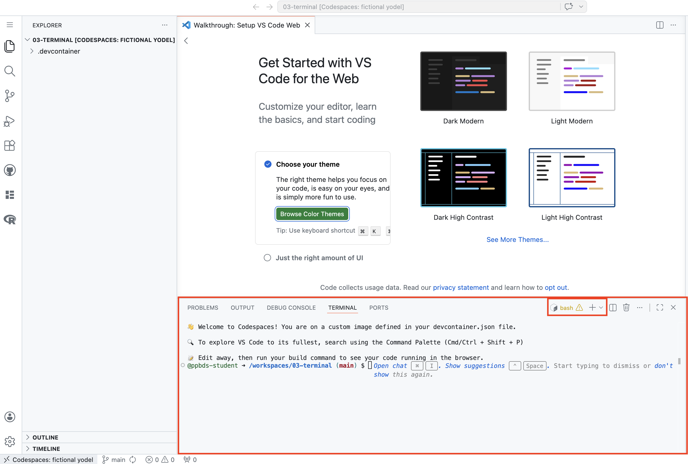
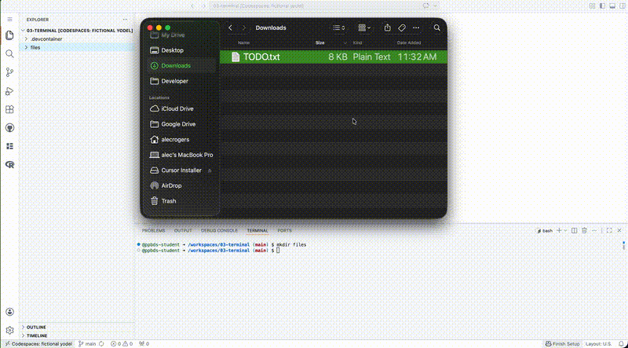
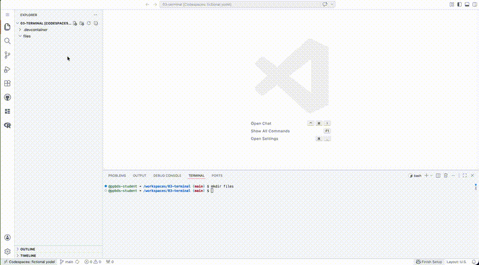
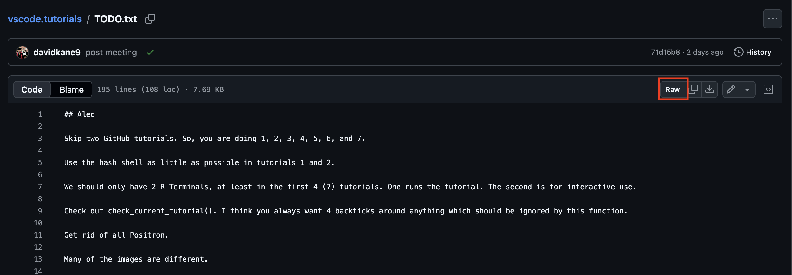
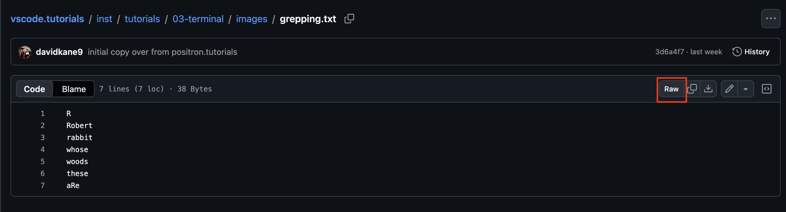

```{r setup, include = FALSE}
library(learnr)
library(tutorial.helpers)
library(tidyverse)
library(knitr)

library(pkgbuild)

knitr::opts_chunk$set(echo = FALSE)
knitr::opts_chunk$set(out.width = '90%')
options(tutorial.exercise.timelimit = 60,
        tutorial.storage = "local")
```


```{r info-section, child = system.file("child_documents/info_section.Rmd", package = "tutorial.helpers")}
```

<!-- Won't just about everyone doing this tutorial be in their projects directory? So I should be too! -->

<!-- The second time we use echo, we act like we haven't explained it before. -->

<!-- Might be useful to add a test which confirms that those files exist, before we ask students to download them. Of course, that will only work if we have web access. -->

<!-- Add a brief discussion of environment variables? -->

<!-- Consider adding a third files download exercise and/or making the current one more like the actual work that students do on this topic, which generally involves an R project, making data/ directory, putting a new file there and so on. -->

<!-- Consider adding a bunch more images. Might be very useful in the paths section, especially taking images from the Explorer and showing how they correspond to the commands. -->

<!-- Could have test cases which confirm that these commands match what I think they should, I think. -->

## Introduction
###

This tutorial introduces the structure and uses of the Terminal from within VS Code running on GitHub Codespaces.

The older, more general term for the Terminal is the "command line." All modern operating systems provide a command line, which sophisticated users can use to modify files and directories with commands like `pwd`, `ls`, `echo`, `mkdir`, `mv`, `rm`, and `cd`. We also discuss regular expressions as well as some of the metacharacters (like `*`, `^`, and `$`) from which they are constructed.

Some material is from [*R for Data Science (2e)*](https://r4ds.hadley.nz/) by Hadley Wickham, Mine Çetinkaya-Rundel, and Garrett Grolemund.

## Terminal
###

The Terminal view is in the Panel in the lower section of the VS Code window. We use terminals to talk directly with the computer. Different types of terminals use different languages to do this. The initial terminal uses the Bash language.

```{r}

```

### Exercise 1

Hit the `Enter` key (the `Return` key on Mac) two times in the Terminal to see what happens. The Terminal has a string of characters called the **prompt**. After a command has been executed, a prompt appears on a new line to let you know that the Terminal is ready for a new command. Copy and paste the three prompt lines from the Terminal as your answer below. We do a lot of **c**opy/**p**asting of **c**ommands/**r**esponses, so we abbreviate those instructions as CP/CR.

```{r terminal-1}
question_text(NULL,
    answer(NULL, correct = TRUE),
    allow_retry = TRUE,
    try_again_button = "Edit Answer",
    incorrect = NULL,
    rows = 3)
```

###

Your answer should look something like:

````
@ppbds-student ➜ /workspaces/codespace-starter (main) $
@ppbds-student ➜ /workspaces/codespace-starter (main) $
@ppbds-student ➜ /workspaces/codespace-starter (main) $
````

Your answer will look different from mine. Default prompts vary from computer to computer. In my case, the first part of the prompt is the name of my GitHub account: `@ppbds-student`. The second part, after the arrow, is the path to the directory, `/workspaces/codespace-starter`, in which I am running the tutorial. The third part, separated by a space and in parentheses, is `main`, the current Git branch (more on this in an upcoming tutorial). The dollar sign indicates the end of the prompt.

###

The prompt acts as a quick way to tell you where you are in the computer. The Terminal is sensitive to your current folder location, so keep this in mind.

### Exercise 2

Let's figure out the location of the folder we are currently in. (Note that the terms "folder" and "directory" mean the same thing.) To see your current location within your computer, type the command `pwd` (**p**resent **w**orking **d**irectory) in the Terminal. Hit the `Enter` (Windows) or `Return` (Mac) key to run the command.

Going forward, we will instruct you to "run" a given command. You do this by typing the command at the prompt and then hitting the `Enter` or `Return` key.

CP/CR.

```{r terminal-2}
question_text(NULL,
    answer(NULL, correct = TRUE),
    allow_retry = TRUE,
    try_again_button = "Edit Answer",
    incorrect = NULL,
    rows = 3)
```

###

Your answer should look something like mine:

````
@ppbds-student ➜ /workspaces/codespace-starter (main) $ pwd
/workspaces/codespace-starter
@ppbds-student ➜ /workspaces/codespace-starter (main) $
````

The `pwd` command prints the full path to your current working directory. When in more complex file systems, the prompt usually only shows a shorter reminder of your location.

### Exercise 3

Let's see a **l**i**s**t of what is in our working directory, where we are currently located. Run `ls`. Note that this is the letter "L" and the letter "S", both in lowercase. It is not the number "1". CP/CR.

```{r terminal-3}
question_text(NULL,
    answer(NULL, correct = TRUE),
    allow_retry = TRUE,
    try_again_button = "Edit Answer",
    incorrect = NULL,
    rows = 3)
```

###

If you do not give it any more information, `ls` assumes that you want a list of what is in your current working directory.

### Exercise 4

Let's **m**a**k**e a **dir**ectory called `example`. Run `mkdir example`. Run `ls` to confirm that the new directory exists inside the current working directory. CP/CR.

```{r terminal-4}
question_text(NULL,
    answer(NULL, correct = TRUE),
    allow_retry = TRUE,
    try_again_button = "Edit Answer",
    incorrect = NULL,
    rows = 3)
```

###

`mkdir` creates an empty directory. We --- and most other people --- use the terms "folder" and "directory" interchangeably.

### Exercise 5

Move into the `example` directory by running `cd example`. Run `pwd`. CP/CR.


```{r terminal-5}
question_text(NULL,
	answer(NULL, correct = TRUE),
	allow_retry = TRUE,
	try_again_button = "Edit Answer",
	incorrect = NULL,
	rows = 3)
```

###

Your answer should look like:

````
@ppbds-student ➜ /workspaces/codespace-starter (main) $ mkdir example
@ppbds-student ➜ /workspaces/codespace-starter (main) $ cd example
@ppbds-student ➜ /workspaces/codespace-starter/example (main) $ pwd
/workspaces/codespace-starter/example
@ppbds-student ➜ /workspaces/codespace-starter/example (main) $
````

The `example` directory is one level below the directory in which you started.

### Exercise 6

Let's create a file called `my.txt`. Run `echo "" > my.txt`.

Run `ls` to confirm that the new file exists inside the current directory. CP/CR.

```{r terminal-6}
question_text(NULL,
    answer(NULL, correct = TRUE),
    allow_retry = TRUE,
    try_again_button = "Edit Answer",
    incorrect = NULL,
    rows = 3)
```

###

````
@ppbds-student ➜ /workspaces/codespace-starter/example (main) $ echo "" > my.txt
@ppbds-student ➜ /workspaces/codespace-starter/example (main) $ ls
my.txt
@ppbds-student ➜ /workspaces/codespace-starter/example (main) $
````

`echo "" > my.txt` creates an empty file. `echo` just repeats whatever follows, which is an empty quote in this case. `>`, which we will discuss more later, pipes whatever comes before it into whatever comes after it.


### Exercise 7

Make a copy of `my.txt` called `my_2.txt` by using the `cp` command. That is, run `cp my.txt my_2.txt`. Confirm that this worked by running `ls`. CP/CR.

```{r terminal-7}
question_text(NULL,
	answer(NULL, correct = TRUE),
	allow_retry = TRUE,
	try_again_button = "Edit Answer",
	incorrect = NULL,
	rows = 3)
```

###

Your answer should look like:

````
@ppbds-student ➜ /workspaces/codespace-starter/example (main) $ cp my.txt my_2.txt
@ppbds-student ➜ /workspaces/codespace-starter/example (main) $ ls
my_2.txt  my.txt
@ppbds-student ➜ /workspaces/codespace-starter/example (main) $
````

### Exercise 8

We rename files with the `mv` command, which is derived from **m**o**v**e. The first argument is the file we want to rename, and the second argument is the new name.

Rename `my.txt` to `fake.txt` by running `mv my.txt fake.txt`. Run `ls` to confirm. CP/CR.

```{r terminal-8}
question_text(NULL,
    answer(NULL, correct = TRUE),
    allow_retry = TRUE,
    try_again_button = "Edit Answer",
    incorrect = NULL,
    rows = 3)
```

###

Your answer should look like:

````
@ppbds-student ➜ /workspaces/codespace-starter/example (main) $ mv my.txt fake.txt
@ppbds-student ➜ /workspaces/codespace-starter/example (main) $ ls
fake.txt  my_2.txt
@ppbds-student ➜ /workspaces/codespace-starter/example (main) $
````

###

From the computer's point of view, **renaming** a file is the same thing as **moving** a file. In fact, moving is more general since it allows us to change both the name *and* the location of a file.

### Exercise 9

Let's **r**e**m**ove the file `fake.txt`. Run `rm fake.txt`. Run `ls` to confirm. CP/CR.

```{r terminal-9}
question_text(NULL,
    answer(NULL, correct = TRUE),
    allow_retry = TRUE,
    try_again_button = "Edit Answer",
    incorrect = NULL,
    rows = 3)
```

###

Your answer should look like:

````
@ppbds-student ➜ /workspaces/codespace-starter/example (main) $ rm fake.txt
@ppbds-student ➜ /workspaces/codespace-starter/example (main) $ ls
my_2.txt
@ppbds-student ➜ /workspaces/codespace-starter/example (main) $
````

Be careful with the `rm` command in the Terminal. Unlike moving files to Trash on your computer, it is (usually) irreversible.

### Exercise 10

We want to remove the `example` directory. But we can't do that while we are "located" in that directory. That is, the computer is aware that our Terminal process --- the entity that is executing our commands like `ls` and `cp` --- is currently working from the `example` directory.

Run `cd ..`. The "dot-dot" symbol --- `..` --- references the directory that contains the current directory. Run `pwd` to confirm. CP/CR.

```{r terminal-10}
question_text(NULL,
	answer(NULL, correct = TRUE),
	allow_retry = TRUE,
	try_again_button = "Edit Answer",
	incorrect = NULL,
	rows = 3)
```

###

Your answer should look like:

````
@ppbds-student ➜ /workspaces/codespace-starter/example (main) $ cd ..
@ppbds-student ➜ /workspaces/codespace-starter (main) $ pwd
/workspaces/codespace-starter
@ppbds-student ➜ /workspaces/codespace-starter (main) $
````

Again, note how the prompt changed because we moved directories. The `..` symbol --- two periods --- always indicates the directory one level up, i.e., the directory in which `example` is located.

### Exercise 11

Run `rm -r example` to remove the directory `example`. Then run `ls` to confirm. CP/CR.

```{r terminal-11}
question_text(NULL,
    answer(NULL, correct = TRUE),
    allow_retry = TRUE,
    try_again_button = "Edit Answer",
    incorrect = NULL,
    rows = 3)
```

````
@ppbds-student ➜ /workspaces/codespace-starter (main) $ rm -r example
@ppbds-student ➜ /workspaces/codespace-starter (main) $ ls
@ppbds-student ➜ /workspaces/codespace-starter (main) $
````

`-r` is an **option** that allows us to delete a directory. The `r` stands for **r**ecursive because, in order to delete a directory, you must also (recursively) delete every directory and file within that directory.

It is good to clean up. Don't leave junk files lying around.

## Paths
###

You will practice using paths both inside and outside the current working directory. You will learn a few shortcuts to make this easier.

### Exercise 1

By default, the Terminal in VS Code starts in `/workspaces/codespace-starter`, the root folder of this Codespace.

Run `pwd` to show your current working directory. CP/CR.

```{r paths-1}
question_text(NULL,
    answer(NULL, correct = TRUE),
    allow_retry = TRUE,
    try_again_button = "Edit Answer",
    incorrect = NULL,
    rows = 3)
```

###

The Activity Bar on the left side of VS Code includes several buttons. When you click one of these buttons, a view opens next to the Activity Bar. Pressing the button again closes that view.

The top button is the Explorer. Pressing it opens the Explorer pane, also called Project Explorer. This functions like the Mac Finder or the Windows Explorer.

### Exercise 2

Use `mkdir` to make a directory named `paths` inside your current working directory. CP/CR.

```{r paths-2}
question_text(NULL,
    answer(NULL, correct = TRUE),
    allow_retry = TRUE,
    try_again_button = "Edit Answer",
    incorrect = NULL,
    rows = 3)
```

###

The new directory is created directly inside the working directory.

### Exercise 3

Let's **c**hange the working **d**irectory to `paths`. Run `cd paths`. Run `pwd` to confirm that you have changed the working directory. CP/CR.

```{r paths-3}
question_text(NULL,
    answer(NULL, correct = TRUE),
    allow_retry = TRUE,
    try_again_button = "Edit Answer",
    incorrect = NULL,
    rows = 3)
```

###

Your answer should look something like:

````
@ppbds-student ➜ /workspaces/codespace-starter (main) $ cd paths
@ppbds-student ➜ /workspaces/codespace-starter/paths (main) $ pwd
/workspaces/codespace-starter/paths
@ppbds-student ➜ /workspaces/codespace-starter/paths (main) $
````

Note how the prompt changed after I ran the `cd paths` command. Before, the prompt included `/workspaces/codespace-starter` because that was the current working directory. Using `cd` changed the current working directory to `paths`, causing the prompt to change as well.

### Exercise 4

Use `mkdir` to make a directory called `lessons` inside `paths` by running `mkdir lessons`. Confirm that this worked by running `ls`. CP/CR.

```{r paths-4}
question_text(NULL,
    answer(NULL, correct = TRUE),
    allow_retry = TRUE,
    try_again_button = "Edit Answer",
    incorrect = NULL,
    rows = 3)
```

###

````
@ppbds-student ➜ /workspaces/codespace-starter/paths (main) $ mkdir lessons
@ppbds-student ➜ /workspaces/codespace-starter/paths (main) $ ls
lessons
@ppbds-student ➜ /workspaces/codespace-starter/paths (main) $
````

Because we have changed working directories, the `lessons` directory is created inside the `paths` directory. It is the only object in the `paths` directory.

### Exercise 5

Make a directory within `lessons` called `fruits` by running `mkdir lessons/fruits`.

Run `ls lessons` to check to see if `fruits` exists inside the `lessons` directory. CP/CR.

```{r paths-5}
question_text(NULL,
    answer(NULL, correct = TRUE),
    allow_retry = TRUE,
    try_again_button = "Edit Answer",
    incorrect = NULL,
    rows = 3)
```

###

````
@ppbds-student ➜ /workspaces/codespace-starter/paths (main) $ mkdir lessons/fruits
@ppbds-student ➜ /workspaces/codespace-starter/paths (main) $ ls lessons/
fruits
@ppbds-student ➜ /workspaces/codespace-starter/paths (main) $
````

###

We could not, as before, simply give `fruits` as an argument to `mkdir` because then the directory would be created directly inside `paths`, the current working directory, rather than within `lessons`. To refer to a location other than the working directory, we need to use a **path**, which describes the location directory by directory. The path above is called a **relative path** because it uses the working directory as its starting point.

### Exercise 6

Let's change our working directory to `fruits`. Run `cd lessons/fruits`.

As you are typing this command, type only the `f` in `fruits` and then press the tab key (twice may be necessary on some computers). Pressing tab autocompletes the name of a file or directory.

CP/CR.

```{r paths-6}
question_text(NULL,
    answer(NULL, correct = TRUE),
    allow_retry = TRUE,
    try_again_button = "Edit Answer",
    incorrect = NULL,
    rows = 3)
```

###

Get in the practice of using the tab key. Avoid typing whenever possible. Be lazy!

### Exercise 7

Use `echo "" >` to make a text file inside `fruits`, named `pineapple.txt`. Recall that your current location --- i.e., your working directory --- is now `fruits`. So, to make a new file within `fruits`, you just need `echo "" > pineapple.txt`. Run `ls` to confirm. CP/CR.

###

```{r paths-7}
question_text(NULL,
    answer(NULL, correct = TRUE),
    allow_retry = TRUE,
    try_again_button = "Edit Answer",
    incorrect = NULL,
    rows = 3)
```

###

````
@ppbds-student ➜ /workspaces/codespace-starter/paths/lessons/fruits (main) $ echo "" > pineapple.txt
@ppbds-student ➜ /workspaces/codespace-starter/paths/lessons/fruits (main) $ ls
pineapple.txt
@ppbds-student ➜ /workspaces/codespace-starter/paths/lessons/fruits (main) $
````
###

`pineapple.txt` is still a relative path, but since the file is directly inside the assumed starting point, i.e. the working directory, the name of the file is all we need. If we had used `lessons/fruits/apple.txt`, as we would have had to do if our working directory were `paths`, we would have gotten an error because those directories would not be recognized from our actual starting point of `fruits`.

Read this paragraph again. No skimming!

### Exercise 8

Use `echo` to make two more text files inside `fruits`, named `pear.txt` and `does-not-belong`. That is, run `echo "" > pear.txt & echo "" > does-not-belong`. Confirm by running `ls`. CP/CR.

###

```{r paths-8}
question_text(NULL,
    answer(NULL, correct = TRUE),
    allow_retry = TRUE,
    try_again_button = "Edit Answer",
    incorrect = NULL,
    rows = 3)
```

###

````
@ppbds-student ➜ /workspaces/codespace-starter/paths/lessons/fruits (main) $ echo "" > pear.txt & echo "" > does-not-belong
@ppbds-student ➜ /workspaces/codespace-starter/paths/lessons/fruits (main) $ ls
does-not-belong pear.txt        pineapple.txt
@ppbds-student ➜ /workspaces/codespace-starter/paths/lessons/fruits (main) $
````

The `&` symbol tells the operating system to run both the command that came before it and the command that comes after it.

### Exercise 9

Let's change our working directory to `lessons`. Run `cd ..` to go to the folder immediately above the working directory. Use `pwd` to confirm that you are in the right directory. CP/CR.

```{r paths-9}
question_text(NULL,
    answer(NULL, correct = TRUE),
    allow_retry = TRUE,
    try_again_button = "Edit Answer",
    incorrect = NULL,
    rows = 3)
```

Your answer should look like this:

````
@ppbds-student ➜ /workspaces/codespace-starter/paths/lessons/fruits (main) $ cd ..
@ppbds-student ➜ /workspaces/codespace-starter/paths/lessons (main) $ pwd
/workspaces/codespace-starter/paths/lessons
@ppbds-student ➜ /workspaces/codespace-starter/paths/lessons (main) $
````

###

`..` is shorthand for the directory immediately above the current working directory. The phrase "current working directory" is a bit redundant. You don't need the word "current."

### Exercise 10

Use `mkdir` to make a directory within `lessons`, named `tbd`. Run `ls` to confirm. CP/CR.

```{r paths-10}
question_text(NULL,
    answer(NULL, correct = TRUE),
    allow_retry = TRUE,
    try_again_button = "Edit Answer",
    incorrect = NULL,
    rows = 3)
```

###

````
@ppbds-student ➜ /workspaces/codespace-starter/paths/lessons (main) $ mkdir tbd
@ppbds-student ➜ /workspaces/codespace-starter/paths/lessons (main) $ ls
fruits  tbd
@ppbds-student ➜ /workspaces/codespace-starter/paths/lessons (main) $
````

In the same way that `..` refers to the directory above the current directory, `.` --- a single period --- refers to the current directory, the one in which we are currently located.

### Exercise 11

Use `mv` to **m**o**v**e the file `does-not-belong` from the `fruits` directory to the `tbd` directory by running `mv fruits/does-not-belong tbd`. Run `ls tbd` to confirm.

CP/CR.

```{r paths-11}
question_text(NULL,
	answer(NULL, correct = TRUE),
	allow_retry = TRUE,
	try_again_button = "Edit Answer",
	incorrect = NULL,
	rows = 3)
```

###

````
@ppbds-student ➜ /workspaces/codespace-starter/paths/lessons (main) $ mv fruits/does-not-belong tbd
@ppbds-student ➜ /workspaces/codespace-starter/paths/lessons (main) $ ls tbd
does-not-belong
@ppbds-student ➜ /workspaces/codespace-starter/paths/lessons (main) $
````

###

We can act on files that are not in the working directory as long as we provide a path --- either relative, as here, or absolute --- to those files. In this case, neither `mv` nor `ls` is acting on the current directory. Instead, they are acting on lower directories: `fruits` and `tbd`.

### Exercise 12

Use `cd` to change the working directory up to `paths` by running `cd ..`. Confirm with `pwd`. Use `mv` and the `.` shorthand to move the directory `tbd` directly inside of `paths` by running `mv lessons/tbd .`. Confirm with `ls`. CP/CR.

```{r paths-12}
question_text(NULL,
    answer(NULL, correct = TRUE),
    allow_retry = TRUE,
    try_again_button = "Edit Answer",
    incorrect = NULL,
    rows = 3)
```

###

````
@ppbds-student ➜ /workspaces/codespace-starter/paths/lessons (main) $ cd ..
@ppbds-student ➜ /workspaces/codespace-starter/paths (main) $ pwd
/workspaces/codespace-starter/paths
@ppbds-student ➜ /workspaces/codespace-starter/paths (main) $ mv lessons/tbd .
@ppbds-student ➜ /workspaces/codespace-starter/paths (main) $ ls
lessons tbd
@ppbds-student ➜ /workspaces/codespace-starter/paths (main) $
````

When using `mv`, there is no difference between moving a directory and moving a file. A command like `mv lessons/tbd .` seems like a bit of witchcraft. But all it really says is to move (`mv`) the `tbd` directory (which is located in the `lessons` directory) to here (`.`), meaning to the current directory.

### Exercise 13

Move up one more directory, back to the original working directory, by running `cd ..`. Confirm with `pwd`. Run `rm -r paths` to remove all the directories and files that we have been working with. CP/CR.

```{r paths-13}
question_text(NULL,
    answer(NULL, correct = TRUE),
    allow_retry = TRUE,
    try_again_button = "Edit Answer",
    incorrect = NULL,
    rows = 3)
```

###

````
@ppbds-student ➜ /workspaces/codespace-starter/paths (main) $ cd ..
@ppbds-student ➜ /workspaces/codespace-starter (main) $ pwd
/workspaces/codespace-starter
@ppbds-student ➜ /workspaces/codespace-starter (main) $ rm -r paths
@ppbds-student ➜ /workspaces/codespace-starter (main) $
````

###

In olden times, professional programmers would spend a lot of time learning the various options to commands like `rm`. Now, we just ask ChatGPT or a similar tool.

<!-- Could have them ask ChatGPT to do something and then do it. -->

## Important symbols
###

We have seen two important symbols --- `..` and `.` --- already. This section will explore those along with `~`.  The most common English terms for these symbols are "dot" for `.`, "dot dot" for `..`, and "tilde" for `~`. The `.` symbol indicates the current directory. The `..` symbol is for the directory one above the current directory. The `~` symbol is for your "home" directory.

### Exercise 1

Use `mkdir symbols` to create a new directory called `symbols`. `cd` into that directory by running `cd symbols`. Confirm the change with `pwd`. Confirm that the directory is empty by running `ls`.

CP/CR.

```{r important-symbols-1}
question_text(NULL,
	answer(NULL, correct = TRUE),
	allow_retry = TRUE,
	try_again_button = "Edit Answer",
	incorrect = NULL,
	rows = 3)
```

###

````
@ppbds-student ➜ /workspaces/codespace-starter (main) $ mkdir symbols
@ppbds-student ➜ /workspaces/codespace-starter (main) $ cd symbols
@ppbds-student ➜ /workspaces/codespace-starter/symbols (main) $ pwd
/workspaces/codespace-starter/symbols
@ppbds-student ➜ /workspaces/codespace-starter/symbols (main) $ ls
@ppbds-student ➜ /workspaces/codespace-starter/symbols (main) $
````

The more practice we get with command-line commands --- often called "shell" commands --- the easier it is to string together several of them in a row.

### Exercise 2

But is the `symbols` directory really empty? Run `ls -a` to check. The `-` indicates an option to the `ls` command. The `a` option tells `ls` to return *a*ll the members of the directory.

CP/CR.

```{r important-symbols-2}
question_text(NULL,
	answer(NULL, correct = TRUE),
	allow_retry = TRUE,
	try_again_button = "Edit Answer",
	incorrect = NULL,
	rows = 3)
```

###

Your answer should look like:

````
@ppbds-student ➜ /workspaces/codespace-starter/symbols (main) $ ls -a
.       ..
@ppbds-student ➜ /workspaces/codespace-starter/symbols (main) $
````

Every directory, even an "empty" one, includes `.` and `..`. The `.` is a link to the current directory, i.e., to the `symbols` directory in which we are currently located. The `..` is a link to the directory one level up, which is `/workspaces/codespace-starter` in my case.

### Exercise 3

Run `ls ..` to examine the contents of the directory one level above the current directory. CP/CR.

```{r important-symbols-3}
question_text(NULL,
	answer(NULL, correct = TRUE),
	allow_retry = TRUE,
	try_again_button = "Edit Answer",
	incorrect = NULL,
	rows = 3)
```

###

My answer looks like this:

````
@ppbds-student ➜ /workspaces/codespace-starter/symbols (main) $ ls ..
diamonds.png  quarto-1.qmd  script-1.R  script-2.R  symbols
@ppbds-student ➜ /workspaces/codespace-starter/symbols (main) $
````

Your answer will look different because you started this tutorial in a different directory, with different contents, than I did.

### Exercise 4

Run `ls ../..` to examine the contents of the directory two levels above the current directory. CP/CR.

```{r important-symbols-4}
question_text(NULL,
	answer(NULL, correct = TRUE),
	allow_retry = TRUE,
	try_again_button = "Edit Answer",
	incorrect = NULL,
	rows = 3)
```

###

My answer looks like this:

````
@ppbds-student ➜ /workspaces/codespace-starter/symbols (main) $ ls ../..
codespace-starter
@ppbds-student ➜ /workspaces/codespace-starter/symbols (main) $
````

Your answer may look different if your Codespace includes other folders inside `/workspaces`.

### Exercise 5

Run `pwd` again. This returns the current working directory. Note that the return value is an **absolute path**. It tells you exactly where you --- meaning your Terminal session or instance --- are located on your computer.

```{r important-symbols-5}
question_text(NULL,
	answer(NULL, correct = TRUE),
	allow_retry = TRUE,
	try_again_button = "Edit Answer",
	incorrect = NULL,
	rows = 3)
```

###

My answer looks like this:

````
@ppbds-student ➜ /workspaces/codespace-starter/symbols (main) $ pwd
/workspaces/codespace-starter/symbols
@ppbds-student ➜ /workspaces/codespace-starter/symbols (main) $
````

The absolute path for my current location, meaning my current working directory, contains these locations.

* The starting `/` indicates the root, or origin, of the file system. There is no directory higher than the root directory.

* `workspaces`, which is where GitHub Codespaces stores workspace folders.

* `codespace-starter`, which is the name of the folder in which I started this tutorial, followed by `symbols`, which is the directory we just created.

### Exercise 6

Run `cd` without any argument. Doing so changes your current directory to your home directory because that is the default behavior for `cd`. Run `pwd` to confirm where you are. CP/CR.

```{r important-symbols-6}
question_text(NULL,
    answer(NULL, correct = TRUE),
    allow_retry = TRUE,
    try_again_button = "Edit Answer",
    incorrect = NULL,
    rows = 3)
```

My answer looks like this:

````
@ppbds-student ➜ /workspaces/codespace-starter/symbols (main) $ cd
@ppbds-student ➜ ~ $ pwd
/home/codespace
@ppbds-student ➜ ~ $
````

In Codespaces, the home directory is usually `/home/codespace`. Note how, after we run `cd`, the prompt changes to report `~` as the current working directory. `~` is the symbol for the current user's home directory.

### Exercise 7

Use `cd`, along with the full path to the `symbols` directory that you determined above, to change the working directory back to the `symbols` directory. Run `pwd` to confirm. CP/CR.

```{r important-symbols-7}
question_text(NULL,
    answer(NULL, correct = TRUE),
    allow_retry = TRUE,
    try_again_button = "Edit Answer",
    incorrect = NULL,
    rows = 3)
```

###

````
@ppbds-student ➜ ~ $ cd /workspaces/codespace-starter/symbols
@ppbds-student ➜ /workspaces/codespace-starter/symbols (main) $ pwd
/workspaces/codespace-starter/symbols
@ppbds-student ➜ /workspaces/codespace-starter/symbols (main) $
````

This is an example of using an absolute path to change locations.

### Exercise 8

Run `ls ~`. The list should be identical to the list you generated above in the home directory. Because the home directory is used in the absolute path of so many files, its path --- generally something like `/home/codespace` in Codespaces --- can be written with the shorthand `~`, which is a tilde, pronounced "TIL-duh." CP/CR.


```{r important-symbols-8}
question_text(NULL,
    answer(NULL, correct = TRUE),
    allow_retry = TRUE,
    try_again_button = "Edit Answer",
    incorrect = NULL,
    rows = 3)
```

###

The shorthands we have learned so far, `.`, `..`, and `~`, stand for the paths to the corresponding directories. They are not specific to any function and can be used in any situation where the text of the relevant path could be used.

### Exercise 9

Confirm that you are currently located in the `symbols` directory by running `pwd`. Run `cd ..` to move one directory up, out of the `symbols` directory. Delete the `symbols` directory with `rm -rf symbols`. CP/CR.

```{r important-symbols-9}
question_text(NULL,
	answer(NULL, correct = TRUE),
	allow_retry = TRUE,
	try_again_button = "Edit Answer",
	incorrect = NULL,
	rows = 3)
```

###

Your answer should look like:

````
@ppbds-student ➜ /workspaces/codespace-starter/symbols (main) $ pwd
/workspaces/codespace-starter/symbols
@ppbds-student ➜ /workspaces/codespace-starter/symbols (main) $ cd ..
@ppbds-student ➜ /workspaces/codespace-starter (main) $ rm -rf symbols
@ppbds-student ➜ /workspaces/codespace-starter (main) $
````

Note that `rm -rf symbols` and `rm -rf symbols/`, with the trailing slash, have the same effect. Except in unusual circumstances, including (or not including) the trailing slash in the name of a directory does not matter.

## Options
###

Options modify the behavior of command-line functions like `ls`, as we saw with `ls -a` above.

### Exercise 1

Use `pwd` to confirm that you are in your default working directory. Make a directory directly inside the working directory, named `options`, by running `mkdir options`. `cd` into `options`. Run `ls` to confirm that it is empty. CP/CR.


```{r options-1}
question_text(NULL,
    answer(NULL, correct = TRUE),
    allow_retry = TRUE,
    try_again_button = "Edit Answer",
    incorrect = NULL,
    rows = 3)
```

###

````
@ppbds-student ➜ /workspaces/codespace-starter (main) $ pwd
/workspaces/codespace-starter
@ppbds-student ➜ /workspaces/codespace-starter (main) $ mkdir options
@ppbds-student ➜ /workspaces/codespace-starter (main) $ cd options/
@ppbds-student ➜ /workspaces/codespace-starter/options (main) $ ls
@ppbds-student ➜ /workspaces/codespace-starter/options (main) $
````

Note how easy it is to string together several commands in order to accomplish our goals.

### Exercise 2

Add a text file to the `options` directory, named `.my-hidden.txt` --- make sure to include the `.` at the front of the file name --- by running `echo "" > .my-hidden.txt`. CP/CR.

```{r options-2}
question_text(NULL,
    answer(NULL, correct = TRUE),
    allow_retry = TRUE,
    try_again_button = "Edit Answer",
    incorrect = NULL,
    rows = 3)
```

###

Other than `.`, avoid using special characters or spaces anywhere in file names. These are difficult to work with in the Terminal.

### Exercise 3

Run `ls` to look for the file you created. CP/CR.

```{r options-3}
question_text(NULL,
	answer(NULL, correct = TRUE),
	allow_retry = TRUE,
	try_again_button = "Edit Answer",
	incorrect = NULL,
	rows = 3)
```

###

Your answer should be something like:

````
@ppbds-student ➜ /workspaces/codespace-starter/options (main) $ ls
@ppbds-student ➜ /workspaces/codespace-starter/options (main) $
````

If you did the previous exercise correctly, you should **not** see the new file. This is because we prefixed the name with `.`, which hides the file from normal view. Files whose name begins with a `.` are called "hidden" files for this reason.

### Exercise 4

Run `ls -a`. Using the **option** `-a`, you should be able to see **a**ll the files in the directory. CP/CR.


```{r options-4}
question_text(NULL,
    answer(NULL, correct = TRUE),
    allow_retry = TRUE,
    try_again_button = "Edit Answer",
    incorrect = NULL,
    rows = 3)
```

###

Options are preceded by a `-` and come before the argument. Your answer should look like:

````
@ppbds-student ➜ /workspaces/codespace-starter/options (main) $ ls -a
.               ..              .my-hidden.txt
@ppbds-student ➜ /workspaces/codespace-starter/options (main) $
````

The `.` file refers to the `options` directory itself. The `..` refers to the directory in which the `options` directory is located. Every directory has both a `.` and a `..` file inside it, but we only see those files if we use the `-a` option.

###

Hidden files live all over your computer.

### Exercise 5

The **environment variable** `HOME` represents the path to your home directory. Type and enter `echo $HOME` to make sure we are telling you the truth.

CP/CR.

```{r options-5}
question_text(NULL,
    answer(NULL, correct = TRUE),
    allow_retry = TRUE,
    try_again_button = "Edit Answer",
    incorrect = NULL,
    rows = 3)
```

###

Your answer should look like:

````
@ppbds-student ➜ /workspaces/codespace-starter/options (main) $ echo $HOME
/home/codespace
@ppbds-student ➜ /workspaces/codespace-starter/options (main) $
````

Note how the prompt has changed because I am now in the `options` directory.

### Exercise 6

Run `ls $HOME`. This should generate a list of the items in your home directory.

CP/CR.

```{r options-6}
question_text(NULL,
    answer(NULL, correct = TRUE),
    allow_retry = TRUE,
    try_again_button = "Edit Answer",
    incorrect = NULL,
    rows = 3)
```

###

There are many different environment variables. You can also make your own. My answer looks like:

````
@ppbds-student ➜ /workspaces/codespace-starter/options (main) $ ls $HOME
Downloads
@ppbds-student ➜ /workspaces/codespace-starter/options (main) $
````

Don't worry about the details of these files. Our main point is that environment variables are very handy because they make it easy to refer to a specific location on a computer, like where R is installed, even though the absolute path to this location is different on every person's computer.

### Exercise 7

In the Terminal, run `ls -l $HOME` so that we can see more information in a **l**ong list.

CP/CR.

```{r options-7}
question_text(NULL,
    answer(NULL, correct = TRUE),
    allow_retry = TRUE,
    try_again_button = "Edit Answer",
    incorrect = NULL,
    rows = 3)
```

###

My answer looks like this:

````
@ppbds-student ➜ /workspaces/codespace-starter/options (main) $ ls -l $HOME
total 4
drwxr-xr-x 2 codespace codespace 4096 Apr 30 12:00 Downloads
@ppbds-student ➜ /workspaces/codespace-starter/options (main) $
````

In a long list, names are in the last column and file type is in the first. If the string in the first column begins with `d`, it is a **d**irectory; if it begins with `-`, it is a file; if it begins with `l`, it is a **l**ink to another file or directory on the computer. The middle columns give, from left to right, the number of files, author, permission, file size (in bytes), and the date/time last modified.

### Exercise 8

Let's download a copy of the `AUTHORS` document from the R source code. It is available at:

````
https://github.com/wch/r-source/blob/trunk/doc/AUTHORS
````

Press the "Download raw file" button. This should place a copy of the file in your `Downloads` directory. At the Terminal, run `ls ~/Downloads/A*`. If this command does not work for you, use AI to figure out a command that does.

CP/CR.

```{r options-8}
question_text(NULL,
    answer(NULL, correct = TRUE),
    allow_retry = TRUE,
    try_again_button = "Edit Answer",
    incorrect = NULL,
    rows = 3)
```

My answer looks like this:

````
@ppbds-student ➜ /workspaces/codespace-starter/options (main) $ ls ~/Downloads/A*
/home/codespace/Downloads/AUTHORS.txt
@ppbds-student ➜ /workspaces/codespace-starter/options (main) $
````

Note how my computer has added a `.txt` suffix to the file. Your computer might or might not do the same. Many operating systems think that every file should have a suffix that describes what it is, and so they add one if it is not present.

### Exercise 9

Move the `AUTHORS` file to the current directory, which is `options`, using `mv`. Check with `ls` to confirm that it worked. CP/CR.

For me, this looks like:

````
@ppbds-student ➜ /workspaces/codespace-starter/options (main) $ mv /home/codespace/Downloads/AUTHORS.txt .
@ppbds-student ➜ /workspaces/codespace-starter/options (main) $ ls
AUTHORS.txt
@ppbds-student ➜ /workspaces/codespace-starter/options (main) $
````

```{r options-9}
question_text(NULL,
	answer(NULL, correct = TRUE),
	allow_retry = TRUE,
	try_again_button = "Edit Answer",
	incorrect = NULL,
	rows = 3)
```

###

Like `mv`, `cp` can change a file name. Like `mv`, if the destination file name is omitted, `cp` will retain the same name by default.

### Exercise 10

Let's view just the initial lines of `AUTHORS.txt`. Run `head AUTHORS.txt`. CP/CR.

```{r options-10}
question_text(NULL,
    answer(NULL, correct = TRUE),
    allow_retry = TRUE,
    try_again_button = "Edit Answer",
    incorrect = NULL,
    rows = 3)
```

###

Now you know how R got its name. If your operating system did not add `.txt` as a suffix, then you should just use `AUTHORS` in this command and those that follow.

### Exercise 11

Let's view more than just the initial 10 lines. The option `-n` allows you to specify the number of initial lines you want to see. Run `head -n 18 AUTHORS.txt`. CP/CR.

```{r options-11}
question_text(NULL,
    answer(NULL, correct = TRUE),
    allow_retry = TRUE,
    try_again_button = "Edit Answer",
    incorrect = NULL,
    rows = 20)
```

###

The option `-n` takes an argument that allows `head` to display any number of initial lines.

### Exercise 12

Use the command `tail` and the same `-n` option to view the last 15 lines by running `tail -n 15 AUTHORS.txt`. CP/CR.


```{r options-12}
question_text(NULL,
    answer(NULL, correct = TRUE),
    allow_retry = TRUE,
    try_again_button = "Edit Answer",
    incorrect = NULL,
    rows = 20)
```

###

If the argument of `-n` is greater than the number of lines in the file, `head` or `tail` will just print the whole file.

### Exercise 13

Let's view the whole file at once. Run `cat AUTHORS.txt`. CP/CR.

```{r options-13}
question_text(NULL,
    answer(NULL, correct = TRUE),
    allow_retry = TRUE,
    try_again_button = "Edit Answer",
    incorrect = NULL,
    rows = 25)
```

###

`cat` stands for con**cat**enate, which means "to chain together." While it is often used on a single text file, the command can take two arguments and print the files together.

### Exercise 14

Run `cat -n AUTHORS.txt`. Notice that `-n` has no argument. CP/CR.


```{r options-14}
question_text(NULL,
    answer(NULL, correct = TRUE),
    allow_retry = TRUE,
    try_again_button = "Edit Answer",
    incorrect = NULL,
    rows = 20)
```

###

`cat -n` prints the text file with line numbers.

### Exercise 15

Let's make our own text file. Start by running `echo`, which takes a quoted string such as "Your First and Last Name Here" as its argument. This "echoes" the argument by printing it in the next line of the Terminal. CP/CR.

```{r options-15}
question_text(NULL,
    answer(NULL, correct = TRUE),
    allow_retry = TRUE,
    try_again_button = "Edit Answer",
    incorrect = NULL,
    rows = 3)
```

###

For me, this looks like:

````
@ppbds-student ➜ /workspaces/codespace-starter/options (main) $ echo "David Kane"
David Kane
@ppbds-student ➜ /workspaces/codespace-starter/options (main) $
````

`echo` can also take a string that is not in quotes as its argument.

### Exercise 16

We can use `>` to redirect the output of `echo` from the Terminal to a text file. Run `echo "Your First and Last Name Here" > test.txt`. Then use `ls` to see if the file `test.txt` exists within your working directory. Then use `cat` to read this file. After you have confirmed that the file contains your name, use `rm` to remove `test.txt`. CP/CR.

```{r options-16}
question_text(NULL,
    answer(NULL, correct = TRUE),
    allow_retry = TRUE,
    try_again_button = "Edit Answer",
    incorrect = NULL,
    rows = 8)
```

###

That is a lot of steps! An important goal of this tutorial is to teach you to be *comfortable* at the command line. My answer looks like:

````
@ppbds-student ➜ /workspaces/codespace-starter/options (main) $ echo "David Kane" > test.txt
@ppbds-student ➜ /workspaces/codespace-starter/options (main) $ ls
AUTHORS.txt     test.txt
@ppbds-student ➜ /workspaces/codespace-starter/options (main) $ cat test.txt
David Kane
@ppbds-student ➜ /workspaces/codespace-starter/options (main) $ rm test.txt
@ppbds-student ➜ /workspaces/codespace-starter/options (main) $
````

### Exercise 17

`>` can be used to redirect the output of any command, not just `echo`. Let's try to make a new text file in `options` with just the first 25 lines of `AUTHORS.txt` called `AUTHORS-fake`. Run `head -n 25 AUTHORS.txt > AUTHORS-fake`. Run `ls` to confirm that it worked. CP/CR.


```{r options-17}
question_text(NULL,
    answer(NULL, correct = TRUE),
    allow_retry = TRUE,
    try_again_button = "Edit Answer",
    incorrect = NULL,
    rows = 3)
```

###

````
@ppbds-student ➜ /workspaces/codespace-starter/options (main) $ head -n 25 AUTHORS.txt > AUTHORS-fake
@ppbds-student ➜ /workspaces/codespace-starter/options (main) $ ls
AUTHORS-fake    AUTHORS.txt
@ppbds-student ➜ /workspaces/codespace-starter/options (main) $
````

### Exercise 18

Using `>>`, whose syntax is the same as `>`, we can append output to an existing document. Use `echo` and `>>` to append your name to the list in `AUTHORS-fake`. That is, run (with your name in place of mine):

````
echo "David Kane" >> AUTHORS-fake
````

Confirm by running `tail AUTHORS-fake`. CP/CR.


```{r options-18}
question_text(NULL,
    answer(NULL, correct = TRUE),
    allow_retry = TRUE,
    try_again_button = "Edit Answer",
    incorrect = NULL,
    rows = 10)
```

###

My answer looks like:

````
@ppbds-student ➜ /workspaces/codespace-starter/options (main) $ echo "David Kane" >> AUTHORS-fake
@ppbds-student ➜ /workspaces/codespace-starter/options (main) $ tail AUTHORS-fake
Thomas Lumley
Martin Maechler
Sebastian Meyer
Paul Murrell
Martyn Plummer
Brian Ripley
Deepayan Sarkar
Duncan Temple Lang
Luke Tierney
David Kane
@ppbds-student ➜ /workspaces/codespace-starter/options (main) $
````

Like `>`, `>>` is not limited to `echo`, but can be used to append the output of any command.


### Exercise 19

Run `cd ..` to change your directory to the directory in which you started the tutorial. Run `rm -r options` to remove the `options` directory. CP/CR.

```{r options-19}
question_text(NULL,
    answer(NULL, correct = TRUE),
    allow_retry = TRUE,
    try_again_button = "Edit Answer",
    incorrect = NULL,
    rows = 3)
```

###

Your answer should look like:

````
@ppbds-student ➜ /workspaces/codespace-starter/options (main) $ cd ..
@ppbds-student ➜ /workspaces/codespace-starter (main) $ rm -r options
@ppbds-student ➜ /workspaces/codespace-starter (main) $
````

As usual, note how the prompt changes from `@ppbds-student ➜ /workspaces/codespace-starter/options (main) $` to `@ppbds-student ➜ /workspaces/codespace-starter (main) $` as we move from the `options` directory to the directory from which we started this tutorial.


## Wildcards
###

You will learn how to search for files by using **wildcards** to form **regular expressions**.

### Exercise 1

Use `pwd` to confirm that you are in your default working directory. Use `mkdir` to create a directory named `wildcards`. CP/CR.

```{r wildcards-1}
question_text(NULL,
    answer(NULL, correct = TRUE),
    allow_retry = TRUE,
    try_again_button = "Edit Answer",
    incorrect = NULL,
    rows = 3)
```

###

````
@ppbds-student ➜ /workspaces/codespace-starter (main) $ pwd
/workspaces/codespace-starter
@ppbds-student ➜ /workspaces/codespace-starter (main) $ mkdir wildcards
@ppbds-student ➜ /workspaces/codespace-starter (main) $
````

The `mkdir` command does not produce any output. To confirm that it had the desired effect, you could run `ls`.

### Exercise 2

Change your working directory to `wildcards` using `cd`. Confirm the change with `pwd`. CP/CR.

```{r wildcards-2}
question_text(NULL,
	answer(NULL, correct = TRUE),
	allow_retry = TRUE,
	try_again_button = "Edit Answer",
	incorrect = NULL,
	rows = 3)
```

###

````
@ppbds-student ➜ /workspaces/codespace-starter (main) $ cd wildcards/
@ppbds-student ➜ /workspaces/codespace-starter/wildcards (main) $ pwd
/workspaces/codespace-starter/wildcards
@ppbds-student ➜ /workspaces/codespace-starter/wildcards (main) $
````

Note how the prompt changed after we switched directories.

Keep track of your current location. There is a difference between being in the directory above `wildcards` and being inside of `wildcards`. Right now, you are inside `wildcards`.

### Exercise 3

Using `echo`, make three text files named `hat.txt`, `cat.txt`, and `ate.txt` by running:

````
echo "" > hat.txt & echo "" > cat.txt & echo "" > ate.txt
````

Confirm that you have done so by running `ls`. (No worries if you make a mistake. Just fix it by removing the misnamed file.)

CP/CR.

```{r wildcards-3}
question_text(NULL,
    answer(NULL, correct = TRUE),
    allow_retry = TRUE,
    try_again_button = "Edit Answer",
    incorrect = NULL,
    rows = 5)
```

###

````
@ppbds-student ➜ /workspaces/codespace-starter/wildcards (main) $ echo "" > hat.txt & echo "" > cat.txt & echo "" > ate.txt
[1] 59474
[2] 59475
[1]  - done       echo "" > hat.txt
[2]  + done       echo "" > cat.txt
@ppbds-student ➜ /workspaces/codespace-starter/wildcards (main) $ ls
ate.txt cat.txt hat.txt
@ppbds-student ➜ /workspaces/codespace-starter/wildcards (main) $
````

If you are curious about how those commands work, ask your favorite AI. The more you interact with AI, the better.

### Exercise 4

Terminal commands allow the use of **wildcards**. A wildcard `*` represents zero or more of any character, and it is used to work with similarly named files as a group.

###

Let's generate a list of all our files whose names contain the letter `a`. First, try to run `ls a`. You will get an error message --- "No such file or directory" --- because there is no file named `a` in the working directory. CP/CR.

```{r wildcards-4}
question_text(NULL,
    answer(NULL, correct = TRUE),
    allow_retry = TRUE,
    try_again_button = "Edit Answer",
    incorrect = NULL,
    rows = 3)
```

###

````
@ppbds-student ➜ /workspaces/codespace-starter/wildcards (main) $ ls a
ls: cannot access 'a': No such file or directory
@ppbds-student ➜ /workspaces/codespace-starter/wildcards (main) $
````

Although we have been using `ls` to return all the contents of a directory, `ls` can also take a name as an argument, as above.

### Exercise 5

Let's try again. Run `ls a*`. The only return will be `ate.txt`. Because you put `*` after `a`, `ls` returns only files that begin with `a`. The "star" wildcard --- `*` --- matches anything. CP/CR.

```{r wildcards-5}
question_text(NULL,
    answer(NULL, correct = TRUE),
    allow_retry = TRUE,
    try_again_button = "Edit Answer",
    incorrect = NULL,
    rows = 3)
```

###

````
@ppbds-student ➜ /workspaces/codespace-starter/wildcards (main) $ ls a*
ate.txt
@ppbds-student ➜ /workspaces/codespace-starter/wildcards (main) $
````

Although `*` will match strings of any length, its positioning matters. `a*` is not the same thing as `*a`. The first matches any string (i.e., any filename) that starts with `a`. The second matches any filename that ends with `a`.

### Exercise 6

Now run `ls *a*`. This should return all three files. CP/CR.

```{r wildcards-6}
question_text(NULL,
    answer(NULL, correct = TRUE),
    allow_retry = TRUE,
    try_again_button = "Edit Answer",
    incorrect = NULL,
    rows = 3)
```

###

````
@ppbds-student ➜ /workspaces/codespace-starter/wildcards (main) $ ls *a*
ate.txt cat.txt hat.txt
@ppbds-student ➜ /workspaces/codespace-starter/wildcards (main) $
````

Note that these **regular expressions** are case-sensitive. A regular expression is a pattern that you can use for many purposes, including as a search criterion.

### Exercise 7

Make a list of all the files with names, before the suffix, that end in `t` by running `ls *t.*`. CP/CR.

```{r wildcards-7}
question_text(NULL,
    answer(NULL, correct = TRUE),
    allow_retry = TRUE,
    try_again_button = "Edit Answer",
    incorrect = NULL,
    rows = 3)
```

###

````
@ppbds-student ➜ /workspaces/codespace-starter/wildcards (main) $ ls *t.*
cat.txt hat.txt
@ppbds-student ➜ /workspaces/codespace-starter/wildcards (main) $
````

This should return `hat.txt` and `cat.txt`. Read this regular expression --- `*t.*` --- as matching any string that includes a `t` followed directly by a period, regardless of any characters before or after. `ate.txt` is not matched because the `t` and the `.` are separated by `e`.

### Exercise 8

Save the output of our list of all the file names that contain `a` to a new file named `afiles.txt`. Keep pressing the **up** arrow key to navigate through your previous commands until you get to the command you used above: `ls *a*`. Then add `> afiles.txt` afterward and run the command. That is, you are running `ls *a* > afiles.txt`.

Then, run `ls` to confirm that it worked.

CP/CR.

```{r wildcards-8}
question_text(NULL,
    answer(NULL, correct = TRUE),
    allow_retry = TRUE,
    try_again_button = "Edit Answer",
    incorrect = NULL,
    rows = 3)
```

###

````
@ppbds-student ➜ /workspaces/codespace-starter/wildcards (main) $ ls *a* > afiles.txt
@ppbds-student ➜ /workspaces/codespace-starter/wildcards (main) $ ls
afiles.txt      ate.txt         cat.txt         hat.txt
@ppbds-student ➜ /workspaces/codespace-starter/wildcards (main) $
````

You can use your `up` and `down` arrow keys to navigate command history. The `>` symbol outputs the result of the left-hand command into the right-hand location.

### Exercise 9

Wildcards can be used with more than `ls`. Let's move `hat.txt` and `cat.txt` together into one directory.

First, make a new directory called `seuss` within the `wildcards` directory, where you are currently located.

Run `ls` to confirm. CP/CR.

```{r wildcards-9}
question_text(NULL,
    answer(NULL, correct = TRUE),
    allow_retry = TRUE,
    try_again_button = "Edit Answer",
    incorrect = NULL,
    rows = 3)
```

###

Your answer should look like:

````
@ppbds-student ➜ /workspaces/codespace-starter/wildcards (main) $ mkdir seuss
@ppbds-student ➜ /workspaces/codespace-starter/wildcards (main) $ ls
afiles.txt      ate.txt         cat.txt         hat.txt         seuss
@ppbds-student ➜ /workspaces/codespace-starter/wildcards (main) $
````

The `wildcards` directory, in which you are currently located, now includes five items, one of which is the `seuss` directory.

### Exercise 10

Run `ls -l`. CP/CR.

```{r wildcards-10}
question_text(NULL,
	answer(NULL, correct = TRUE),
	allow_retry = TRUE,
	try_again_button = "Edit Answer",
	incorrect = NULL,
	rows = 3)
```

###

````
@ppbds-student ➜ /workspaces/codespace-starter/wildcards (main) $ ls -l
total 16
-rw-r--r-- 1 codespace codespace 24 Apr 30 12:00 afiles.txt
-rw-r--r-- 1 codespace codespace  1 Apr 30 12:00 ate.txt
-rw-r--r-- 1 codespace codespace  1 Apr 30 12:00 cat.txt
-rw-r--r-- 1 codespace codespace  1 Apr 30 12:00 hat.txt
drwxr-xr-x 2 codespace codespace 4096 Apr 30 12:00 seuss
@ppbds-student ➜ /workspaces/codespace-starter/wildcards (main) $
````

The `-l` option provides a **l**ong-format listing of the contents of the directory, including information about the type of content (file versus directory) and creation dates/times. The leading `d` in the line for `seuss` indicates that it is a directory.

<!-- Give a tour of what the different columns mean? Note this is the second time we have used ls -l. -->

### Exercise 11

Run `ls *t.*`. CP/CR.

```{r wildcards-11}
question_text(NULL,
	answer(NULL, correct = TRUE),
	allow_retry = TRUE,
	try_again_button = "Edit Answer",
	incorrect = NULL,
	rows = 3)
```

###

````
@ppbds-student ➜ /workspaces/codespace-starter/wildcards (main) $ ls *t.*
cat.txt hat.txt
@ppbds-student ➜ /workspaces/codespace-starter/wildcards (main) $
````

Before moving or otherwise acting on a group of files, we often want to ensure that we have the correct group. Running `ls` with the appropriate regular expression is an easy way to test.

### Exercise 12

Use the previous command (since we have confirmed that it generates the list of files we want to move), but replace `ls` with `mv` and then add `seuss`, which indicates where we want to move the files. In other words, run `mv *t.* seuss`. CP/CR.

```{r wildcards-12}
question_text(NULL,
	answer(NULL, correct = TRUE),
	allow_retry = TRUE,
	try_again_button = "Edit Answer",
	incorrect = NULL,
	rows = 3)
```

###

````
@ppbds-student ➜ /workspaces/codespace-starter/wildcards (main) $ mv *t.* seuss
@ppbds-student ➜ /workspaces/codespace-starter/wildcards (main) $
````

The `mv` command, like `mkdir`, does not produce any output. You need to check by hand to ensure it has done what you wanted.

### Exercise 13

Run `ls -R`. CP/CR.

```{r wildcards-13}
question_text(NULL,
	answer(NULL, correct = TRUE),
	allow_retry = TRUE,
	try_again_button = "Edit Answer",
	incorrect = NULL,
	rows = 3)
```

###

Your answer should look like:

````
@ppbds-student ➜ /workspaces/codespace-starter/wildcards (main) $ ls -R
afiles.txt      ate.txt         seuss

./seuss:
cat.txt hat.txt
@ppbds-student ➜ /workspaces/codespace-starter/wildcards (main) $
````

The `-R` option to the `ls` command stands for **r**ecursive. We see not simply the contents of the current directory (two files and the `seuss` directory) but also the contents of the `seuss` directory itself.

### Exercise 14

Use `cd ..` to move out of the `wildcards` directory, one level up. Run `pwd`. CP/CR.

```{r wildcards-14}
question_text(NULL,
	answer(NULL, correct = TRUE),
	allow_retry = TRUE,
	try_again_button = "Edit Answer",
	incorrect = NULL,
	rows = 3)
```

###

````
@ppbds-student ➜ /workspaces/codespace-starter/wildcards (main) $ cd ..
@ppbds-student ➜ /workspaces/codespace-starter (main) $ pwd
/workspaces/codespace-starter
@ppbds-student ➜ /workspaces/codespace-starter (main) $
````

In order to delete a directory, you cannot be located within that directory. We want to delete (that is, "remove") the `wildcards` directory since we always want to --- at least for this tutorial --- clean up any temporary files/directories that we have created.

### Exercise 15

Run `rm wildcards`. That command will fail because `wildcards` is a directory. You can't just `rm` directories in the same way that you `rm` files. Instead, you need to use `rm -r`, where the `-r` indicates **r**ecursive. Run `rm -r wildcards`. CP/CR.

```{r wildcards-15}
question_text(NULL,
	answer(NULL, correct = TRUE),
	allow_retry = TRUE,
	try_again_button = "Edit Answer",
	incorrect = NULL,
	rows = 3)
```

###

````
@ppbds-student ➜ /workspaces/codespace-starter (main) $ rm wildcards
rm: cannot remove 'wildcards': Is a directory
@ppbds-student ➜ /workspaces/codespace-starter (main) $ rm -rf wildcards/
@ppbds-student ➜ /workspaces/codespace-starter (main) $
````

Note that both `wildcards` and `wildcards/` refer to the same entity, the `wildcards` directory. The Terminal often "adds" a forward slash (`/`) to the end of directory names to indicate that the object is a directory, not simply a file.

## Files
###

Downloading files and moving them to a sensible location is a core skill for data scientists.

### Exercise 1

Confirm your location with `pwd`. Run `mkdir files` to create a temporary directory in which to work. `cd` to that directory with `cd files`. Confirm that it is empty with `ls`. CP/CR.

```{r files-1}
question_text(NULL,
	answer(NULL, correct = TRUE),
	allow_retry = TRUE,
	try_again_button = "Edit Answer",
	incorrect = NULL,
	rows = 3)
```

###

````
@ppbds-student ➜ /workspaces/codespace-starter (main) $ pwd
/workspaces/codespace-starter
@ppbds-student ➜ /workspaces/codespace-starter (main) $ mkdir files
@ppbds-student ➜ /workspaces/codespace-starter (main) $ cd files/
@ppbds-student ➜ /workspaces/codespace-starter/files (main) $ ls
@ppbds-student ➜ /workspaces/codespace-starter/files (main) $
````

We often, as here, move to the directory in which we will be working. But we could have stayed in the starting directory, which is `/workspaces/codespace-starter` for me, and then worked from there using `files/` in the commands to come.

### Exercise 2

In your browser, go to `https://github.com/PPBDS/vscode.tutorials`.

This is the location for the R package that contains this tutorial. Click on the `TODO.txt` file, which should bring you to this URL:

`https://github.com/PPBDS/vscode.tutorials/blob/main/TODO.txt`.

Click on the "Download raw file" symbol to download the `TODO.txt` file to your computer. Most computers have a `Downloads` directory.

```{r}
knitr:: include_graphics("images/download-file.png")
```

Find the location of the file using Finder (Mac) or File Explorer (Windows). You'll need to know where this file exists on your computer in order to upload it to your Codespace. Back in your Codespace, drag and drop `TODO.txt` into the `files` directory in the File Explorer.



Run `ls` to confirm that you have moved `TODO.txt` to the correct directory. CP/CR.

```{r files-2}
question_text(NULL,
	answer(NULL, correct = TRUE),
	allow_retry = TRUE,
	try_again_button = "Edit Answer",
	incorrect = NULL,
	rows = 3)
```


### Exercise 3

Delete the file by running `rm TODO.txt`.

Alternatively, you can upload the file this way:

1. Right-click the `files` directory. The option to `paste` will appear. Don't click this.

2. Then left-click the `files` directory. A drop-down menu will appear.

3. Select `Upload` from the menu.

4. Select `TODO.txt` from the file selection window.



Run `ls` to confirm that you have moved `TODO.txt` to the correct directory. CP/CR.

```{r files-3}
question_text(NULL,
	answer(NULL, correct = TRUE),
	allow_retry = TRUE,
	try_again_button = "Edit Answer",
	incorrect = NULL,
	rows = 3)
```

### Exercise 4

Delete the file by running `rm TODO.txt`.

Now, instead of downloading `TODO.txt` to your machine and uploading it to your Codespace, you'll download this file directly from GitHub using the `curl` command. First, we'll return to the GitHub webpage where this file is located:

````
https://github.com/PPBDS/vscode.tutorials/blob/main/TODO.txt
````

The URL above links to a webpage, but for our `curl` command, we want the link to download the raw text file. To get this from the webpage, press the "Raw" button in the top right.

```{r}

```

This will bring you to a page that displays the raw text file. Copy the URL in your address bar. It should begin with: `https://raw.githubusercontent.com/`.

Back in your Codespace, run the following command while in your `files` directory, replacing `URL` with the URL you found. 

````
curl -O URL
````

Run `ls` to confirm that the file has been downloaded. CP/CR.


```{r files-4}
question_text(NULL,
	answer(NULL, correct = TRUE),
	allow_retry = TRUE,
	try_again_button = "Edit Answer",
	incorrect = NULL,
	rows = 5)
```

###

My answer looks like this:

````
@ppbds-student ➜ /workspaces/codespace-starter/files (main) $ curl -O https://raw.githubusercontent.com/PPBDS/vscode.tutorials/refs/heads/main/TODO.txt
  % Total    % Received % Xferd  Average Speed   Time    Time     Time  Current
                                 Dload  Upload   Total   Spent    Left  Speed
100  7876  100  7876    0     0   111k      0 --:--:-- --:--:-- --:--:--  111k
@ppbds-student ➜ /workspaces/codespace-starter/files (main) $ ls
TODO.txt
@ppbds-student ➜ /workspaces/codespace-starter/files (main) $
````

###

`curl` downloads the file from the URL. The `-O` option names the downloaded file with its **O**riginal name: `TODO.txt`.

### Exercise 5

Go one level up with `cd ..`. Delete the `files` directory with `rm -r files`. CP/CR.

```{r files-5}
question_text(NULL,
	answer(NULL, correct = TRUE),
	allow_retry = TRUE,
	try_again_button = "Edit Answer",
	incorrect = NULL,
	rows = 5)
```

###

Your answer should look like:

````
@ppbds-student ➜ /workspaces/codespace-starter/files (main) $ cd ..
@ppbds-student ➜ /workspaces/codespace-starter (main) $ rm -r files/
@ppbds-student ➜ /workspaces/codespace-starter (main) $
````

###


## grep
###

In a previous section, we used **wildcards** to generate lists of file names that matched a specific pattern. In this section, we will use `grep` to look for words *inside* files. The idea of matching patterns carries over to `grep`.

### Exercise 1

Make a directory called `grepping` using `mkdir`. Run `ls`. CP/CR.

```{r grep-1}
question_text(NULL,
    answer(NULL, correct = TRUE),
    allow_retry = TRUE,
    try_again_button = "Edit Answer",
    incorrect = NULL,
    rows = 3)
```

###

We call this folder `grepping` rather than `grep` because you should not use a command, like `grep`, as the name of a file or a directory. It is possible to do this, just like it is possible to jump off a bridge. But in both cases, you will probably regret it.

### Exercise 2

`cd` into the `grepping` directory. Run this command:

```
echo hat.txt > files.txt & echo cat.txt >> files.txt & echo ate.txt >> files.txt & echo "" >> files.txt
```

The trick with this command is that `>` redirects the results into a file, deleting anything already in the file, while `>>` appends to an existing file. So, we are creating `files.txt` line by line.

Run `cat files.txt`. CP/CR.

```{r grep-2}
question_text(NULL,
	answer(NULL, correct = TRUE),
	allow_retry = TRUE,
	try_again_button = "Edit Answer",
	incorrect = NULL,
	rows = 3)
```

###

When I run this, I see:

````
@ppbds-student ➜ /workspaces/codespace-starter (main) $ cd grepping
@ppbds-student ➜ /workspaces/codespace-starter/grepping (main) $ echo hat.txt > files.txt & echo cat.txt >> files.txt & echo ate.txt >> files.txt & echo "" >> files.txt
[1] 98048
[2] 98049
[3] 98050
[1]    done       echo hat.txt > files.txt
[3]  + done       echo ate.txt >> files.txt
[2]  + done       echo cat.txt >> files.txt
@ppbds-student ➜ /workspaces/codespace-starter/grepping (main) $ cat files.txt
hat.txt
cat.txt
ate.txt
@ppbds-student ➜ /workspaces/codespace-starter/grepping (main) $
````

This shows how three different commands can be run from one command line.

The extra `""` toward the end of the command ensures that there is a blank line at the end of the file, which is always a good idea when working with text files.

### Exercise 3

Let's search the text file for lines containing the letter "a". Run `grep a files.txt`. CP/CR.

```{r grep-3}
question_text(NULL,
    answer(NULL, correct = TRUE),
    allow_retry = TRUE,
    try_again_button = "Edit Answer",
    incorrect = NULL,
    rows = 3)
```

###

````
@ppbds-student ➜ /workspaces/codespace-starter/grepping (main) $ grep a files.txt
hat.txt
cat.txt
ate.txt
@ppbds-student ➜ /workspaces/codespace-starter/grepping (main) $
````

Remember to use the *tab* key to take advantage of auto-completion. Don't type! Tab complete!

This should return all three lines from the file, which are the names of the three files we created earlier in the tutorial. The blank line is not returned because it does not include an `a`.

`grep` is used to search for a string of characters within a text file. When it finds a match, it prints the line. You can put the regular expression, in this case `a`, in quotes, but that is not required.

### Exercise 4

Let's search through `files.txt` for lines that begin with the letter "a". Run `grep ^a files.txt`. CP/CR.

```{r grep-4}
question_text(NULL,
    answer(NULL, correct = TRUE),
    allow_retry = TRUE,
    try_again_button = "Edit Answer",
    incorrect = NULL,
    rows = 3)
```

###

````
@ppbds-student ➜ /workspaces/codespace-starter/grepping (main) $ grep ^a files.txt
ate.txt
@ppbds-student ➜ /workspaces/codespace-starter/grepping (main) $
````

`^` is put at the beginning of a regular expression to indicate that the expression must occur at the beginning of a line. A dollar sign --- `$` --- at the end of a regular expression indicates that the expression must occur at the end of the line.

### Exercise 5

Now, we'll download another text file. You can view the file on the following webpage:

````
https://github.com/PPBDS/vscode.tutorials/blob/main/inst/tutorials/03-terminal/images/grepping.txt
````
Then navigate to the URL for the raw text file.

```{r}

```

Copy the URL in your address bar. It will should begin with `https://raw.githubusercontent.com/`.

Back in your Codespace, move to the `03-terminal` directory. Then run the following command, replacing `URL` with the URL for the raw file:

````
curl -o grepping/grepping.txt URL
````

Then run `ls grepping` to verify that the file has been downloaded to the correct location.

CP/CR.

```{r grep-5}
question_text(NULL,
	answer(NULL, correct = TRUE),
	allow_retry = TRUE,
	try_again_button = "Edit Answer",
	incorrect = NULL,
	rows = 3)
```

###

My answer looks like:

````
@ppbds-student ➜ /workspaces/codespace-starter (main) $ curl -o grepping/grepping.txt https://raw.githubusercontent.com/PPBDS/vscode.tutorials/refs/heads/main/inst/tutorials/03-terminal/images/grepping.txt
  % Total    % Received % Xferd  Average Speed   Time    Time     Time  Current
                                 Dload  Upload   Total   Spent    Left  Speed
100    38  100    38    0     0    455      0 --:--:-- --:--:-- --:--:--   457
@ppbds-student ➜ /workspaces/codespace-starter (main) $ ls grepping
files.txt  grepping.txt
@ppbds-student ➜ /workspaces/codespace-starter (main) $
````

There are now two files in `grepping`: `files.txt` and `grepping.txt`.

###

The `-o` (lowercase "o") option lets you specify the **o**utput name. By renaming, we can place the downloaded file in any file path. In this case, we rename the downloaded file to `grepping.txt` and place it in the `grepping` directory.

### Exercise 6

Move back into the `grepping` directory with `cd grepping`. Then run `wc grepping.txt`. The `wc` command stands for **w**ord **c**ount. CP/CR.

```{r grep-6}
question_text(NULL,
	answer(NULL, correct = TRUE),
	allow_retry = TRUE,
	try_again_button = "Edit Answer",
	incorrect = NULL,
	rows = 3)
```

###

````
@ppbds-student ➜ /workspaces/codespace-starter (main) $ cd grepping
@ppbds-student ➜ /workspaces/codespace-starter/grepping (main) $ wc grepping.txt
       7       7      38 grepping.txt
@ppbds-student ➜ /workspaces/codespace-starter/grepping (main) $
````

The first number returned by `wc` is the number of lines in the file. The second is the total number of words. The third is the number of characters. In this case, the number of lines is the same as the number of words.

### Exercise 7

Use `grep` to search `grepping.txt` for lines that contain `R`. That is, run:

`grep R grepping.txt`

CP/CR.

```{r grep-7}
question_text(NULL,
    answer(NULL, correct = TRUE),
    allow_retry = TRUE,
    try_again_button = "Edit Answer",
    incorrect = NULL,
    rows = 3)
```

###

````
@ppbds-student ➜ /workspaces/codespace-starter/grepping (main) $ grep R grepping.txt
R
Robert
aRe
@ppbds-student ➜ /workspaces/codespace-starter/grepping (main) $
````

`aRe` is included because the pattern `R` matches any line that includes an `R`, regardless of where that `R` is on the line.

### Exercise 8

Use `grep` and `^` to search `grepping.txt` for lines that **begin** with `R`. That is, run:

`grep ^R grepping.txt`

CP/CR.

```{r grep-8}
question_text(NULL,
    answer(NULL, correct = TRUE),
    allow_retry = TRUE,
    try_again_button = "Edit Answer",
    incorrect = NULL,
    rows = 3)
```

###

````
@ppbds-student ➜ /workspaces/codespace-starter/grepping (main) $ grep ^R grepping.txt
R
Robert
@ppbds-student ➜ /workspaces/codespace-starter/grepping (main) $
````

`^` and `$` are called metacharacters. It is often useful to put quotes around a regular expression that includes metacharacters.

### Exercise 9

Use `grep` and `$` to search `grepping.txt` for lines that end with `e`. That is, run:

`grep e$ grepping.txt`

CP/CR.

```{r grep-9}
question_text(NULL,
    answer(NULL, correct = TRUE),
    allow_retry = TRUE,
    try_again_button = "Edit Answer",
    incorrect = NULL,
    rows = 3)
```

###

````
@ppbds-student ➜ /workspaces/codespace-starter/grepping (main) $ grep e$ grepping.txt
whose
these
aRe
@ppbds-student ➜ /workspaces/codespace-starter/grepping (main) $
````

`egrep` is an even more powerful version of `grep`.  Learning more about `egrep` is beyond the scope of this tutorial.

### Exercise 10

Use `cd ..` to change the working directory to the directory that is one level above your current location. This should be the default working directory from which we started. Run `pwd`. CP/CR.

```{r grep-10}
question_text(NULL,
    answer(NULL, correct = TRUE),
    allow_retry = TRUE,
    try_again_button = "Edit Answer",
    incorrect = NULL,
    rows = 3)
```

###

````
@ppbds-student ➜ /workspaces/codespace-starter/grepping (main) $ cd ..
@ppbds-student ➜ /workspaces/codespace-starter (main) $ pwd
/workspaces/codespace-starter
@ppbds-student ➜ /workspaces/codespace-starter (main) $
````

All tutorials in this series use `/workspaces/codespace-starter` as the default working directory.

### Exercise 11

Use `rm -r` to remove `grepping`. CP/CR.

```{r grep-11}
question_text(NULL,
    answer(NULL, correct = TRUE),
    allow_retry = TRUE,
    try_again_button = "Edit Answer",
    incorrect = NULL,
    rows = 3)
```

###

````
@ppbds-student ➜ /workspaces/codespace-starter (main) $ rm -r grepping
@ppbds-student ➜ /workspaces/codespace-starter (main) $
````

It is always a good idea to clean up after yourself. As the sign says when taking a hike in the forest: "Take only photos. Leave only footprints."

## Git
###

Now that you are comfortable with the Terminal, let's look at one more feature of your Codespace. The `codespace-starter` directory is not just a folder --- it is also a **git repository**.

### Exercise 1

Use `pwd` to confirm that you are in `workspaces/codespace-starter`. Then run `ls -a`. CP/CR.

```{r git-1}
question_text(NULL,
    answer(NULL, correct = TRUE),
    allow_retry = TRUE,
    try_again_button = "Edit Answer",
    incorrect = NULL,
    rows = 5)
```

###

````
@ppbds-student ➜ /workspaces/codespace-starter (main) $ ls -a
.  ..  .git  script-1.R  script-2.R
@ppbds-student ➜ /workspaces/codespace-starter (main) $
````

Notice the `.git` directory. This hidden directory is what makes `codespace-starter` a **git repository**. **Git** is a version control system --- software that tracks changes to files over time, allowing you to save snapshots of your work and collaborate with others. The `(main)` you see in your prompt is git indicating which **branch** you are on. You will learn more about branches later on.

Your output may look different depending on which files you have created while working through previous tutorials.

### Exercise 2

Run `ls .git`. CP/CR.

```{r git-2}
question_text(NULL,
    answer(NULL, correct = TRUE),
    allow_retry = TRUE,
    try_again_button = "Edit Answer",
    incorrect = NULL,
    rows = 5)
```

###

````
@ppbds-student ➜ /workspaces/codespace-starter (main) $ ls .git
COMMIT_EDITMSG  HEAD  branches  config  description  hooks  index  info  logs  objects  packed-refs  refs
@ppbds-student ➜ /workspaces/codespace-starter (main) $
````

This is where git stores everything it needs to track your work: commit history, configuration, object storage, and more. You should never modify these files directly. Git manages them entirely on its own.

### Exercise 3

Run `git status`. CP/CR.

```{r git-3}
question_text(NULL,
    answer(NULL, correct = TRUE),
    allow_retry = TRUE,
    try_again_button = "Edit Answer",
    incorrect = NULL,
    rows = 5)
```

###

````
@ppbds-student ➜ /workspaces/codespace-starter (main) $ git status
On branch main
Untracked files:
  (use "git add <file>..." to include in what will be committed)
	diamonds.png
	script-1.R
	script-2.R

nothing added to commit but untracked files present (use "git add" to track)
@ppbds-student ➜ /workspaces/codespace-starter (main) $
````

`git status` is one of the most commonly used git commands. It shows the current state of your repository. Your exact output will vary depending on which files you have created while working through previous tutorials. **Untracked files** are files that exist in the directory but that git has not been asked to watch. Git is aware of them --- it lists them here --- but it is not recording changes to them. You will learn how to track files in git in the next tutorial.

## Summary
###

This tutorial introduced the structure and uses of the Terminal from within VS Code running on GitHub Codespaces.

The older, more general term for the terminal is the "command line." All modern operating systems provide a command line, which sophisticated users can use to modify files and directories with commands like `pwd`, `ls`, `echo`, `mkdir`, `mv`, `rm`, and `cd`. We also discussed regular expressions as well as some of the metacharacters (like `*`, `^`, and `$`) from which they are constructed. Some material is from [*R for Data Science (2e)*](https://r4ds.hadley.nz/) by Hadley Wickham, Mine Çetinkaya-Rundel, and Garrett Grolemund.

Learn more about the command line and related topics by reading [*The Unix Workbench*](https://seankross.com/the-unix-workbench/) by Sean Kross.

```{r download-answers, child = system.file("child_documents/download_answers.Rmd", package = "tutorial.helpers")}
```
