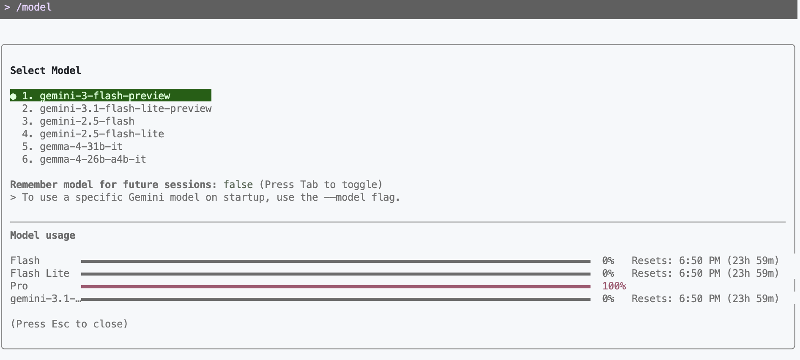
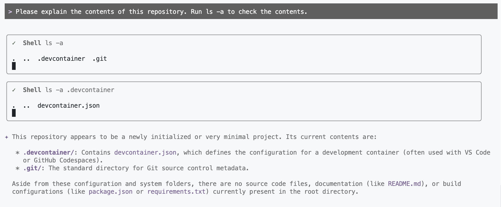
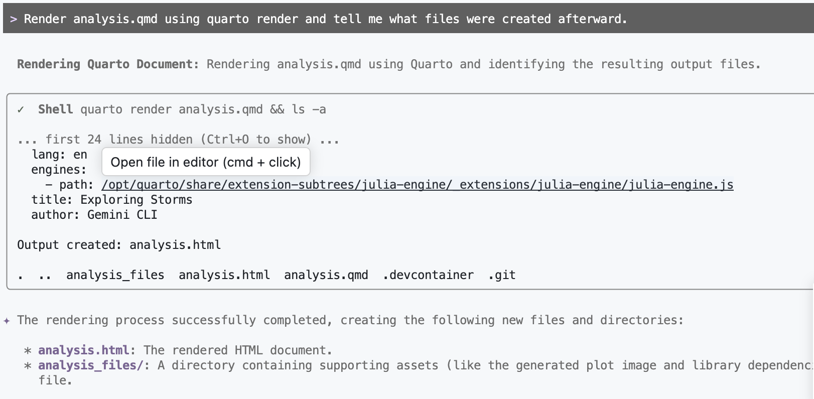
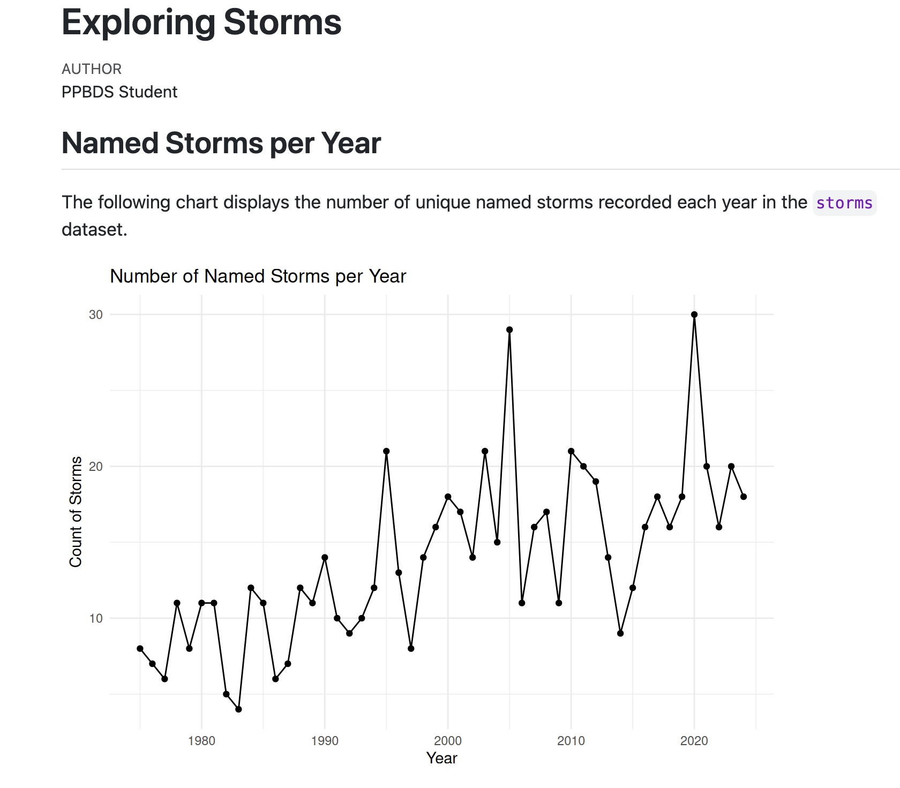
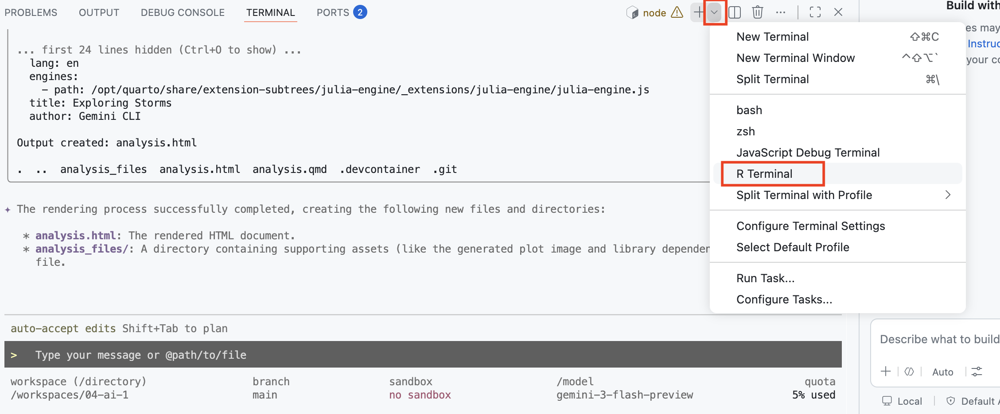
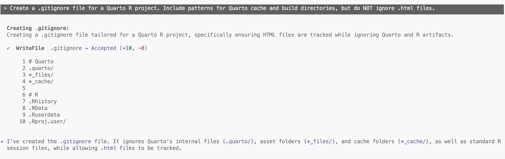

```{r setup, include = FALSE}
library(learnr)
library(tutorial.helpers)
library(knitr)
library(tidyverse)
library(nycflights13)

knitr::opts_chunk$set(echo = FALSE)
knitr::opts_chunk$set(out.width = '90%')
options(tutorial.exercise.timelimit = 60,
        tutorial.storage = "local")
```

```{r info-section, child = system.file("child_documents/info_section.Rmd", package = "tutorial.helpers")}
```

## Introduction
###

This is your first look at an AI *agent*. You have already used AI as a chat window --- asking a question and copy/pasting the answer back by hand. The [Gemini CLI](https://github.com/google-gemini/gemini-cli) is different: it is a terminal-based assistant that can read your files, run commands in the terminal, and write new files directly, asking your permission at each step. In this tutorial you will set it up and use it to explore a project and to create and render a Quarto analysis. A second section then teaches the core `analysis.qmd` workflow: one working chunk per artifact, iterative rewrites, and caching.

### Exercise 1

You must do this tutorial in a Codespace created from a GitHub repo named `04-ai-1`. If you haven't already done this, follow these steps:

1. Create a GitHub Repo: go to the [codespace-starter repo](https://github.com/ppbds-student/codespace-starter). Click the green "Use this Template" drop-down button and select "Create a new repository". Name the repo `04-ai-1`. Then click "Create repository".

2. Create a Codespace from `04-ai-1`: from this repo's page, click the green "Code" drop down button, select the "Codespaces" tab, and click "Create Codespace on main".

Copy and paste the URL for your `04-ai-1` repository.

```{r introduction-1}
question_text(NULL,
	answer(NULL, correct = TRUE),
	allow_retry = TRUE,
	try_again_button = "Edit Answer",
	incorrect = NULL,
	rows = 5)
```

###

Your answer should look something like:

````
https://github.com/ppbds-student/04-ai-1
````

###

The `codespace-starter` repo includes a `.devcontainer/devcontainer.json` file that tells GitHub exactly what to install when a Codespace starts. The Gemini CLI is already listed there, which is why you'll be able to run `gemini` immediately without installing anything yourself.

### Exercise 2

Copy and paste the URL for your Codespace.


```{r introduction-2}
question_text(NULL,
	answer(NULL, correct = TRUE),
	allow_retry = TRUE,
	try_again_button = "Edit Answer",
	incorrect = NULL,
	rows = 5)
```

###

Your answer should look something like:

````
https://congenial-chainsaw-wv757pv4pp67cpw.github.dev/
````

###

There are three main ways to interact with AI: a *chat interface* (like chatgpt.com), a *command-line tool* running in your terminal, and *an AI built into your editor* (like GitHub Copilot). This tutorial uses the command-line approach --- you'll run Gemini directly in the VS Code terminal, where it can read your files and take actions on your behalf. Feel free to close the Copilot sidebar.

### Exercise 3

At the bash Terminal, run `pwd`. CP/CR.

```{r introduction-3}
question_text(NULL,
	answer(NULL, correct = TRUE),
	allow_retry = TRUE,
	try_again_button = "Edit Answer",
	incorrect = NULL,
	rows = 6)
```

###

Your answer should look like:

````
@ppbds-student ➜ /workspaces/04-ai-1 (main) $ pwd
/workspaces/04-ai-1
@ppbds-student ➜ /workspaces/04-ai-1 (main) $
````

Gemini CLI can see exactly what you can see. Because it runs in the same directory (`/workspaces/04-ai-1`), any files here are directly accessible to it --- a key difference from a chat interface, where you'd have to manually paste file contents for the AI to read them.

### Exercise 4

Now, run `ls -a`. CP/CR.

```{r introduction-4}
question_text(NULL,
	answer(NULL, correct = TRUE),
	allow_retry = TRUE,
	try_again_button = "Edit Answer",
	incorrect = NULL,
	rows = 5)
```

###

Your answer should look like:

````
@ppbds-student ➜ /workspaces/04-ai-1 (main) $ ls -a
.  ..  .devcontainer  .git
@ppbds-student ➜ /workspaces/04-ai-1 (main) $
````

###

The `.git` directory tells both you and Gemini that this is a Git repository. When Gemini sees this, it knows it can run `git` commands --- like adding files to Git, reading the commit history, and pushing to GitHub.

## Gemini CLI
###

The [Gemini CLI](https://github.com/google-gemini/gemini-cli) is a free, open AI assistant built by Google that runs in your terminal. Unlike a web chat interface, it can take actions on your behalf: reading files, running terminal commands, and writing new files. Each time it wants to take an action, it asks for your permission first --- so you always stay in control.

### Exercise 1

Start the Gemini CLI by running `gemini` in the bash Terminal. First it will ask you if you wish to connect your Codespace to Gemini. Press `y` to allow it. Next, it will ask whether you trust the current working directory --- again, press `y`. 

CP/CR the first several lines of terminal output --- enough to show the authentication prompt and the `>` prompt that appears after you successfully log in.

```{r gemini-cli-1}
question_text(NULL,
	answer(NULL, correct = TRUE),
	allow_retry = TRUE,
	try_again_button = "Edit Answer",
	incorrect = NULL,
	rows = 10)
```

###

````
@ppbds-student ➜ /workspaces/04-ai-1 (main) $ gemini
? Do you want to connect to Gemini? Yes
? Do you trust the files in this folder? Yes

╭─────────────────────────────────────────────────────╮
│  Welcome to Gemini CLI                              │
│  Your AI-powered terminal assistant                 │
╰─────────────────────────────────────────────────────╯

To get started, authenticate with your Google account.
Visit the URL below, sign in, and paste the code here.

https://accounts.google.com/o/oauth2/auth?...

>
````

You may notice that VS Code renames the terminal tab from "bash" to "node" once Gemini starts. This is because the Gemini CLI is built on [Node.js](https://nodejs.org/en/about), and VS Code detects this and updates the tab name.


```{r}
include_graphics("images/node-terminal.png")
```

### Exercise 2

It will then ask you to authenticate with your Google account. You will see a URL printed in the terminal. 
```{r}
include_graphics("images/gemini-CLI-auth-link.png")
```

Open that URL in your browser, sign in with your Google account, and copy the authorization code that appears on the page. Paste it back into the terminal and press `Enter`. Then, Copy and Paste the tips to get started which will appear once Gemini is done authenticating.


```{r gemini-cli-2}
question_text(NULL,
	answer(NULL, correct = TRUE),
	allow_retry = TRUE,
	try_again_button = "Edit Answer",
	incorrect = NULL,
	rows = 5)
```

###

```{r}
include_graphics("images/gemini-CLI-auth-done.png")
```

###

This uses [OAuth 2.0](https://oauth.net/2/), the same standard behind "Sign in with Google" buttons --- you grant a temporary permission token rather than sharing your password. The token is saved in this Codespace, but each new Codespace requires a fresh sign-in.

### Exercise 3

You are now inside the Gemini CLI interactive session. The `>` prompt means Gemini is waiting for your input. Type `/help` and press `Enter` to see the list of available commands.

CP/CR.

```{r gemini-cli-3}
question_text(NULL,
	answer(NULL, correct = TRUE),
	allow_retry = TRUE,
	try_again_button = "Edit Answer",
	incorrect = NULL,
	rows = 18)
```

###

````
> /help

Available commands:
  /help              Show this help message
  /quit or /exit     Exit the Gemini CLI
  /model             Show or change the current model
  /stats session     Show usage statistics for this session
  /stats model       Show model token limits and current usage
  /clear             Clear the current conversation history
  /chat              List and restore saved chats
...
>
````

Note that your output will likely be longer than what is shown here, as the Gemini CLI adds new commands regularly.

###

Slash commands control the program itself, not Gemini --- the command `/help` tells the *program* to print its options, while a plain sentence talks to *Gemini*. For factual session data like usage statistics, always use slash commands rather than asking Gemini, which will only guess.

### Exercise 4

Type `/model` to see which Gemini model is currently active. CP/CR.

```{r gemini-cli-4}
question_text(NULL,
	answer(NULL, correct = TRUE),
	allow_retry = TRUE,
	try_again_button = "Edit Answer",
	incorrect = NULL,
	rows = 4)
```

###

```{r}

```

You may see something different here depending on your Gemini CLI version — that's fine, don't worry about it.

###

The Gemini model family has several tiers: **Pro** for complex reasoning and coding tasks, **Flash** for speed and lower usage. You can switch mid-session with `/model model-name` if you want to save your daily limit for simpler work or use a more powerful model.

### Exercise 5

Ask Gemini to describe what files are in the repository. Type something like:

```
Please explain the contents of this repository. Run ls -a to check the contents.
```

Gemini will display a **tool authorization prompt** before running commands. It should look something like this:

```{r}
include_graphics("images/gemini-CLI-git-permission.png")
```

Press `1` or hit enter where it says allow once to allow the command to run. You could press `2` to allow Gemini to run the same command without asking again in this session. CP/CR the authorization prompt and Gemini's response.


```{r gemini-cli-5}
question_text(NULL,
	answer(NULL, correct = TRUE),
	allow_retry = TRUE,
	try_again_button = "Edit Answer",
	incorrect = NULL,
	rows = 15)
```

###

```{r}

```

<!-- AR: Update KD to explain that it's difficult to predict the exact tool calls the AI will make for any prompt. 

Future KD content: 3 levels of authorization: one-time, always in project, always across projects (need to configure in global settings) -->

The tool authorization prompt is a deliberate safety feature --- an AI that could silently run commands in your terminal without asking would be a significant security risk.

### Exercise 6

Ask Gemini to create an `analysis.qmd` file. Tell it you want:

- A YAML header with the title `"Exploring Storms"` and your name as author
- `execute: echo: false` in the YAML
- A setup chunk loading `library(tidyverse)` wrapped in `suppressPackageStartupMessages()`
- A plot using the `storms` dataset from **dplyr** --- for example, a line chart showing the number of named storms per year

Press `y` when Gemini asks to write the file. CP/CR the tool authorization and Gemini's explanation of what it created.

```{r gemini-cli-6}
question_text(NULL,
	answer(NULL, correct = TRUE),
	allow_retry = TRUE,
	try_again_button = "Edit Answer",
	incorrect = NULL,
	rows = 12)
```

###

Your output should look something like:

````
> Create an analysis.qmd with a title, author, execute echo false, suppressPackageStartupMessages tidyverse, and a ggplot2 plot using a built-in dataset.

╔ Tool Use: write_file ════════════════════╗
║  Path: analysis.qmd                      ║
╚══════════════════════════════════════════╝

Allow this tool call? (1=once, 2=always, n=no): 1

✔ Created analysis.qmd

I've created `analysis.qmd` with:
- YAML header titled "Exploring Storms" and `execute: echo: false`
- Setup chunk using `suppressPackageStartupMessages(library(tidyverse))`
- A line chart showing the number of named storms per year using the `storms` dataset

>
````

###

When you ask Gemini to create a file, it generates the entire contents in one step and writes it for you. Instead of typing the YAML header, chunk settings, and library calls yourself, you describe what you want and refine the result --- editing is almost always faster than composing from scratch.

### Exercise 7

Still inside Gemini, ask it to render `analysis.qmd` for you. Type something like:

```
Render analysis.qmd using quarto render and tell me what files were created afterward.
```

Gemini will issue two tool calls: one to render the document and one to list the resulting files. Press `y` for each. CP/CR the output.

```{r gemini-cli-7}
question_text(NULL,
	answer(NULL, correct = TRUE),
	allow_retry = TRUE,
	try_again_button = "Edit Answer",
	incorrect = NULL,
	rows = 15)
```

###

```{r}

```

###

Gemini ran two commands to answer one question, using the result of each step to decide what to do next. This is what makes it an AI *agent* --- it takes actions and reasons about results, rather than just producing text.

### Exercise 8

Let's view the rendered file in a browser. In the Explorer (the file tree on the left side of VS Code), find `analysis.html`. Right-click it and select **"Open with Live Server"**.

```{r}
include_graphics("images/live-server.png")
```

This opens `analysis.html` in a new browser tab served through your Codespace. The URL will look something like `https://[codespace-name]-5500.app.github.dev/analysis.html`.

Copy/paste that URL below.

```{r gemini-cli-8}
question_text(NULL,
	answer(NULL, correct = TRUE),
	allow_retry = TRUE,
	try_again_button = "Edit Answer",
	incorrect = NULL,
	rows = 3)
```

###

````
https://congenial-chainsaw-wv757pv4pp67cpw-5500.app.github.dev/analysis.html
````

Keep this tab open. Every time `analysis.html` is updated in your Codespace --- whether by Gemini or by running `quarto render` yourself --- the tab will automatically refresh.

###

Your rendered file should look something like this:

```{r}

```

###

Live Server is a VS Code extension that hosts HTML files so they can be viewed in a browser and reloads the page whenever a file changes. This is necessary in a Codespace because the files live on a remote computer and cannot be opened directly in a browser.

### Exercise 9

Ask Gemini: Add a plot to a new code chunk in `analysis.qmd` using the `storms` dataset. Visualize something like a boxplot showing the distribution of wind speeds by storm category. Include a meaningful title and subtitle, and then to render the file.

After Gemini finishes, check your Live Server tab --- it should have refreshed automatically to show the plot. Open a new R Terminal. 

```{r}

```

Then, in the new R Terminal, run:

```
tutorial.helpers::show_file("analysis.qmd", chunk = "Last")
```

CP/CR.

```{r gemini-cli-9}
question_text(NULL,
	answer(NULL, correct = TRUE),
	allow_retry = TRUE,
	try_again_button = "Edit Answer",
	incorrect = NULL,
	rows = 20)
```

###

```{r gemini-cli-9-test}
#| echo: true
storms %>%
  filter(!is.na(category)) %>%
  mutate(category = as.factor(category)) %>%
  ggplot(aes(x = category, y = wind, fill = category)) +
  geom_boxplot() +
  labs(
    title = "Distribution of Wind Speeds by Storm Category",
    subtitle = "Higher categories correspond to significantly higher median wind speeds",
    x = "Storm Category",
    y = "Wind Speed (knots)",
    fill = "Category"
  ) +
  theme_minimal() +
  theme(legend.position = "none")
```

Your answer will vary, but it should show **ggplot2** code using the `storms` dataset --- something like a boxplot of wind speed by storm category. The chunk should not have `#| echo: true` --- since you set `execute: echo: false` in the YAML header, all chunks use that setting by default.

###

When Gemini adds a plot and re-renders, two things happen automatically: Quarto updates `analysis.html`, and Live Server detects the change and refreshes your browser. This loop --- ask Gemini, render, view --- is the same workflow you would use throughout a real project.

### Exercise 10

Ask Gemini to create a `.gitignore` file suitable for a Quarto R project. Type something like:

```
Create a .gitignore file.
```

<!-- AR: Need expected submission. Show_file(".gitignore") -->

```{r gemini-cli-10}
question_text(NULL,
	answer(NULL, correct = TRUE),
	allow_retry = TRUE,
	try_again_button = "Edit Answer",
	incorrect = NULL,
	rows = 12)
```

###

<!-- AR: hack to not include any cache directories -->

```{r}

```

###

Git tracks changes to files in your repository, but there are certain files that we should not track. A `.gitignore` tells Git to ignore certain files entirely. The guiding principle: if a file can be *regenerated* from your source, it doesn't belong in the commit history.

### Exercise 11

<!-- AR: Combine with ex. 10 -->

Ask Gemini to show you the contents of the `.gitignore` it just created. Type something like:

```
Show me the contents of .gitignore.
```

Press `y` to authorize the shell command. CP/CR.

```{r gemini-cli-11}
question_text(NULL,
	answer(NULL, correct = TRUE),
	allow_retry = TRUE,
	try_again_button = "Edit Answer",
	incorrect = NULL,
	rows = 12)
```

###

Your output should look something like:

````
> Show me the contents of .gitignore                                                                                       

  ✓  ReadFile  .gitignore

✦ The contents of .gitignore are:

    1 # Quarto
    2 .quarto/
    3 *_files/
    4 *_cache/
    5
    6 # R
    7 .Rhistory
    8 .RData
    9 .Ruserdata
   10 .Rproj.user/
````

###

Asking Gemini to read back a file it just created is a quick way to verify the contents without leaving Gemini. The underlying command is the same `cat` you would run yourself --- Gemini just runs it on your behalf and shows you the result.


### Exercise 12

Before moving on, let's deliberately quit and restart Gemini to see what happens to the conversation history. Type `/quit`.

Now run `gemini` to start a fresh session. Once you're at the `>` prompt, ask:

```
What have we done in this project so far?
```

Without reading any files, Gemini will have no memory of the previous session. Press `y` to let it read the repo and watch it reconstruct the context from the filesystem.

CP/CR Gemini's full response.

```{r gemini-cli-12}
question_text(NULL,
	answer(NULL, correct = TRUE),
	allow_retry = TRUE,
	try_again_button = "Edit Answer",
	incorrect = NULL,
	rows = 15)
```

###

````
Based on the current state of the repository, the project is in its early stages. Here is a summary of what has been done:

   1. Initial Setup: The project has been initialized with a basic Quarto structure, including a .devcontainer for development and a .gitignore file.
   2. Storms Analysis: You have created analysis.qmd, which uses R and the tidyverse to explore the storms dataset. It currently includes:
       * Named Storms per Year: A line and point plot showing the count of unique named storms from year to year.
       * Wind Speed Distribution: A boxplot visualizing how wind speeds vary across different storm categories.
   3. Output Generation: The analysis has been rendered into analysis.html.

  There are no other project-specific instructions (GEMINI.md) or memory records yet. Would you like to continue the analysis or add new features to this report?
````

###

Gemini's **conversation history** is gone the moment you type `/quit`, but the **files on disk** are permanent --- this is why it can pick up where you left off after a restart just by reading the files. The `/chat save <name>` command lets you preserve a conversation so you can resume it later with `/chat resume <name>`.

## Gemini in tutorials
###

In future tutorials you will spend most of your time prompting an AI agent to edit `analysis.qmd`, as well as rendering, and inspecting the resulting HTML. This section introduces key aspects of creating analysis.qmd files including: maintaining one working chunk per final artifact, iteratively rewriting that chunk to keep only necessary code, managing code chunk outputs in your rendered file, and caching results. Throughout this section we will explicitly tell you to use AI; in future tutorials that is always assumed.

### Exercise 1

In the R Terminal, run:

```
show_file("analysis.qmd")
```

CP/CR.

```{r gemini-in-tutorials-1}
question_text(NULL,
	answer(NULL, correct = TRUE),
	allow_retry = TRUE,
	try_again_button = "Edit Answer",
	incorrect = NULL,
	rows = 25)
```

###

<!-- AR: weird printing!! no code chunk delimeters -->

<pre><code>---
title: "Exploring Storms"
author: "PPBDS Student"
format: html
execute:
  echo: false
---

#| label: setup
#| include: false
suppressPackageStartupMessages(library(tidyverse))

## Named Storms per Year

The following chart displays the number of unique named storms recorded each year in the `storms` dataset.

#| label: storms-plot
storms %>%
  distinct(year, name) %>%
  count(year) %>%
  ggplot(aes(x = year, y = n)) +
  geom_line() +
  geom_point() +
  labs(
    title = "Number of Named Storms per Year",
    x = "Year",
    y = "Count of Storms"
  ) +
  theme_minimal()

## Wind Speed Distribution by Category

This boxplot shows the distribution of maximum wind speeds for each category of storm. It highlights how intensity increases across the categories defined in the dataset.

#| label: wind-distribution-plot
storms %>%
  filter(!is.na(category)) %>%
  mutate(category = as.factor(category)) %>%
  ggplot(aes(x = category, y = wind, fill = category)) +
  geom_boxplot() +
  labs(
    title = "Distribution of Wind Speeds by Storm Category",
    subtitle = "Higher categories correspond to significantly higher median wind speeds",
    x = "Storm Category",
    y = "Wind Speed (knots)",
    fill = "Category"
  ) +
  theme_minimal() +
  theme(legend.position = "none")
</code></pre>

Each blank line in the output marks a boundary between chunks --- the fence lines are stripped, so a blank line is all that remains between one chunk and the next.

###

Keep chunks clean as you work. Code chunks should contain clean code that we'd like to keep or should be the working chunk in which we are iteratively rewriting as we do our work.

### Exercise 2

Ask Gemini to consolidate `analysis.qmd` so it contains only the setup chunk and the named-storms-per-year line chart. Delete any other chunks. Render. In the R Terminal, run `show_file("analysis.qmd")`. CP/CR.

Throughout this tutorial we will often say "ask Gemini to" when we want you to use AI.

```{r gemini-in-tutorials-2}
question_text(NULL,
	answer(NULL, correct = TRUE),
	allow_retry = TRUE,
	try_again_button = "Edit Answer",
	incorrect = NULL,
	rows = 20)
```

###

<pre><code>---
title: "Exploring Storms"
author: "PPBDS Student"
format: html
execute:
  echo: false
---

#| label: setup
#| include: false
suppressPackageStartupMessages(library(tidyverse))

## Named Storms per Year

The following chart displays the number of unique named storms recorded each year in the `storms` dataset.

#| label: storms-plot
storms %>%
  distinct(year, name) %>%
  count(year) %>%
  ggplot(aes(x = year, y = n)) +
  geom_line() +
  geom_point() +
  labs(
    title = "Number of Named Storms per Year",
    x = "Year",
    y = "Count of Storms"
  ) +
  theme_minimal()
</code></pre>

###

Each code chunk should produce **one** final artifact --- either cleaned data or a plot. A chunk that mixes exploratory steps with its final output needs to be cleaned up. In tutorials, the goal usually one working chunk per topic, updated cleanly along the way.

###

Sometimes a code chunk takes a long time to run. We can **cache** a code chunk to save its results and avoid re-running it on subsequent renders.

### Exercise 3

Add `#| cache: true` to the storms chunk. Render. In the bash Terminal, run `ls`. CP/CR.

```{r gemini-in-tutorials-3}
question_text(NULL,
	answer(NULL, correct = TRUE),
	allow_retry = TRUE,
	try_again_button = "Edit Answer",
	incorrect = NULL,
	rows = 5)
```

###

Your answer should look something like:

````
@ppbds-student ➜ /workspaces/04-ai-1 (main) $ ls
analysis.html  analysis_cache  analysis_files  analysis.qmd
@ppbds-student ➜ /workspaces/04-ai-1 (main) $
````

###

Caching is a render-time feature. The first render writes the chunk's result to disk; later renders skip re-running the chunk and load from disk instead. `analysis_cache/` appearing in `ls` confirms it is wired up.

### Exercise 4

Ask Gemini to add `analysis_cache` to `.gitignore`. Note that the Source Control badge count in VS Code has increased because the cache directory is now visible to git --- adding this line makes it drop back. In the R Terminal, run `show_file(".gitignore")`. CP/CR.

```{r gemini-in-tutorials-4}
question_text(NULL,
	answer(NULL, correct = TRUE),
	allow_retry = TRUE,
	try_again_button = "Edit Answer",
	incorrect = NULL,
	rows = 6)
```

###

````
*_files/
analysis_cache
````

###

Cache files are regenerated from source and do not belong in git. The rule is simple: if a file can be rebuilt, do not commit it.

### Exercise 5

Ask Gemini to add a **new chunk** at the bottom of `analysis.qmd` that prints the `flights` dataset. Render. In the R Terminal, run `show_file("analysis.qmd", chunk = "Last")`. CP/CR.

```{r gemini-in-tutorials-5}
question_text(NULL,
	answer(NULL, correct = TRUE),
	allow_retry = TRUE,
	try_again_button = "Edit Answer",
	incorrect = NULL,
	rows = 4)
```

###

<!-- AR: include the library call here? -->

```{r gemini-in-tutorials-5-test}
#| echo: true
flights
```

###

`flights` is a dataset from the **nycflights13** package with 336,776 rows --- every flight that departed from one of New York City's three airports (JFK, LGA, EWR) in 2013, with departure and arrival times, delays, carrier, destination, and more.

### Exercise 6

Ask Gemini to update the last chunk to pipe `flights` through `glimpse()`. Render and inspect the output. In the R Terminal, run `show_file("analysis.qmd", chunk = "Last")`. CP/CR.

```{r gemini-in-tutorials-6}
question_text(NULL,
	answer(NULL, correct = TRUE),
	allow_retry = TRUE,
	try_again_button = "Edit Answer",
	incorrect = NULL,
	rows = 5)
```

###

```{r gemini-in-tutorials-6-test}
#| echo: true
flights |> 
glimpse()
```

###

`glimpse()` gives a column-level overview of a dataset --- every variable name, its type, and a few example values on one screen. Use this and/or other similar functions like `summary()` to initially explore any unfamiliar dataset.

### Exercise 7

Ask Gemini to update the working chunk to filter `flights` to `origin == "JFK"` and select `dep_delay`, `arr_delay`, and `carrier`. Leave the result as the final expression so it prints. Render. In the R Terminal, run `show_file("analysis.qmd", chunk = "Last")`. CP/CR.

```{r gemini-in-tutorials-7}
question_text(NULL,
	answer(NULL, correct = TRUE),
	allow_retry = TRUE,
	try_again_button = "Edit Answer",
	incorrect = NULL,
	rows = 6)
```

###

```{r gemini-in-tutorials-7-test}
#| echo: true
flights |>
  filter(origin == "JFK") |>
  select(dep_delay, arr_delay, carrier)
```

###

The pipe `|>` passes the left side's result directly to the next function. Reading it as "and then" helps: take `flights`, **and then** keep only JFK departures, **and then** keep these three columns. The result prints because the final expression is a value, not an assignment.

### Exercise 8

Ask Gemini to save the filtered tibble to a variable called `flights_jfk` instead of printing it directly. Render and notice the table disappears from the HTML. In the R Terminal, run `show_file("analysis.qmd", chunk = "Last")`. CP/CR.

```{r gemini-in-tutorials-8}
question_text(NULL,
	answer(NULL, correct = TRUE),
	allow_retry = TRUE,
	try_again_button = "Edit Answer",
	incorrect = NULL,
	rows = 6)
```

###

```{r gemini-in-tutorials-8-test}
#| echo: true
flights_jfk <- flights |>
  filter(origin == "JFK") |>
  select(dep_delay, arr_delay, carrier)
```

###

Assignment captures the result silently --- a chunk that only uses `<-` to assign a value to an object produces no output in the render. A blank section in the HTML is not an error; it means the chunk built an object without displaying it.

### Exercise 9

Ask Gemini to add a line to the chunk that prints `flights_jfk`. Render and confirm the table reappears. In the R Terminal, run `show_file("analysis.qmd", chunk = "Last")`. CP/CR.

```{r gemini-in-tutorials-9}
question_text(NULL,
	answer(NULL, correct = TRUE),
	allow_retry = TRUE,
	try_again_button = "Edit Answer",
	incorrect = NULL,
	rows = 8)
```

###

```{r gemini-in-tutorials-9-test}
#| echo: true
flights_jfk <- flights |>
  filter(origin == "JFK") |>
  select(dep_delay, arr_delay, carrier)

flights_jfk
```

###

Calling a variable by name on the last line of a chunk is all it takes to print it. Ending a data-preparation chunk with the variable name is a standard way to confirm its shape before building a plot.

### Exercise 10

<!-- AR: Create a new chunk for the plot. First chunk creates and prints flights_jfk. -->

Ask Gemini to replace the `flights_jfk` print line with a ggplot2 scatter plot of `dep_delay` vs. `arr_delay`, colored by `carrier`. Render. In the R Terminal, run `show_file("analysis.qmd", chunk = "Last")`. CP/CR.

```{r gemini-in-tutorials-10}
question_text(NULL,
	answer(NULL, correct = TRUE),
	allow_retry = TRUE,
	try_again_button = "Edit Answer",
	incorrect = NULL,
	rows = 10)
```

###

```{r gemini-in-tutorials-10-test}
#| echo: true
flights_jfk <- flights |>
  filter(origin == "JFK") |>
  select(dep_delay, arr_delay, carrier)

ggplot(flights_jfk, aes(x = dep_delay, y = arr_delay, color = carrier)) +
  geom_point(alpha = 0.1) +
  labs(title = "Departure vs. Arrival Delay for JFK Flights",
       x = "Departure Delay (min)", y = "Arrival Delay (min)")
```

###

The chunk now has two parts: the silent assignment and the plot call. Only the plot renders as output --- the assignment runs but produces nothing visible.

### Exercise 11

In the R Terminal, run `show_file("analysis.qmd")`. CP/CR.

```{r gemini-in-tutorials-11}
question_text(NULL,
	answer(NULL, correct = TRUE),
	allow_retry = TRUE,
	try_again_button = "Edit Answer",
	incorrect = NULL,
	rows = 30)
```

###

Your answer should look something like:

<pre><code>---
title: "Exploring Storms"
author: Your Name
execute:
  echo: false
---

#| message: false
suppressPackageStartupMessages(library(tidyverse))
library(nycflights13)

#| cache: true
storms |>
  count(year) |>
  ggplot(aes(x = year, y = n)) +
  geom_line() +
  labs(title = "Named Storms per Year", x = "Year", y = "Number of Storms")

flights_jfk <- flights |>
  filter(origin == "JFK") |>
  select(dep_delay, arr_delay, carrier)

ggplot(flights_jfk, aes(x = dep_delay, y = arr_delay, color = carrier)) +
  geom_point(alpha = 0.1) +
  labs(title = "Departure vs. Arrival Delay for JFK Flights",
       x = "Departure Delay (min)", y = "Arrival Delay (min)")
</code></pre>

###

From here on, using AI to write your analysis code is always the assumed approach --- you will describe a goal, let the agent write the code (generally in a working code chunk), render, and inspect the result.

## Summary
###

This tutorial introduced the [Gemini CLI](https://github.com/google-gemini/gemini-cli) as an AI *agent* --- a terminal-based assistant that reads your files, runs commands, and writes files on your behalf, asking permission at each step. You authenticated with your Google account, let Gemini explore the repository, and used it to create and render a Quarto analysis. You then practiced the core `analysis.qmd` workflow: maintaining one working chunk per artifact, iteratively rewriting it, suppressing output, and caching results.

### Exercise 1

Quit Gemini with `/quit` if you haven't already. From the bash Terminal, run:

```
quarto render analysis.qmd
```

CP/CR.

```{r summary-1}
question_text(NULL,
	answer(NULL, correct = TRUE),
	allow_retry = TRUE,
	try_again_button = "Edit Answer",
	incorrect = NULL,
	rows = 10)
```

###

Your output should look something like:

```
(/) Rendering analysis.qmd
pandoc
  to: html
  output-file: analysis.html
  standalone: true
  section-divs: true
  html-math-method: mathjax
  wrap: none
  default-image-extension: png

metadata
  document-css: false
  link-citations: true
  date-format: long
  lang: en

Output created: analysis.html
```

###

You have not saved this work to GitHub yet --- that takes Git, which you have not learned at this point in the curriculum.

###

Other AI coding tools include [Claude Code](https://claude.ai/claude-code) (Anthropic), [GitHub Copilot](https://github.com/features/copilot) (Microsoft), and [Cursor](https://cursor.sh/) (Anysphere). The workflow is the same across all of them: describe what you want, review the result, and iterate.

```{r download-answers, child = system.file("child_documents/download_answers.Rmd", package = "tutorial.helpers")}
```

