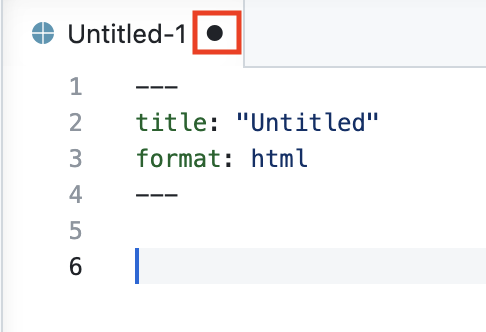
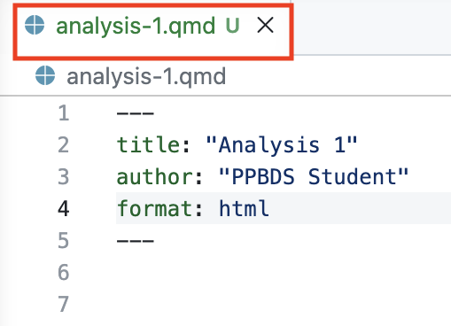
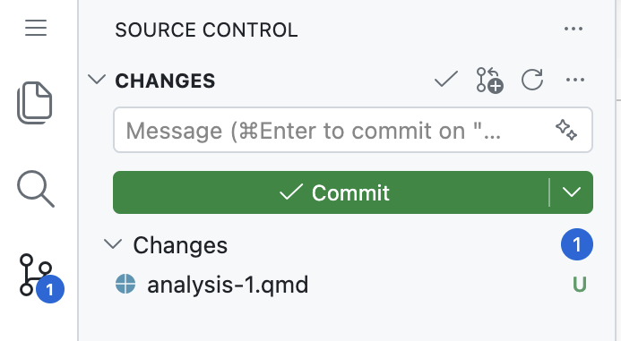
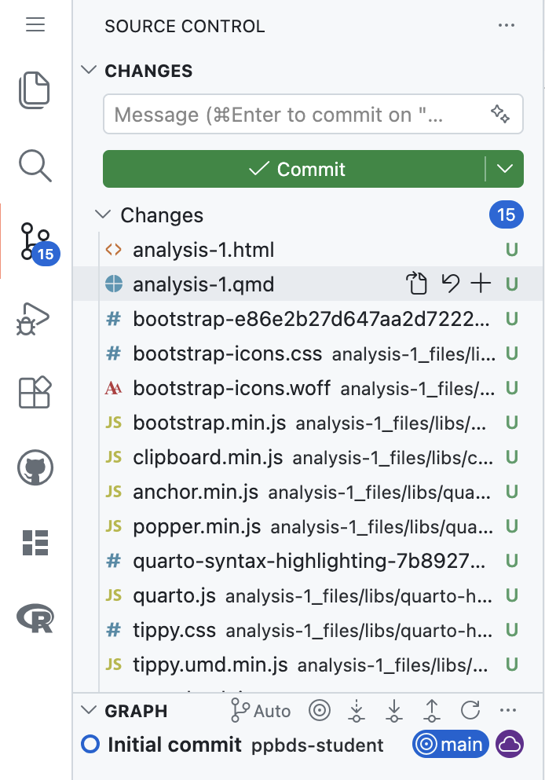
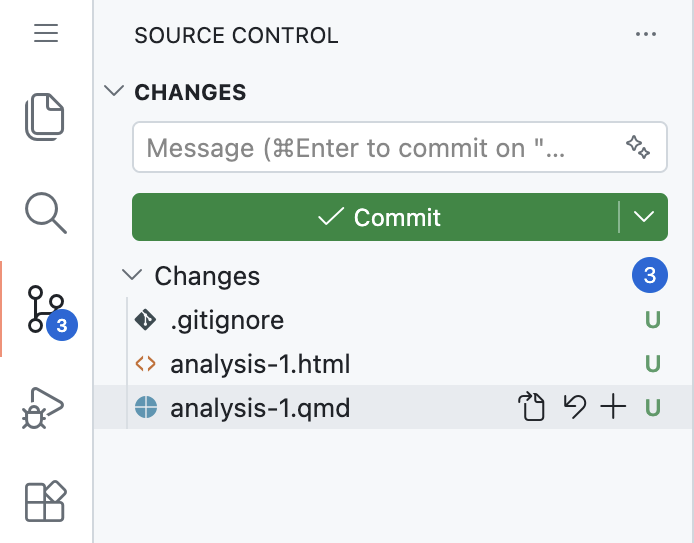
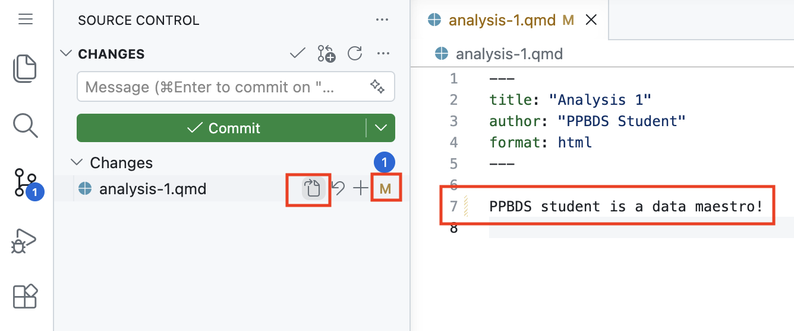

```{r setup, include = FALSE}
library(learnr)
library(tutorial.helpers)
library(knitr)

library(tidyverse)
library(usethis)
library(gitcreds)

knitr::opts_chunk$set(echo = FALSE)
knitr::opts_chunk$set(out.width = '90%')
options(tutorial.exercise.timelimit = 60, 
        tutorial.storage = "local")
```


```{r info-section, child = system.file("child_documents/info_section.Rmd", package = "tutorial.helpers")}
```

<!-- Change First-Repo to `repo-1`. Then, update all the relevant PNG files. -->

<!-- Stop being afraid of the command line. Use lots of git commands.  -->

<!-- Should we be using suppressPack..() and execute: trickery in our publishing example? Or should we make it simpler, just using code chunk options?  -->

<!-- Should we have a repo-3? Only if this tutorial only takes 45 minutes now, which I doubt. -->

## Introduction
### 

This tutorial covers [Git](https://git-scm.com/), a program for keeping track of changes in your code, and [GitHub](https://github.com/), the leading company for storing your code in the cloud. Some material is from [*R for Data Science (2e)*](https://r4ds.hadley.nz/) by Hadley Wickham, Mine Çetinkaya-Rundel, and Garrett Grolemund. 

The most useful references for Git/GitHub are [*Happy Git and GitHub for the useR*](https://happygitwithr.com/) and [*Pro Git*](https://git-scm.com/book/en/v2). Refer to these for questions and further learning. Or ask AI!

<!-- DK: This should all be cut. But maybe more of these details belong in Getting Started chapter and the Getting Started tutorial.


Or, rather, students need to learn how to create a new repo, not the one they are in, which is 04-github-1, from scratch.
 
 AR: We'll teach to create a new repo in 05-github-2 and focus on git fundamentals and publishing here - right? Cut all git setup sections.
 -->

## Using Git
### 

GitHub is an online drive for all your R code and projects. In the professional world, what you have on your GitHub account is sometimes more important than what you have on your resume. It is a verifiable demonstration of your abilities.

You've already been creating and storing git repositories on Github. Now, we'll practice using the Git program.

[Git](https://en.wikipedia.org/wiki/Git) is "software for tracking changes in any set of files, usually used for coordinating work among programmers collaboratively developing source code during software development."


### Exercise 1

At the Terminal, run `pwd`. CP/CR.

```{r using-git-1}
question_text(NULL,
	answer(NULL, correct = TRUE),
	allow_retry = TRUE,
	try_again_button = "Edit Answer",
	incorrect = NULL,
	rows = 3)
```

###

Your answer should look like:

````
@ppbds-student ➜ /workspaces/04-github-1 (main) $ pwd
/workspaces/04-github-1
@ppbds-student ➜ /workspaces/04-github-1 (main) $
````

You should be in a directory named `04-github-1`. By default, the creating a repo from the Codespace starter and opening a Codespace creates this root directory.

### Exercise 2

At the Terminal, run `ls`. CP/CR.

```{r using-git-2}
question_text(NULL,
	answer(NULL, correct = TRUE),
	allow_retry = TRUE,
	try_again_button = "Edit Answer",
	incorrect = NULL,
	rows = 3)
```

###

Your answer should look like:

````
@ppbds-student ➜ /workspaces/04-github-1 (main) $ ls
@ppbds-student ➜ /workspaces/04-github-1 (main) $ 
````

There are no non-hidden files or directories in the repository so far.

### Exercise 3

At the Terminal, run `ls -a`. The `a` option tells `ls` to show all directories/files, including ones that are hidden, i.e., which start with a dot, meaning a `.`. CP/CR.

```{r using-git-3}
question_text(NULL,
	answer(NULL, correct = TRUE),
	allow_retry = TRUE,
	try_again_button = "Edit Answer",
	incorrect = NULL,
	rows = 3)
```

###

Your answer should look like:

````
@ppbds-student ➜ /workspaces/04-github-1 (main) $ ls -a
.  ..  .devcontainer  .git
@ppbds-student ➜ /workspaces/04-github-1 (main) $
````

`.` refers to the current directory. `..` stands for the parent directory. These two links are present in (almost) every directory on your computer.

`.git` is a hidden directory used by the program Git to keep track of all the files in your project. 

Unless you have a good reason, you should never mess with the contents of a hidden directory like `.git`.

### Exercise 4

At the Terminal, create a new quarto document. From the three horizontal bar icon in the Activity Bar, select `File -> New File...` then select `Quarto Document` from the drop-down menu. This opens the new file in the Editor.

```{r}

```

Notice how there is a black dot next in the `analysis-1.qmd` tab in the Editor. This indicates that file is unsaved.

Change the title to "First Analysis" add your name as an author. Save the file with `Cmd/Ctrl + S` as `analysis-1.qmd`.

```{r}

```

Notice how after saving, the `analysis-1.qmd` tab in the Editor is now green with a "U". This indicates that the file is saved, but the file is **U**ntracked by Git.

Then run `cat analysis-1.qmd`.

CP/CR.

```{r using-git-4}
question_text(NULL,
	answer(NULL, correct = TRUE),
	allow_retry = TRUE,
	try_again_button = "Edit Answer",
	incorrect = NULL,
	rows = 3)
```

###

You should have something like this:

````
@ppbds-student ➜ /workspaces/04-github-1 (main) $ cat analysis-1.qmd 
---
title: "Analysis 1"
author: "PPBDS Student"
format: html
---

@ppbds-student ➜ /workspaces/04-github-1 (main) $
````


### Exercise 5

Click the Source Control button in the Activity Bar. This opens the Source Control pane, which is an interface to using Git and GitHub.

```{r}

```

The top part of the pane shows the files that have been added/modified. This is Git telling you what it thinks has changed. Again, the "U" next to the end of the line for `analysis-1.qmd` indicates that Git has noticed changes to the file but that they are **U**ntracked.

Render `analysis-1.qmd` with `Cmd/Cntrl + Shift + K`.

The Terminal tab is filled with a bunch of commands. Copy/paste the last few lines.

```{r using-git-5}
question_text(NULL,
	answer(NULL, correct = TRUE),
	allow_retry = TRUE,
	try_again_button = "Edit Answer",
	incorrect = NULL,
	rows = 6)
```

###

Your answer should look like:

````
metadata
  document-css: false
  link-citations: true
  date-format: long
  lang: en
  
Output created: README.html

Watching files for changes
Browse at http://localhost:7383/
````

### Exercise 6

The VS Code window has changed quite a bit. The Viewer tab has appeared, showing the HTML. The Source Control pane now includes many new files. The Terminal tab is not showing us a prompt.


We can stop the previewing of `analysis-1.qmd` by typing `Ctrl + c` in the Terminal.  Once we do, the Viewer tab is empty, so we can close the entire Secondary Activity Bar.

From the Terminal, run `ls`. CP/CR.

```{r using-git-6}
question_text(NULL,
	answer(NULL, correct = TRUE),
	allow_retry = TRUE,
	try_again_button = "Edit Answer",
	incorrect = NULL,
	rows = 6)
```

###

Your answer should look like:

````
@ppbds-student ➜ /workspaces/04-github-1 (main) $ ls
analysis-1_files  analysis-1.html  analysis-1.qmd
@ppbds-student ➜ /workspaces/04-github-1 (main) $ 
````

The bottom part of the Source Control pane shows the history of changes in this repo.

### Exercise 7

Look more closely at the Source Control pane:

```{r}

```

We have a many new files like, `analysis.html`, created when we rendered `analysis-1.qmd`. They have "U" indicators because, according to git, they are **U**ntracked. Many of these files are weird and confusing. It turns out that all these files live in the `analysis-1_files` directory.

From the Terminal, run `ls -R analysis-1_files`. The `-R` option means **r**ecursive. CP/CR.


```{r using-git-7}
question_text(NULL,
	answer(NULL, correct = TRUE),
	allow_retry = TRUE,
	try_again_button = "Edit Answer",
	incorrect = NULL,
	rows = 3)
```

###

Your answer should look like:

````
@ppbds-student ➜ /workspaces/04-github-1 (main) $ ls -R analysis-1_files
analysis-1_files:
libs

analysis-1_files/libs:
bootstrap  clipboard  quarto-html

analysis-1_files/libs/bootstrap:
bootstrap-e86e2b27d647aa2d7222437750a2ec6e.min.css  bootstrap-icons.css  bootstrap-icons.woff  bootstrap.min.js

analysis-1_files/libs/clipboard:
clipboard.min.js

analysis-1_files/libs/quarto-html:
anchor.min.js  popper.min.js  quarto-syntax-highlighting-7b89279ff1a6dce999919e0e67d4d9ec.css  tippy.css
axe            quarto.js      tabsets                                                          tippy.umd.min.js

analysis-1_files/libs/quarto-html/axe:
axe-check.js

analysis-1_files/libs/quarto-html/tabsets:
tabsets.js
@ppbds-student ➜ /workspaces/04-github-1 (main) $ 
````

Whenever you render a document using Quarto, it creates a directory called `base-name-of-your-file_files`. Since the base name of `analysis-1.qmd` is `analysis-1`, the new directory created is `analysis-1_files`. This directory is filled with the programs/information/etc which helped to turn `analysis-1.qmd` into `analysis-1.html`. This is mostly confusing stuff that we should ignore. In fact, we usually don't even want it monitored by Git or stored on GitHub.

### Exercise 8

From the three horizontal bar icon, `File -> New Text File`. Save this new file as `.gitignore`. (Don't forget the leading period.) 

From the Terminal, r un `ls -a`. CP/CR.

```{r using-git-8}
question_text(NULL,
	answer(NULL, correct = TRUE),
	allow_retry = TRUE,
	try_again_button = "Edit Answer",
	incorrect = NULL,
	rows = 3)
```

###

Your answer should look like:

````
@ppbds-student ➜ /workspaces/04-github-1 (main) $ ls -a
.  ..  analysis-1_files  analysis-1.html  analysis-1.qmd  .devcontainer  .git  .gitignore
@ppbds-student ➜ /workspaces/04-github-1 (main) $ 
````

Because `.gitignore` begins with a `.`, it is a hidden file. It would not appear if we just used `ls`. Note that the Source Control pane now shows a new file, `.gitignore` with an associated "U", meaning it is also untracked.

### Exercise 9

The purpose of the `.gitignore` file is to specify those files/directories which **git** should **ignore**. Add a new line to the file, `analysis-1_files`, followed by an empty line. Save your changes.

From the Terminal, run `cat .gitignore`. CP/CR.

```{r using-git-9}
question_text(NULL,
	answer(NULL, correct = TRUE),
	allow_retry = TRUE,
	try_again_button = "Edit Answer",
	incorrect = NULL,
	rows = 3)
```

###

Your answer should look like:

````
@ppbds-student ➜ /workspaces/04-github-1 (main) $ cat .gitignore
analysis-1_files
@ppbds-student ➜ /workspaces/04-github-1 (main) $ 
````

The `README_files` line in `.gitignore` tells Git to ignore the `README_files` directory and everything in it.

Note the change in the Source Control pane!

```{r}

```

Now, according to Git, there have been only three changes to the repo. (Of course, there have been more changes, but Git is ignoring anything which resides in `analysis-1_files`.) Three files: `analysis-1.qmd`, `README.html` and `.gitigore`, are untracked (U).


### Exercise 10

In the box above the "Commit" button, add "initial version" as your commit comment. Press the "Commit" button. You will see a dialogue box like this:

<!-- AR: clean up image -->

```{r}
include_graphics("images/README-7.png")
```

Press "Yes". In the future, you might click on "Always" so that this dialogue stops appearing. It will be months, at least, before you make active use of staging in your Git workflow.

From the Terminal, run `git log`. CP/CR.

```{r using-git-10}
question_text(NULL,
	answer(NULL, correct = TRUE),
	allow_retry = TRUE,
	try_again_button = "Edit Answer",
	incorrect = NULL,
	rows = 5)
```

###

Your answer should look like this:

````
@ppbds-student ➜ /workspaces/04-github-1 (main) $ git log
commit e6e05d17847846e0fda9ceedb9cce3b58fd0a024
Author: ppbds-student <acrogers362+ppbds-student@gmail.com>
Date:   Fri May 1 19:22:33 2026 +0000

    initial version

commit c6ef687e00ddff16f0274cba6949ee470ef3e5ec (origin/main, origin/HEAD)
Author: ppbds-student <acrogers362+ppbds-student@gmail.com>
Date:   Fri May 1 13:28:01 2026 -0400

    Initial commit
````

`git log` generates a record --- a "log" --- of all the Git actions we have taken. In this case, you can see that we have committed changes twice. The first was done behind the scenes when we created the project by connecting to GitHub. The second change is the commit which we just pushed, the one which adds `analysis-1.qmd`, `.gitignore` and `analysis-1.html`. 

<!--AR: after committing files, make change and then commit again-->

### Exercise 11

Return to editing `analysis-1.qmd`. Add the line beggining with your actual name "[Your name] is a data maestro!". Make sure there is a blank line at the end of the document and save.

run `cat analysis-1.qmd`. CP/CR.

```{r using-git-11}
question_text(NULL,
	answer(NULL, correct = TRUE),
	allow_retry = TRUE,
	try_again_button = "Edit Answer",
	incorrect = NULL,
	rows = 5)
```


###

Your answer should look something like this:

````
@ppbds-student ➜ /workspaces/04-github-1 (main) $ cat analysis-1.qmd
---
title: "Analysis 1"
author: "PPBDS Student"
format: html
---

PPBDS student is a data maestro!
@ppbds-student ➜ /workspaces/04-github-1 (main) $ 
````


### Exercise 12

Within the Source Control pane, press the "Open File" button for `analysis-1.qmd`, which is the first of four symbols to the right of the file name. 

```{r}

```

Notice how there's now an orange "M" next to the file name. This indicates that Git is now tracking the file's changes and that it has been **M**modified.

Hold your cursor over the symbol (a curved arrow) next to the "Open File" button. What is the name for this button?

```{r using-git-12}
question_text(NULL,
	message = "Discard Changes",
	answer(NULL, correct = TRUE),
	allow_retry = FALSE,
	incorrect = NULL,
	rows = 6)
```

###

<!-- AR: Add exercise to make a new change and actually revert? -->

Clicking this button gets rid of your changes since the last time you told Git to save them. 

### Exercise 13

Hold your cursor over the symbol --- `+`, a plus sign --- next to the "Discard Changes" button. What is the name for this button?

```{r using-git-13}
question_text(NULL,
	message = "Stage Changes",
	answer(NULL, correct = TRUE),
	allow_retry = FALSE,
	incorrect = NULL,
	rows = 2)
```

###

Saving changes in Git is, in theory, a two-step process. The first step is to "stage" the changes. The second step is to "commit" the changes. For the most part, we don't stage. We just "commit," which incorporates the staging process automatically.

### Exercise 14

Commit the changes with a comment like "added sentence". 

Run `git log`. CP/CR the latest entry.

```{r using-git-14}
question_text(NULL,
	answer(NULL, correct = TRUE),
	allow_retry = TRUE,
	try_again_button = "Edit Answer",
	incorrect = NULL,
	rows = 5)
```

###

Your answer should look something like:

````
@ppbds-student ➜ /workspaces/04-github-1 (main) $ git log
commit b81019c11410adc933cdb256649ee4cf66f9026f (HEAD -> main)
Author: ppbds-student <acrogers362+ppbds-student@gmail.com>
Date:   Fri May 1 19:41:05 2026 +0000

    added sentence
````

### Exercise 15

The Source Control pane now looks like this:

<!--AR: Clean up image. -->
```{r}
include_graphics("images/README-8.png")
```

Although you have committed your changes to Git --- i.e., the changes have been made locally --- you still need to "push" the changes to GitHub.  Hover your cursor over the "Sync Changes" button. What does the pop-up say?


```{r using-git-15}
question_text(NULL,
	message = "Push 2 commits to origin/main",
	answer(NULL, correct = TRUE),
	allow_retry = FALSE,
	incorrect = NULL,
	rows = 6)
```

###

The term "origin/main" refers to the "main" branch on the "origin" repo, which is the GitHub repo. 

Note how the bottom portion of the pane, the Source Control Graph now has two items. Before you committed, it had just one. The Source Control Graph shows a Git history of this repo.

### Exercise 16

Press the "Sync Changes" button.

From the Terminal, run `git log` again. CP/CR.

```{r using-git-16}
question_text(NULL,
	answer(NULL, correct = TRUE),
	allow_retry = TRUE,
	try_again_button = "Edit Answer",
	incorrect = NULL,
	rows = 7)
```

###

<!--AR: needs to be cleaned up both output and knowledge drop-->

Your answer should look like:

````
dkane@MacBookPro First-Repo % git log
commit 61722f1b6a67d4e297eeff4ba77675ea3dae77ba (HEAD -> main, origin/main, origin/HEAD)
Author: David Kane <dave.kane@gmail.com>
Date:   Tue Mar 11 11:27:15 2025 -0400

    initial version

commit 969819f5c16d3776254121570a4853da45f174ba
Author: David Kane <dave.kane@gmail.com>
Date:   Sun Mar 9 15:46:04 2025 -0400

    Initial commit
dkane@MacBookPro First-Repo % 
````

This looks the same as before, except that "(HEAD -> main)" in the top line has changed to "(HEAD -> main, origin/main, origin/HEAD)".  This tells us that our changes have been pushed to GitHub, and not simply committed locally. We will save a discussion of what `"HEAD" means for later.

A term like "commit 969819f5c16d3776254121570a4853da45f174ba" gives us the address of that commit. We can revert to the code base as it looked after that commit by using that string.

If you look at the GitHub page for `04-github-1`, you will see that the changes have been pushed to GitHub. If your computer blows up, you won't lose any of your work.


## Publishing with GitHub Pages
### 

<!-- AR: Don't create a new repo! -->

### Exercise 12

Add an R code chunk in `analysis-1.qmd` by using the shortcut key `Cmd/Ctrl + option + i`. (Recall that "code chunk" and "code cell" mean the same thing.) In that chunk, put `library(tidyverse)`. `Cmd/Ctrl + Shift + K` to render the the document. Your Positron window should look like:

```{r}
include_graphics("images/second-repo-7.png")
```

As usual, the HTML file is displayed in the Viewer tab and, in the Panel, the focus switches to the Terminal, in which Quarto is "Watching files for changes."

In the R Terminal, run `tutorial.helpers::show_file("analysis-1.qmd", chunk = "Last")`. CP/CR.

```{r publishing-with-github-pages-12}
question_text(NULL,
	answer(NULL, correct = TRUE),
	allow_retry = TRUE,
	try_again_button = "Edit Answer",
	incorrect = NULL,
	rows = 7)
```

###

````
> tutorial.helpers::show_file("analysis-1.qmd", chunk = "Last")
library(tidyverse)
>
````

The HTML shows both our code and some annoying messages. No viewer wants to see that!

### Exercise 13

Change the title of the document to "A Beautiful Graphic". Add your name as the author by adding `author: Your Name` to the YAML header, along with:

````
execute:
  echo: false
  warning: false
````

Make sure to use spaces (not tabs) in YAML headers.

`Cmd/Ctrl + Shift + K` to render the the document. The HTML should now be clean.

In the R Terminal, run `tutorial.helpers::show_file("analysis-1.qmd", end = 8)`. CP/CR.

```{r publishing-with-github-pages-13}
question_text(NULL,
	answer(NULL, correct = TRUE),
	allow_retry = TRUE,
	try_again_button = "Edit Answer",
	incorrect = NULL,
	rows = 8)
```

###

````
> tutorial.helpers::show_file("analysis-1.qmd", end = 8)
---
title: "A Beautiful Graphic"
author: David Kane
format: html
execute:
  echo: false
  warning: false
---
>
````

Turning off warnings with `warning: false` is dangerous. In general, if this needs to be done, it should just be done in the code chunk in which it is needed, not in the YAML header.

It is better to figure out the cause of any warnings and then address that cause directly. Simply closing your eyes and pretending that the warnings aren't there is a bad strategy. 

### Exercise 14

Ask your favorite AI how to make the warnings from using `library(tidyverse)` in a code chunk in a Quarto document disappear. Copy/paste the key part of the answer you receive here:

```{r publishing-with-github-pages-14}
question_text(NULL,
	answer(NULL, correct = TRUE),
	allow_retry = TRUE,
	try_again_button = "Edit Answer",
	incorrect = NULL,
	rows = 8)
```

###

From [Grok](https://grok.com/chat/d17d86c4-1740-4ff4-94a4-bd4aafd50be0):

````
Wrap the library(tidyverse) call with suppressPackageStartupMessages() to silence the startup messages. This keeps your output clean while still loading the package.
````

### Exercise 15

Edit `analysis-1.qmd` so that `library(tidyverse)` is replaced by `suppressPackageStartupMessages(library(tidyverse))`. Remove `warning: false` from the YAML header. `Cmd/Ctrl + Shift + K`.

Copy/paste whatever appears in your HTML below:

```{r publishing-with-github-pages-15}
question_text(NULL,
	answer(NULL, correct = TRUE),
	allow_retry = TRUE,
	try_again_button = "Edit Answer",
	incorrect = NULL,
	rows = 6)
```

###

````
A Beautiful Graphic
Author
David Kane
````

Don't worry about formatting when you copy/paste from an HTML. Your screen should look something like:

```{r}
include_graphics("images/second-repo-7-b.png")
```


### Exercise 16

Create a new R code chunk with `Cmd/Ctrl + option + i`. Ask [Grok](https://grok.com/) (or a generative AI of your choice) this question:

> I have loaded the tidyverse package. Give me some R code which uses ggplot and a built-in data set to create a beautiful graphic.

Paste that code into the new code chunk. `Cmd/Ctrl + shift + K` to render. If there is an error, or if the graphic is ugly, iterate with your AI until you have a graphic of which you are proud.

In the R Terminal, run `tutorial.helpers::show_file("analysis-1.qmd", chunk = "Last")`. CP/CR.

```{r publishing-with-github-pages-16}
question_text(NULL,
	answer(NULL, correct = TRUE),
	allow_retry = TRUE,
	try_again_button = "Edit Answer",
	incorrect = NULL,
	rows = 12)
```

###

````
> tutorial.helpers::show_file("analysis-1.qmd", chunk = "Last")
ggplot(mpg, aes(x = displ, y = hwy, color = class)) +
  geom_point(alpha = 0.7) +
  scale_color_brewer(palette = "Set2") +
  scale_size_continuous(range = c(2, 8)) +
  labs(
    title = "Highway MPG vs Engine Displacement by Vehicle Class",
    subtitle = "Larger points indicate higher city MPG",
    x = "Engine Displacement (L)",
    y = "Highway MPG",
    color = "Vehicle Class",
    size = "City MPG"
  ) +
  theme_minimal() +
  theme(
    plot.title = element_text(size = 16, face = "bold", hjust = 0.5),
    plot.subtitle = element_text(size = 12, hjust = 0.5),
    legend.position = "right",
    legend.box = "vertical",
    panel.grid.major = element_line(color = "grey90"),
    panel.grid.minor = element_blank()
  )
>
````

My image looks like:

```{r}
ggplot(mpg, aes(x = displ, y = hwy, color = class)) +
  geom_point(alpha = 0.7) +
  scale_color_brewer(palette = "Set2") +
  scale_size_continuous(range = c(2, 8)) +
  labs(
    title = "Highway MPG vs Engine Displacement by Vehicle Class",
    subtitle = "Larger points indicate higher city MPG",
    x = "Engine Displacement (L)",
    y = "Highway MPG",
    color = "Vehicle Class",
    size = "City MPG"
  ) +
  theme_minimal() +
  theme(
    plot.title = element_text(size = 16, face = "bold", hjust = 0.5),
    plot.subtitle = element_text(size = 12, hjust = 0.5),
    legend.position = "right",
    legend.box = "vertical",
    panel.grid.major = element_line(color = "grey90"),
    panel.grid.minor = element_blank()
  )
```

Generative AI is the future of coding. You need to practice more.

<!-- AR: Maybe we should publish first and then do the final commit. -->
<!-- AR: Then add another visualization. Publish again. Do another commit. -->
### Exercise 17

If you click the Source Control button, your Postitron window should look something like this:

```{r}
include_graphics("images/second-repo-8.png")
```

Commit your files and push them to GitHub. Don't forget the commit message. Don't forget that "push" means the same thing as "sync."

Using `Ctrl + c` to stop the Quarto watching process. From the Terminal, run `git log -n 1`. CP/CR.

```{r publishing-with-github-pages-17}
question_text(NULL,
	answer(NULL, correct = TRUE),
	allow_retry = TRUE,
	try_again_button = "Edit Answer",
	incorrect = NULL,
	rows = 3)
```

###

````
dkane@macbook repo-2 % git log -n 1
commit e92f83c6b62fffb235d47361880cb13e9bed8b17 (HEAD -> main, origin/main, origin/HEAD)
Author: David Kane <dave.kane@gmail.com>
Date:   Fri Mar 14 07:49:45 2025 -0400

    add a graphic
dkane@macbook repo-2 % 
````

We are being a little sloppy to equate "pushing" with "syncing." Strictly speaking, "syncing" does two things: it "pushes" your changes to GitHun *and* it "pulls" any changes made on GitHub to your local computer. But, in this case, because no one else but you can change the GitHub repo, there is nothing to "pull." 

### Exercise 18

Let's publish our results to [GitHub Pages](https://pages.github.com/). Before we do, go to the GitHub repo for `repo-2`, click on the "Settings" top menu item and, after that, click on the "Pages" side menu item.

```{r}
include_graphics("images/second-repo-9.png")
```

We won't modify these options by hand. But it is useful to know where the details are located.

From the Terminal, run `quarto publish gh-pages analysis-1.qmd`. Respond with "Y" when it checks that you want to. (This might take a minute to run.) 

CP/CR just the first 10 or so lines of what results.


```{r publishing-with-github-pages-18}
question_text(NULL,
	answer(NULL, correct = TRUE),
	allow_retry = TRUE,
	try_again_button = "Edit Answer",
	incorrect = NULL,
	rows = 12)
```

###

Here is what I see, broken up to allow for comments:

````
kane@macbook repo-2 % quarto publish gh-pages analysis-1.qmd
? Publish site to https://davidkane9.github.io/repo-2/ using gh-pages? (Y/n) › Yes
````

There are settings which will cause this question to not be asked every time we update the website. Otherwise, Quarto will check each time.

````
Switched to a new branch 'gh-pages'
[gh-pages (root-commit) 7750037] Initializing gh-pages branch
remote: 
remote: Create a pull request for 'gh-pages' on GitHub by visiting:        
remote:      https://github.com/davidkane9/repo-2/pull/new/gh-pages        
remote: 
To https://github.com/davidkane9/repo-2.git
 * [new branch]      HEAD -> gh-pages
 ````

By default, `quarto publish` follows the standard GitHub Pages approach of creating a new Git "branch" called `gh-pages`. Branches are lightweight pointers to specific commits, allowing you to isolate work in progress, experiment with new features, and collaborate effectively without affecting the main codebase. 

 ````
Switched to branch 'main'
Your branch is up to date with 'origin/main'.
From https://github.com/davidkane9/repo-2
 * branch            gh-pages   -> FETCH_HEAD
Rendering for publish:

processing file: analysis-1.qmd
1/4                  
2/4 [unnamed-chunk-1]
3/4                  
4/4 [unnamed-chunk-2]
output file: analysis.knit.md
````

`quarto publish` processes `analysis-1.qmd` in the same way that `quarto preview` or `quarto render` does.

### Exercise 19

Go to your `repo-2` page on GitHub. Refresh the page. `quarto publish` has changed some of the items. Copy/paste all the text in the "Visit site" box.


```{r publishing-with-github-pages-19}
question_text(NULL,
	answer(NULL, correct = TRUE),
	allow_retry = TRUE,
	try_again_button = "Edit Answer",
	incorrect = NULL,
	rows = 3)
```

###

````
Your site is live at https://davidkane9.github.io/repo-2/
Last deployed by @davidkane9 davidkane9 6 minutes ago
````

Here is my whole page:

```{r}
include_graphics("images/second-repo-10.png")
```

We could have made these changes "by hand" but it is much easier to just let `quarto publish` handle things.

Publishing to GitHub Pages has not changed any of the files in our repo, so the "Source Control" button does not show any changes for us to deal with. Our local repo matches our `repo-2` on GitHub. We are done!


## Summary
### 

This tutorial covered [git](https://git-scm.com/), a program for keeping track of changes in your code, and [GitHub](https://github.com/), the leading company for storing your code in the cloud. Some material is from [*R for Data Science (2e)*](https://r4ds.hadley.nz/) by Hadley Wickham, Mine Çetinkaya-Rundel, and Garrett Grolemund.

The most useful reference for Git/GitHub is [*Happy Git and GitHub for the useR*](https://happygitwithr.com/). Refer to that book whenever you have a problem.

```{r download-answers, child = system.file("child_documents/download_answers.Rmd", package = "tutorial.helpers")}
```
