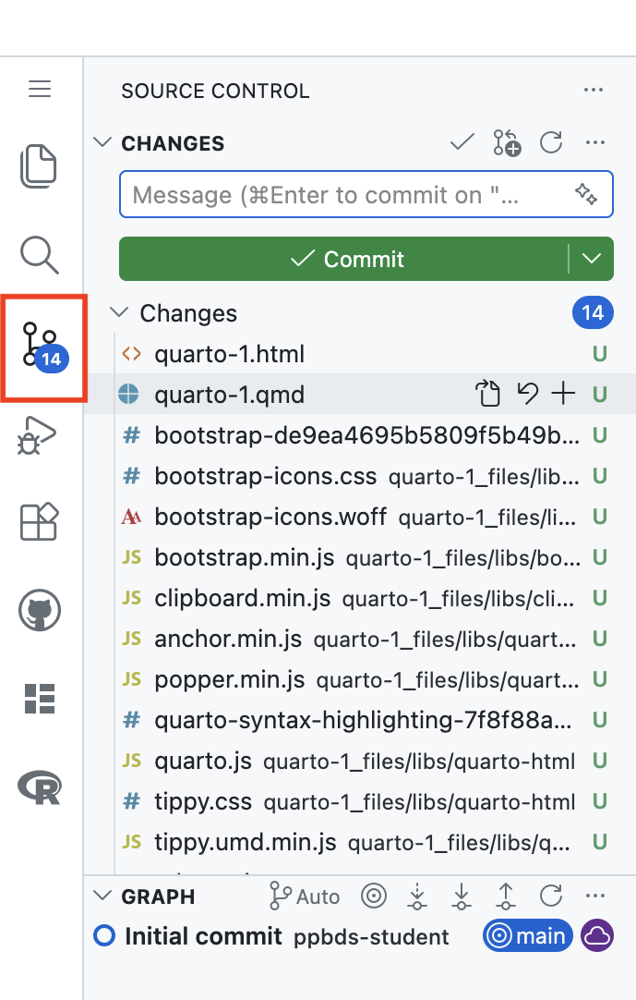
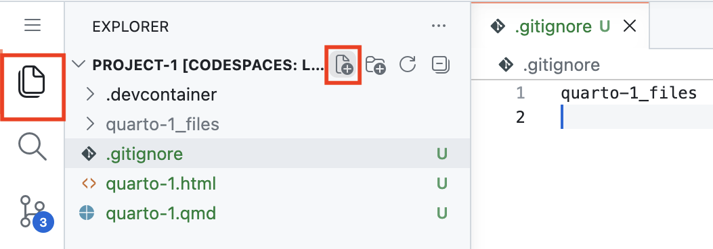
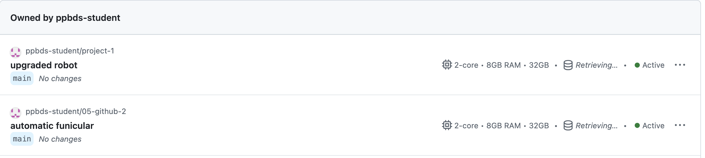
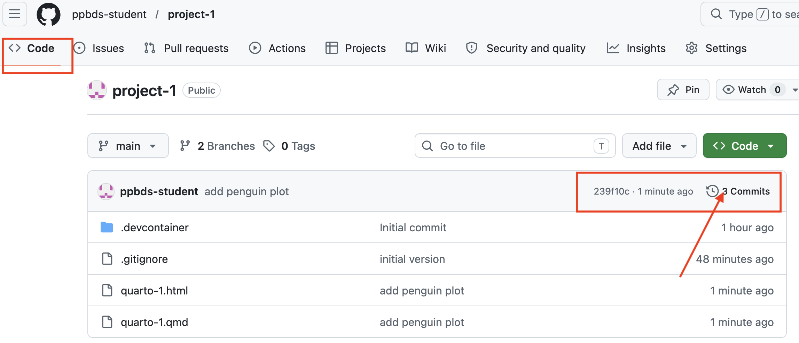

```{r setup, include = FALSE}
library(learnr)
library(tutorial.helpers)
library(knitr)

library(tidyverse)
library(palmerpenguins)

knitr::opts_chunk$set(echo = FALSE)
knitr::opts_chunk$set(out.width = '90%')
options(tutorial.exercise.timelimit = 60, 
        tutorial.storage = "local")
```

```{r info-section, child = system.file("child_documents/info_section.Rmd", package = "tutorial.helpers")}
```

## Introduction
### 

This tutorial covers more details about [Git](https://git-scm.com/) and [GitHub](https://github.com/). Some material is from [*R for Data Science (2e)*](https://r4ds.hadley.nz/) by Hadley Wickham, Mine Çetinkaya-Rundel, and Garrett Grolemund.

The most useful reference for Git/GitHub is [*Happy Git and GitHub for the useR*](https://happygitwithr.com/). Refer to that book whenever you have a problem.

During this tutorial, you will create two GitHub repos and Codespaces --- one for each project. You should complete the tutorial itself in a separate Codespace.

## Project 1
###

This first project will simply review the steps which we have already learned. Making the data science work cycle second nature requires practice.

We'll create a GitHub repo from `codespace-starter` and then a Codespace associated with that repo.

### Exercise 1

Go to [codespace-starter](https://github.com/PPBDS/codespace-starter). Click on the green "Use this Template" button in the top right. Then select "Create a new repository."

Create a GitHub repo (called `project-1`). Then click the green "Create repository" button. Copy/paste the URL for the new GitHub repo's web page.

```{r project-1-1}
question_text(NULL,
	answer(NULL, correct = TRUE),
	allow_retry = TRUE,
	try_again_button = "Edit Answer",
	incorrect = NULL,
	rows = 3)
```

### 

```         
https://github.com/ppbds-student/project-1
```

The URL for a GitHub repository takes the form https://github.com/[user name]/[repo name].

Always start a new data science project with a new GitHub repo.

### Exercise 2

Now, let's create a Codespace connected to the new repo. Click the green "Code" button in the upper right. Select the "Codespaces" tab and then click the green "Create Codespace on main".

Copy and paste the link from your new Codespace.

```{r project-1-2}
question_text(NULL,
	answer(NULL, correct = TRUE),
	allow_retry = TRUE,
	try_again_button = "Edit Answer",
	incorrect = NULL,
	rows = 3)
```

### 

Your link should look something like this:

```
https://legendary-carnival-vpvrv9p59jxpc66v6.github.dev/
```

A Codespace is a full development environment --- editor, terminal, R installation, and all --- running on a computer owned by GitHub, not you. This one is tied directly to your repo, so the files in the Codespace and the files on GitHub can stay in sync using git. This means you can close the browser tab, come back days later on a completely different machine, and pick up exactly where you left off. 

The random-looking words in the URL (like `legendary-carnival`) are just GitHub's way of giving each Codespace a unique address.

### Exercise 3

Click the hamburger menu (three horizontal lines) in the top-left corner to open the Application Menu. Select `File -> New File ...-> Quarto Document`. 

Title it "Quarto 1". Under the title line in the YAML header, type "author: [YOUR NAME]". Save the file with the name `quarto-1.qmd`. 

Create an R Terminal, then run `list.files()`. CP/CR.

```{r project-1-3}
question_text(NULL,
	answer(NULL, correct = TRUE),
	allow_retry = TRUE,
	try_again_button = "Edit Answer",
	incorrect = NULL,
	rows = 6)
```

### 

Your answer should look like this:

```         
R 4.4.3> list.files()
[1] "quarto-1.qmd"
R 4.4.3> 
```

###

Titles should be in title case, obviously. File names are usually all lower case. Spaces in titles are fine, but there should never be spaces (or other weird characters --- other than underlines, `_`, and, less commonly, dashes, `-`) in file names.

### Exercise 4

Press `Cmd/Ctrl + Shift + K`.

This will create an HTML file and display it in the Viewer tab in the Secondary Activity Bar.

Look at the Terminal. Copy-and-paste the lines which resulted from rendering `quarto-1.qmd`.

```{r project-1-4}
question_text(NULL,
	answer(NULL, correct = TRUE),
	allow_retry = TRUE,
	try_again_button = "Edit Answer",
	incorrect = NULL,
	rows = 10)
```

### 

```         
@ppbds-student ➜ /workspaces/project-1 (main) $ quarto preview /workspaces/project-1/quarto-1.qmd --no-browser --no-watch-inputs
pandoc 
  to: html
  output-file: quarto-1.html
  standalone: true
  section-divs: true
  html-math-method: mathjax
  wrap: none
  default-image-extension: png
  variables: {}
  
metadata
  document-css: false
  link-citations: true
  date-format: long
  lang: en
  engines:
    - path: /opt/quarto/share/extension-subtrees/julia-engine/_extensions/julia-engine/julia-engine.js
  title: Quarto 1
  author: ppbds-student
  
Output created: quarto-1.html

Watching files for changes
Browse at http://localhost:5456/
Listening on http://127.0.0.1:5456/
```

###

The `.qmd` is your source of truth --- it is the file you edit. The `.html` is a *product* of it, rendered by `quarto preview`.

Never edit the `.html` directly; any change you make there will be overwritten the next time you render. If you want to update what the world sees, update the `.qmd` and run `quarto preview` again.

### Exercise 5

Use `Ctrl + C` to stop the watching process. Then, run `ls`. CP/CR.

```{r project-1-5}
question_text(NULL,
	answer(NULL, correct = TRUE),
	allow_retry = TRUE,
	try_again_button = "Edit Answer",
	incorrect = NULL,
	rows = 3)
```

###

````
Watching files for changes
Browse at http://localhost:5456/
Listening on http://127.0.0.1:5456/
^C@ppbds-student ➜ /workspaces/project-1 (main) $ ls
quarto-1_files  quarto-1.html  quarto-1.qmd
@ppbds-student ➜ /workspaces/project-1 (main) $ 
````

Note that `^C` symbol, which is how `Ctrl + c` is recorded.

The `quarto-1.html` is our rendered file, as expected. The `quarto-1_files` directory contains a variety of files which were involved in the transformation of `quarto-1.qmd` into `quarto-1.html`. None of the files in `quarto-1_files` are worth understanding, at least at this point in your data science education.

### Exercise 6

Click the source control icon in the Activity Bar (in red box below) to open the Source Control view. This provides information about how git is tracking changes to this project.

```{r}

```

There are 14 files that git has recognized as changed. Most are in the `quarto-1_files` directory --- intermediate files not worth tracking. We'll create a `.gitignore` to tell git to ignore them.

Select the File Explorer icon in the Activity Bar. Then, click the new document button to the right of the "PROJECT-1" heading. 

```{r}

```

Title the file .gitignore. with two lines: `quarto-1_files` and a blank line. Save the file. Make sure to save it at the top of the project, **not inside of the `quarto-1_files` directory**.

In the Terminal, run `cat .gitignore`. CP/CR.

```{r project-1-6}
question_text(NULL,
	answer(NULL, correct = TRUE),
	allow_retry = TRUE,
	try_again_button = "Edit Answer",
	incorrect = NULL,
	rows = 3)
```

### 

```         
@ppbds-student ➜ /workspaces/project-1 (main) $ cat .gitignore
quarto-1_files
@ppbds-student ➜ /workspaces/project-1 (main) $ 
```

Now the blue badge on the Source Control icon in the Activity Bar shows a 3 instead of 14. This means that `.gitignore` is working and that `quarto-1_files` are now ignored by git.

### Exercise 7

Press the Source Control button. Commit all the files --- `.gitignore`, `quarto-1.qmd` and `quarto-1.html` --- which have not been committed yet. Your commit message should be something like "Initial version." Sync all the files.

From the Terminal, run `git log`. CP/CR.

```{r project-1-7}
question_text(NULL,
	answer(NULL, correct = TRUE),
	allow_retry = TRUE,
	try_again_button = "Edit Answer",
	incorrect = NULL,
	rows = 8)
```

### 

Your answer should look something like this:

````
@ppbds-student ➜ /workspaces/project-1 (main) $ git log
commit 05d03bf26fd9cc79ec1a6754ea750fb5ef84531f (HEAD -> main, origin/main, origin/HEAD)
Author: ppbds-student <acrogers362+ppbds-student@gmail.com>
Date:   Wed May 6 13:31:50 2026 +0000

    initial version

commit e3b01ee67e435cf241b375065536630da8ae7f7d
Author: ppbds-student <acrogers362+ppbds-student@gmail.com>
Date:   Wed May 6 08:31:03 2026 -0400

    Initial commit 
````

You should see your commit message in the top (most recent) commit.

###

The 40-character string next to "commit" (like `05d03bf26fd9cc79ec1a6754ea750fb5ef84531f`) is called a **commit hash**. It is a unique fingerprint for that exact snapshot of your project --- no two commits, anywhere in the history of any Git repo, will ever share the same hash.

### Exercise 8

Add a code chunk within your document which includes `library(tidyverse)`. Render the document to ensure that everything works. (Fix any errors if it doesn't.)

In the R Terminal, run:

```         
tutorial.helpers::show_file("quarto-1.qmd", chunk = "Last")
```

CP/CR.

```{r project-1-8}
question_text(NULL,
	answer(NULL, correct = TRUE),
	allow_retry = TRUE,
	try_again_button = "Edit Answer",
	incorrect = NULL,
	rows = 3)
```

###

````
R 4.4.3> tutorial.helpers::show_file("quarto-1.qmd", chunk = "Last")
library(tidyverse)
R 4.4.3> 
````

Anytime you use `show_file()` without having a blank line at the end of the file, you will get a warning message.

Recall that you can add a code chunk by using the shortcut key combination: `Cmd/Ctrl + Shift + I`.

### Exercise 9

Add `library(palmerpenguins)` to the code chunk. Render the document to ensure that everything works. (Fix any errors if it doesn't.)

If you get an error like: "There is no package called `palmerpenguins`", run `install.packages("palmerpenguins")` in the R Terminal.

In the R Terminal, run:

```         
tutorial.helpers::show_file("quarto-1.qmd", chunk = "Last")
```

CP/CR.

```{r project-1-9}
question_text(NULL,
	answer(NULL, correct = TRUE),
	allow_retry = TRUE,
	try_again_button = "Edit Answer",
	incorrect = NULL,
	rows = 8)
```

### 

Your answer should look like:


````
R 4.4.3> tutorial.helpers::show_file("quarto-1.qmd", chunk = "Last")
library(tidyverse)
library(palmerpenguins)
R 4.4.3>
````

### 

There is an important distinction between `install.packages()` and `library()`. You only need to install a package once --- it downloads and saves the package to your machine. `library()` loads an already-installed package into your current R session and must be called every time you start a new session.

###

Because of this, `library()` belongs in your `.qmd`, but `install.packages()` does not. A `.qmd` is an analysis document meant to be shared and re-rendered; including `install.packages()` would silently modify the R package library of anyone who renders it, which is not your call to make.

### Exercise 10

Add a new code chunk containing just `penguins`. Render the document. Copy the displayed contents of `quarto-1.html` below. The copy/paste may lose formatting --- that's fine.

```{r project-1-10}
question_text(NULL,
	answer(NULL, correct = TRUE),
	allow_retry = TRUE,
	try_again_button = "Edit Answer",
	incorrect = NULL,
	rows = 15)
```

### 

Your HTML should look like this. Of course, your copy/paste job will be a mess.

```{r}
include_graphics("images/penguins.png")
```

Because the code is just the name of the tibble, R prints out the first 10 rows of the tibble, along with some other information, just like it would if you typed `penguins` at the R Terminal.

### Exercise 11

We don't want our R code to be echoed in the HTML. Add `#| echo: false` to the top of each code chunk. We also don't want the startup messages from loading **tidyverse**, so add `#| message: false` to the top of the first code chunk as well.

`Cmd/Ctrl + Shift + K` to confirm that everything looks good. The only thing that should appear in the HTML, other than title and author, is the `penguins` data set.

In the R Terminal, run `tutorial.helpers::show_file("quarto-1.qmd")`. CP/CR.


```{r project-1-11}
question_text(NULL,
	answer(NULL, correct = TRUE),
	allow_retry = TRUE,
	try_again_button = "Edit Answer",
	incorrect = NULL,
	rows = 12)
```

###

Because of limitations in our technology, we can't show you what the whole file looks like.

<!-- 
DK: When we use this, the code seems to run, trying to print out the penguins data set, but just giving us:

<div data-pagedtable="false">
  <script data-pagedtable-source type="application/json">
{"columns":[{"label":["species"],"name":[1],"type":["fct"],"align":["left"]},{"l
...

Not sure about the cause.

````
R 4.4.3> tutorial.helpers::show_file("quarto-1.qmd")
---
title: "Quarto 1"
author: ppbds-student
format: html
---

```{r}
#| echo: false
#| message: false
library(tidyverse)
library(palmerpenguins)
```

```{r}
#| echo: false
penguins
```
```` -->

###

`#| echo: false` and `#| message: false` are **chunk options** --- settings placed at the top of a code chunk with `#|` that control how that chunk behaves when rendered. `echo: false` hides the code itself; `message: false` suppresses any messages the code produces. Because they live inside the chunk, they apply only to that chunk --- giving you precise, per-chunk control over what appears in the HTML.

### Exercise 12

Use AI to create a beautiful graphic using the `penguins` data. Phrase the question however you like. I asked [chatGPT](https://chatgpt.com/):

> Using R and the tidyverse package, create a beautiful graphic using the penguins data from the palmerpenguins package.

Replace `penguins` in the second code chunk with the graphics code generated by the AI. (I had to make three changes in the code in order to get rid of some annoying messages and warnings. I could also have just asked the AI to do so for me.) My graphic:

```{r}
theme_custom <- theme_minimal(base_size = 14) +
  theme(
    plot.title = element_text(face = "bold", size = 16, hjust = 0.5),
    plot.subtitle = element_text(size = 12, hjust = 0.5),
    legend.position = "right",
    panel.grid.major = element_line(color = "grey80"),
    panel.grid.minor = element_blank()
  )

penguins |> 
    drop_na() |> 
    ggplot(aes(x = flipper_length_mm, 
               y = body_mass_g, 
               color = species)) +
    geom_point(alpha = 0.8, size = 3) +
    geom_smooth(method = "lm", 
                formula = y ~ x,    
                se = FALSE, 
                linetype = "dashed") +
    scale_color_brewer(palette = "Dark2") +
    labs(
      title = "Penguin Flipper Length vs Body Mass",
      subtitle = "Species comparison from Palmer Station, Antarctica",
      x = "Flipper Length (mm)",
      y = "Body Mass (g)",
      color = "Species",
      caption = "Data from the palmerpenguins package"
    ) +
  theme_custom
```

Render `quarto-1.qmd`, using `Cmd/Ctrl + Shift + K`.

From the R Terminal, run `tutorial.helpers::show_file("quarto-1.qmd", chunk = "Last")`. CP/CR.

```{r project-1-12}
question_text(NULL,
	answer(NULL, correct = TRUE),
	allow_retry = TRUE,
	try_again_button = "Edit Answer",
	incorrect = NULL,
	rows = 3)
```

### 

My answer looks like this, but yours will be different, of course.

````
R 4.4.3> tutorial.helpers::show_file("quarto-1.qmd", chunk="Last")
theme_custom <- theme_minimal(base_size = 14) +
  theme(
    plot.title = element_text(face = "bold", size = 16, hjust = 0.5),
    plot.subtitle = element_text(size = 12, hjust = 0.5),
    legend.position = "right",
    panel.grid.major = element_line(color = "grey80"),
    panel.grid.minor = element_blank()
  )

penguins |> 
    drop_na() |> 
    ggplot(aes(x = flipper_length_mm, 
               y = body_mass_g, 
               color = species)) +
    geom_point(alpha = 0.8, size = 3) +
    geom_smooth(method = "lm", 
                formula = y ~ x,    
                se = FALSE, 
                linetype = "dashed") +
    scale_color_brewer(palette = "Dark2") +
    labs(
      title = "Penguin Flipper Length vs Body Mass",
      subtitle = "Species comparison from Palmer Station, Antarctica",
      x = "Flipper Length (mm)",
      y = "Body Mass (g)",
      color = "Species",
      caption = "Data from the palmerpenguins package"
    ) +
  theme_custom
R 4.4.3> 
````
###

Generative AI is the biggest change in the day-to-day work of data scientists in the last 30 years. Use it every chance you get.


### Exercise 13

Our plot looks nice! Let's share it with the world!

From the Terminal, run `quarto publish gh-pages quarto-1.qmd`. Respond with "Y" when prompted. CP/CR just the first 5 or so lines of what results.

```{r project-1-13}
question_text(NULL,
	answer(NULL, correct = TRUE),
	allow_retry = TRUE,
	try_again_button = "Edit Answer",
	incorrect = NULL,
	rows = 7)
```

###

Your output should begin something like this:

````
@ppbds-student ➜ /workspaces/project-1 (main) $ quarto publish gh-pages quarto-1.qmd
? Update site at https://ppbds-student.github.io/project-1/? (Y/n) › Yes
Rendering for gh-pages:

[1/1] quarto-1.qmd

Output created: quarto-1.html
````

###

Notice the shift in URLs: your repo lives at `github.com/username/project-1`, but the published website is at `username.github.io/project-1`. These are two distinct things --- the first is where your source code is stored, the second is a website GitHub is hosting on your behalf. The `github.io` domain is GitHub's way of signaling "this is a website, not a repository."

### Exercise 14

Commit and sync `quarto-1.qmd` and `quarto-1.html` with the message "add AI graphic". Then from the Terminal, run `git log --oneline`. CP/CR.

```{r project-1-14}
question_text(NULL,
	answer(NULL, correct = TRUE),
	allow_retry = TRUE,
	try_again_button = "Edit Answer",
	incorrect = NULL,
	rows = 6)
```

###

Your answer should look something like this:

````
@ppbds-student ➜ /workspaces/project-1 (main) $ git log --oneline
a7c3e91 (HEAD -> main, origin/main, origin/HEAD) add AI graphic
05d03bf initial version
e3b01ee Initial commit
@ppbds-student ➜ /workspaces/project-1 (main) $
````

###

`git log --oneline` is just `git log` with each commit compressed to a single line: the first 7 characters of the hash, followed by the commit message. It shows the exact same history as `git log`, but without the author and date details --- useful when you just want a quick overview of what has been committed.

### Exercise 15

Now that you've successfully published your website and committed all of your work. It's time to clean up your Codespaces. Go to the `https://github.com/codespaces` where you can view all your Codespaces. You should see a table that looks like this:

```{r}

```

There should be two active Codespaces. One where you are running this tutorial and the other where you have been working on this website. Copy and paste the text from the table.

```{r project-1-15}
question_text(NULL,
	answer(NULL, correct = TRUE),
	allow_retry = TRUE,
	try_again_button = "Edit Answer",
	incorrect = NULL,
	rows = 5)
```

###

Your submission should look something like this. Don't worry about differences in formatting.

````

Owned by ppbds-student
ppbds-student
ppbds-student/project-1
upgraded robot
main

No changes

2-core • 8GB RAM • 32GB
•

Retrieving…
•

Active
ppbds-student
ppbds-student/05-github-2
automatic funicular
main

No changes

2-core • 8GB RAM • 32GB
•

Retrieving…
•

Active

````

###

Both Codespaces are counting against your available Codespace time. It's good to get in the habit of stopping and deleting Codespaces once you are done with them.

### Exercise 16

Click the `...` next to your Codespace where you were working on the website and select "Delete".

Once it is deleted, go to the GitHub repo page for your website and look at the file list under the `<> Code` tab. You can see that all of the files you had created are here. In the upper right of this table, you can see that there have been 3 commits to the repo and that the last commit was made recently. Click on the "3 commits" button.

```{r}

```

Now you can see the history of commits to this repo. Copy and paste this table.	

```{r project-1-16}
question_text(NULL,
	answer(NULL, correct = TRUE),
	allow_retry = TRUE,
	try_again_button = "Edit Answer",
	incorrect = NULL,
	rows = 5)
```

###

Your answer should show something like:

```
add AI graphic
ppbds-student
ppbds-student
committed
5 minutes ago
initial version
ppbds-student
ppbds-student
committed
53 minutes ago
Initial commit
ppbds-student
ppbds-student
authored
1 hour ago
```

###

The Codespace is gone, but every file you committed is still here. The Codespace was just a temporary workspace --- a computer GitHub lent you to do your work. GitHub itself was always the permanent home for your project. This is why we commit and sync so often: not to save our work *to* the Codespace, but to save it *through* the Codespace to GitHub.

## Project 2
###

With `project-1`, we went through all the steps of a data science project: create a GitHub repo; open a Codespace; write and render a Quarto document; commit our work; and publish to GitHub Pages.

Let's do it all again with a new repo and a fresh Codespace.

### Exercise 1

Go to [codespace-starter](https://github.com/PPBDS/codespace-starter). Click the green "Use this Template" button and select "Create a new repository." Create a GitHub repo called `project-2`, then click the green "Create repository" button. Copy/paste the URL for the new GitHub repo's web page.

```{r project-2-1}
question_text(NULL,
	answer(NULL, correct = TRUE),
	allow_retry = TRUE,
	try_again_button = "Edit Answer",
	incorrect = NULL,
	rows = 3)
```

###

Your answer should look something like:

```
https://github.com/ppbds-student/project-2
```

###

GitHub repos are either **public** or **private**. A public repo is visible to anyone on the internet --- not just people you share the link with, but anyone who searches for it. A private repo is visible only to you and collaborators you explicitly invite. Repos created from `codespace-starter` are public by default, which is also what allows GitHub Pages to host your website for free.

### Exercise 2

Create a Codespace connected to the `project-2` repo. Click the green "Code" button in the upper right, select the "Codespaces" tab, and click the green "Create Codespace on main." Copy and paste the link from your new Codespace.

```{r project-2-2}
question_text(NULL,
	answer(NULL, correct = TRUE),
	allow_retry = TRUE,
	try_again_button = "Edit Answer",
	incorrect = NULL,
	rows = 3)
```

###

Your link should look something like this:

```
https://zany-computing-machine-vpvrv9p59jxpc66v6.github.dev/
```

###

When a Codespace starts up, GitHub is building a fresh computer from scratch based on instructions in the `.devcontainer/devcontainer.json` file inside your repo. That file specifies which R version to install, which R packages to pre-load, and which editor extensions to add. This is why your Codespace arrives with R, tidyverse, and Quarto already configured --- none of that happened by accident. 

The first startup takes the longest because GitHub is doing all of this setup work; if you stop and reopen the same Codespace later, it starts much faster because the environment is already built.

### Exercise 3

Select `File -> New File -> Quarto Document`. Provide a title ("Quarto 2") and an author (you). Save the document as `quarto-2.qmd`. `Cmd/Ctrl + Shift + K`.

In the R Terminal, run:

````
list.files(all.files = TRUE)
````

CP/CR.

```{r project-2-3}
question_text(NULL,
	answer(NULL, correct = TRUE),
	allow_retry = TRUE,
	try_again_button = "Edit Answer",
	incorrect = NULL,
	rows = 6)
```

###

Your answer should look like this:

```
R 4.4.3> list.files(all.files = TRUE)
[1] "."              ".."             ".devcontainer"  ".git"           "quarto-2_files" "quarto-2.html"  "quarto-2.qmd"
R 4.4.3>
```

The `all.files = TRUE` argument includes hidden files --- those whose names begin with a period. The single `.` refers to this directory while `..` refers to the directory above. `.git` is a directory used solely by Git. `quarto-2_files` is a junk directory created by Quarto. 

### Exercise 4

Create a `.gitignore` with `*_files` and a blank line.

In the R Terminal, run:

````
tutorial.helpers::show_file(".gitignore")
````

CP/CR.


```{r project-2-4}
question_text(NULL,
	answer(NULL, correct = TRUE),
	allow_retry = TRUE,
	try_again_button = "Edit Answer",
	incorrect = NULL,
	rows = 6)
```

### 

Your answer should look like this:

```         
R 4.4.3> tutorial.helpers::show_file(".gitignore")
*_files
R 4.4.3> 
```


Note that `*` is a "regular expression" which matches any characters. So, Git will ignore any files or directories which end with `_files`, including `quarto-2_files`.

### Exercise 5

Commit and sync `.gitignore`, `quarto-2.qmd`, and `quarto-2.html`. Use a sensible commit message.

From the Terminal, run `git log`. CP/CR.

```{r project-2-5}
question_text(NULL,
	answer(NULL, correct = TRUE),
	allow_retry = TRUE,
	try_again_button = "Edit Answer",
	incorrect = NULL,
	rows = 3)
```

### 

Your answer should look like this:

```
@ppbds-student ➜ /workspaces/project-2 (main) $ git log
commit 8f414d418c039a79364b6fbe4c6de32acb1e6235 (HEAD -> main, origin/main, origin/HEAD)
Author: ppbds-student <acrogers362+ppbds-student@gmail.com>
Date:   Wed May 6 14:12:30 2026 +0000

    initial version

commit 4abced5c8c5b3dcd3a26d9efdce126031d8a0a0b
Author: ppbds-student <acrogers362+ppbds-student@gmail.com>
Date:   Wed May 6 08:31:03 2026 -0400

    Initial commit
@ppbds-student ➜ /workspaces/project-2 (main) $
```

There have been two commits in this repo. The first was generated automatically when we created the repo. The second was the one we just committed by hand, along with the commit message "initial version." Note how, next to the word "commit," there is a 40 character string of letters and numbers. This is the "hash" by which Git identifies each commit. The hash is always unique.

### Exercise 6

Add a new code chunk to `quarto-2.qmd` that loads the **tidyverse**.

````
```{r}
library(tidyverse)
```
````

The **tidyverse** includes **ggplot2**, which contains the `mpg` dataset --- fuel economy data for 234 car models from 1999 to 2008. We will use `mpg` to build our plot.

In the R Terminal, run:

````
tutorial.helpers::show_file("quarto-2.qmd", chunk = "Last")
````

CP/CR.

```{r project-2-6}
question_text(NULL,
	answer(NULL, correct = TRUE),
	allow_retry = TRUE,
	try_again_button = "Edit Answer",
	incorrect = NULL,
	rows = 5)
```

###

Your answer should look like this:

<pre><code>
> tutorial.helpers::show_file("quarto-2.qmd", chunk = "Last")
<pre><code>```{r}
library(tidyverse)
```</code></pre>
</code></pre>

### Exercise 7

Render `quarto-2.qmd`. You will notice two problems: the R code is visible and a tidyverse startup message appears. We need to fix both.

In the YAML header, add:

```
execute:
  echo: false
```

Also, replace `library(tidyverse)` with `suppressPackageStartupMessages(library(tidyverse))`. Render `quarto-2.qmd` to confirm the code and messages are gone.

In the R Terminal, run `tutorial.helpers::show_file("quarto-2.qmd")`. CP/CR.

```{r project-2-7}
question_text(NULL,
	answer(NULL, correct = TRUE),
	allow_retry = TRUE,
	try_again_button = "Edit Answer",
	incorrect = NULL,
	rows = 12)
```

###

Your answer should look like:

````
> tutorial.helpers::show_file("quarto-2.qmd")
---
title: "Quarto 2"
author: ppbds-student
format: html
execute:
  echo: false
---
```{r}
suppressPackageStartupMessages(library(tidyverse))
```
````

###

In Project 1 you used `#| echo: false` on each chunk individually. Here, `execute: echo: false` in the YAML header does the same thing for every chunk in the document at once --- no repetition needed. We set it in the YAML now, before adding more chunks, so that every future chunk inherits it automatically. 

For the tidyverse messages, we use `suppressPackageStartupMessages()`, a pure R function, rather than `#| message: false`. The difference: `#| message: false` tells Quarto to hide the output after it is produced; `suppressPackageStartupMessages()` prevents the message from being produced at all. 

Each approach has its place --- YAML for document-wide defaults, chunk options for fine-grained control, and R functions when you want the solution to live in the code itself.

### Exercise 8

Before committing, run `git status` from the Terminal to see what has changed. CP/CR. Then commit and sync `quarto-2.qmd` and `quarto-2.html` with the message "load tidyverse, suppress echo".

```{r project-2-8}
question_text(NULL,
	answer(NULL, correct = TRUE),
	allow_retry = TRUE,
	try_again_button = "Edit Answer",
	incorrect = NULL,
	rows = 8)
```

###

Your `git status` output should look something like this:

```
@ppbds-student ➜ /workspaces/project-2 (main) $ git status
On branch main
Your branch is up to date with 'origin/main'.

Changes not staged for commit:
  (use "git add <file>..." to update index)
  (use "git restore <file>..." to discard changes in working directory)
        modified:   quarto-2.html
        modified:   quarto-2.qmd

no changes added to commit (use "git add" and/or "git commit -a" to commit)
@ppbds-student ➜ /workspaces/project-2 (main) $
```

###

`git status` is showing you exactly the same information as the Source Control view you have been clicking throughout this tutorial --- just in text form. The files marked "modified" in `git status` are the ones with an **M** badge in the Source Control view; "untracked" files show a **U**. The Source Control button is simply a visual wrapper around `git status`. Understanding the terminal version means you know what the visual interface is actually doing under the hood.

### Exercise 9

Now let's add a plot. Use an AI tool of your choice (e.g., ChatGPT, Claude, Copilot) to generate a **ggplot2** graphic using the `mpg` dataset. Create an interesting visualization --- for example, a scatterplot of engine displacement versus highway miles per gallon colored by car class. Paste the code into a new chunk in `quarto-2.qmd` and render to confirm it works.

In the R Terminal, run:

````
tutorial.helpers::show_file("quarto-2.qmd", chunk = "Last")
````

CP/CR.

```{r project-2-9}
question_text(NULL,
	answer(NULL, correct = TRUE),
	allow_retry = TRUE,
	try_again_button = "Edit Answer",
	incorrect = NULL,
	rows = 8)
```

###

Your answer will vary depending on the graphic you chose. It might look something like this:

````
> tutorial.helpers::show_file("quarto-2.qmd", chunk = "Last")
```{r}
mpg |>
  ggplot(aes(x = displ, y = hwy, color = class)) +
    geom_point() +
    labs(title = "Engine Displacement vs. Highway MPG",
         x = "Engine Displacement (L)",
         y = "Highway MPG",
         color = "Car Class")
```
````

###

AI tools are remarkably good at generating **ggplot2** code. You describe what you want in plain English --- the dataset, the variables, the type of plot --- and the AI produces working code. This is one of the most practical uses of AI for data science: not replacing your judgment about *what* to visualize, but handling the mechanical work of translating that intent into code.

### Exercise 10

From the R Terminal, type `mpg` and hit Enter. CP/CR.

```{r project-2-10}
question_text(NULL,
	answer(NULL, correct = TRUE),
	allow_retry = TRUE,
	try_again_button = "Edit Answer",
	incorrect = NULL,
	rows = 3)
```

###

You likely got an error:

```
> mpg
Error: object 'mpg' not found
>
```

Recall the distinction between QMD World and R Terminal World. In QMD World, we loaded **tidyverse** (and therefore **ggplot2**, which contains `mpg`). But in R Terminal World, we have not done that yet. The R Terminal is a completely separate environment --- it does not automatically inherit anything from the `.qmd` file.

### Exercise 11

Put your cursor in `quarto-2.qmd` on the `suppressPackageStartupMessages(library(tidyverse))` line. Hit `Cmd/Ctrl + Enter`. This sends that line of code down to the R Terminal and runs it there.

From the R Terminal, run `search()`. CP/CR.

```{r project-2-11}
question_text(NULL,
	answer(NULL, correct = TRUE),
	allow_retry = TRUE,
	try_again_button = "Edit Answer",
	incorrect = NULL,
	rows = 3)
```

###

The return value from `search()` should now include all the **tidyverse** packages, like `"package:ggplot2"` and `"package:dplyr"`. Once tidyverse is loaded in the R Terminal, `mpg` will be available there as well --- confirming that `Cmd/Ctrl + Enter` is how you bridge the two worlds when you need to work interactively.

### Exercise 12

Commit and sync `quarto-2.qmd` and `quarto-2.html` with the message "add AI graphic". Then from the Terminal, run `git log --oneline`. CP/CR.

```{r project-2-12}
question_text(NULL,
	answer(NULL, correct = TRUE),
	allow_retry = TRUE,
	try_again_button = "Edit Answer",
	incorrect = NULL,
	rows = 6)
```

###

Your answer should look something like this:

```
@ppbds-student ➜ /workspaces/project-2 (main) $ git log --oneline
c4d91b2 (HEAD -> main, origin/main, origin/HEAD) add AI graphic
a3f9c21 load tidyverse, suppress echo
8f414d4 initial version
4abced5 Initial commit
@ppbds-student ➜ /workspaces/project-2 (main) $
```

###

Four commits, four readable descriptions. Each line is a decision you made and chose to record --- what you changed and why. This is what makes `git log` useful as a record of your thinking. A month from now, you will be able to look at this history and reconstruct exactly what you did and in what order.

### Exercise 13

Let's publish our results to [GitHub Pages](https://pages.github.com/).

From the Terminal, run `quarto publish gh-pages quarto-2.qmd`. Respond with "Y" when it checks that you want to. (This might take a minute to run.)

CP/CR just the first 5 or so lines of what results.


```{r project-2-13}
question_text(NULL,
	answer(NULL, correct = TRUE),
	allow_retry = TRUE,
	try_again_button = "Edit Answer",
	incorrect = NULL,
	rows = 7)
```

###

`quarto publish` sends your rendered output directly to GitHub Pages. Your source file (`quarto-2.qmd`) and the live website are separate: if you edit the `.qmd` and render locally but never run `quarto publish` again, the website will still show the old version.

### Exercise 14

Go to your `project-2` repo page on GitHub. Refresh the page. `quarto publish` has changed some of the items. Copy/paste all the text in the "Visit site" box.


```{r project-2-14}
question_text(NULL,
	answer(NULL, correct = TRUE),
	allow_retry = TRUE,
	try_again_button = "Edit Answer",
	incorrect = NULL,
	rows = 3)
```

###

````
Your site is live at https://ppbds-student.github.io/project-2/
Last deployed by @ppbds-student ppbds-student 6 minutes ago
````

### Exercise 15

Delete your `project-2` Codespace. Go to the `project-2` repo on GitHub and click the `<> Code` tab. Copy/paste the names of the files you see listed there.

```{r project-2-15}
question_text(NULL,
	answer(NULL, correct = TRUE),
	allow_retry = TRUE,
	try_again_button = "Edit Answer",
	incorrect = NULL,
	rows = 5)
```

###

Your answer should show something like:

```
.gitignore
README.md
quarto-2.html
quarto-2.qmd
```

The Codespace is gone, but everything you committed is still here. Notice that next to each file, GitHub shows the commit message from the last time that file was changed. This is another reason why good commit messages matter --- they leave a breadcrumb trail visible right on the repo's main page, not just buried in `git log`.

## Summary
### 

This tutorial covered more details in the usage of [Git](https://git-scm.com/) and [GitHub](https://github.com/). Some material was from [*R for Data Science (2e)*](https://r4ds.hadley.nz/) by Hadley Wickham, Mine Çetinkaya-Rundel, and Garrett Grolemund.

The most useful reference for Git/GitHub is [*Happy Git and GitHub for the useR*](https://happygitwithr.com/). Refer to that book whenever you have a problem.

```{r download-answers, child = system.file("child_documents/download_answers.Rmd", package = "tutorial.helpers")}
```
