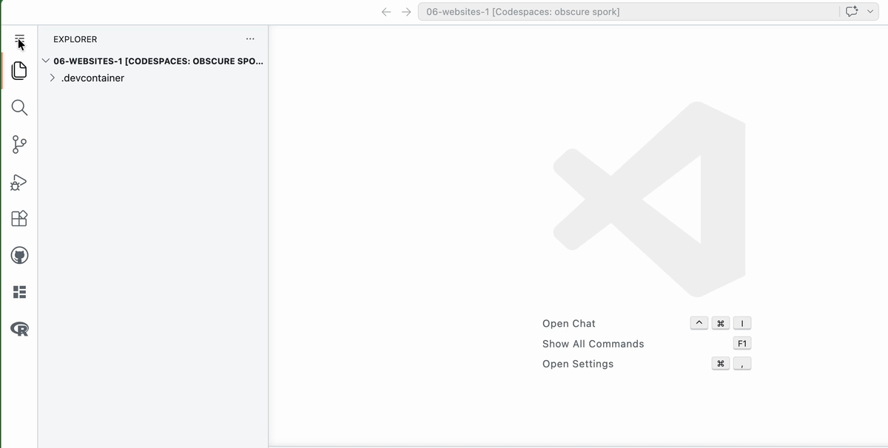

```{r setup, include = FALSE}
knitr::opts_chunk$set(echo = FALSE)
knitr::opts_chunk$set(out.width = '90%')
options(tutorial.exercise.timelimit = 240, 
        tutorial.storage = "local") 

library(learnr)
library(tutorial.helpers)
library(knitr)
library(tidyverse)
```


```{r info-section, child = system.file("child_documents/info_section.Rmd", package = "tutorial.helpers")}
```

## Introduction
### 

This tutorial introduces the process of creating and organizing [Quarto websites](https://quarto.org/docs/websites/) using the [Quarto CLI](https://quarto.org/docs/get-started/) (command line interface) and commands like `quarto create`, `quarto render`, `quarto preview`, and `quarto publish`. Some material is from [*R for Data Science (2e)*](https://r4ds.hadley.nz/) by Hadley Wickham, Mine Çetinkaya-Rundel, and Garrett Grolemund.

### 

If you haven't already, start a new Github repository named `06-websites-1` and create a new Codespace where you will run this tutorial and complete all your work.

## Creating files
### 

Let's make a [Quarto website](https://quarto.org/docs/websites/).

### Exercise 1

Verify that you have created a new public Github repo (called `06-websites-1`). Copy/paste the URL for the repo.

```{r creating-files-1}
question_text(NULL,
	answer(NULL, correct = TRUE),
	allow_retry = TRUE,
	try_again_button = "Edit Answer",
	incorrect = NULL,
	rows = 3)
```

### 

Your answer should look something like:

```
https://github.com/ppbds-student/06-websites-1
```

Always start a new data science project with a new Github repo.

### Exercise 2

<!-- DK: Show images of how you can this by hand, just as an FYI. -->

In the Terminal, run `quarto create project website .`. Don't forget the `.` at the end of the command — it tells Quarto to place the new files in the current directory.

You can also do this using the Application Menu. Start by clicking the hamburger icon (three horizontal bars) in the Activity Bar:

```{r}

```

If you are asked for a "Title," use `A New Website`.

CP/CR.

```{r creating-files-2}
question_text(NULL,
	answer(NULL, correct = TRUE),
	allow_retry = TRUE,
	try_again_button = "Edit Answer",
	incorrect = NULL,
	rows = 8)
```

### 

Your answer should look like this:

````
@ppbds-student ➜ /workspaces/06-websites-1 (main) $ quarto create project website .
? Title (website) › A New Website
Creating project at /workspaces/06-websites-1:
  - Created _quarto.yml
  - Created .gitignore
  - Created index.qmd
  - Created about.qmd
  - Created styles.css
@ppbds-student ➜ /workspaces/06-websites-1 (main) $
````

Quarto created 5 new files in the current directory. On the command line, `.` always refers to the current directory.

### Exercise 3

In the Terminal, run `ls`. CP/CR.

```{r creating-files-3}
question_text(NULL,
	answer(NULL, correct = TRUE),
	allow_retry = TRUE,
	try_again_button = "Edit Answer",
	incorrect = NULL,
	rows = 3)
```

### 

````
@ppbds-student ➜ /workspaces/06-websites-1 (main) $ ls
_quarto.yml     about.qmd       index.qmd       styles.css
@ppbds-student ➜ /workspaces/06-websites-1 (main) $
````

These are the basic files needed to build a Quarto website. Note that `ls` does not show "hidden" files — those beginning with a `.`.

### Exercise 4

In the Terminal, run `ls -a`. CP/CR. 

```{r creating-files-4}
question_text(NULL,
	answer(NULL, correct = TRUE),
	allow_retry = TRUE,
	try_again_button = "Edit Answer",
	incorrect = NULL,
	rows = 5)
```

### 

````
@ppbds-student ➜ /workspaces/06-websites-1 (main) $ ls -a
.               .git            about.qmd       styles.css
..              .gitignore      _quarto.yml     index.qmd
@ppbds-student ➜ /workspaces/06-websites-1 (main) $
````

In general, do not touch or modify "dot" directories — those whose names begin with a period. They are managed by the operating system or other programs. For example, Git uses `.git` to track all changes in the project. Also note that `quarto create` added a `.gitignore` file, which was hidden from the plain `ls` output.


## Examining files
### 

Now that we have created the necessary files, let's examine them one by one to understand how a Quarto website is structured.

### Exercise 1

In the R Terminal, run:

````
show_file("_quarto.yml")
````

CP/CR.

Did you get an error along the lines of 'could not find function "show_file"'? You need to run `library(tutorial.helpers)` in the R Terminal first to load `show_file()`. You could also use `tutorial.helpers::show_file("_quarto.yml")`, as in previous tutorials, but at this stage we want you to practice loading packages explicitly.


```{r examining-files-1}
question_text(NULL,
	answer(NULL, correct = TRUE),
	allow_retry = TRUE,
	try_again_button = "Edit Answer",
	incorrect = NULL,
	rows = 10)
```

### 

YAML files are how [Quarto projects](https://quarto.org/docs/projects/quarto-projects.html) describe themselves. You can identify `_quarto.yml` as a YAML file from its `.yml` extension and its content. The first two lines specify that this is a website.

````
project:                                   
  type: website
````

But other values for `type` are possible.

### Exercise 2

In the R Terminal, run:

````
show_file("_quarto.yml", start = 4, end = 10)
````

CP/CR.

```{r examining-files-2}
question_text(NULL,
	answer(NULL, correct = TRUE),
	allow_retry = TRUE,
	try_again_button = "Edit Answer",
	incorrect = NULL,
	rows = 3)
```

### 

These lines provide metadata about the website and its organization.

````
website:
  title: "A New Website"
  navbar:
    left:
      - href: index.qmd
        text: Home
      - about.qmd
````

Indents and other whitespace matter in YAML files. Be careful!


### Exercise 3

In the R Terminal, run:

````
show_file("_quarto.yml", start = 12, end = 16)
````

CP/CR.

```{r examining-files-3}
question_text(NULL,
	answer(NULL, correct = TRUE),
	allow_retry = TRUE,
	try_again_button = "Edit Answer",
	incorrect = NULL,
	rows = 5)
```

### 

These lines provide formatting information about the pages of the website. 

````
format:
  html:
    theme: cosmo
    css: styles.css
    toc: true
````

The `css` line tells Quarto to use the `styles.css` file, located in the same directory, for the styling of the pages.

### Exercise 4

In the R Terminal, run:

````
show_file("index.qmd")
````

CP/CR.


```{r examining-files-4}
question_text(NULL,
	answer(NULL, correct = TRUE),
	allow_retry = TRUE,
	try_again_button = "Edit Answer",
	incorrect = NULL,
	rows = 3)
```

### 

The answer should look like:

````
> show_file("index.qmd")
---
title: "A New Website"
---

This is a Quarto website.

To learn more about Quarto websites visit <https://quarto.org/docs/websites>.
>
````

Whenever a web browser goes to a directory on the internet, it looks for an `index.html` file. If found, that file is displayed. So, the `index.qmd` file, which we will soon render as `index.html`, is important.

### 

Note that the `title` (`"A New Website"`) in `_quarto.yml` is independent of the `title` (`"A New Website"`) in `index.qmd`. The former is the title for the entire website; the latter is the title for just the `index.html` page. They are set to the same value by default when you run `quarto create project website .` and provide a title.

If you skip the title prompt titles will be set to `.`.

<!-- DK: Fix to show the correct answer. Note that, in other scenarios, the automatiocally generated .gitignore file might be different, only including /.quarto/, for example. -->

<!-- HK: Exercise 5 expected answer shows only one line in .gitignore: "/.quarto/" but when students actually run show_file(".gitignore") they get two lines: "/.quarto/" AND "**/*.quarto_ipynb". The second line is missing from the expected answer. This could confuse students into thinking their output is wrong when it is actually correct. The expected answer needs to be updated to include both lines. -->

### Exercise 5

In the R Terminal, run:

````
show_file(".gitignore")
````

CP/CR.


```{r examining-files-5}
question_text(NULL,
	answer(NULL, correct = TRUE),
	allow_retry = TRUE,
	try_again_button = "Edit Answer",
	incorrect = NULL,
	rows = 3)
```

### 

```
> show_file(".gitignore")
/.quarto/
>
```

The leading `/` in `/.quarto/` escapes the `.`. In other words, we need the leading `/` if we want to ignore the files in a dotted directory.

In fact, the `.quarto` directory does not yet exist. But the `quarto create project` command wanted to ensure that, once it does, Git would ignore it and its contents.

### Exercise 6

Commit all files with the message "initial version" and then sync.

Run `git log -n 1` in the Terminal. CP/CR.

```{r examining-files-6}
question_text(NULL,
    answer(NULL, correct = TRUE),
    allow_retry = TRUE,
    try_again_button = "Edit Answer",
    incorrect = NULL,
    rows = 3)
```

### 

````
@ppbds-student ➜ /workspaces/06-websites-1 (main) $ git log -n 1
commit 658eedd63f2c3e2734484a2397935e854f5008f7 (HEAD -> main, origin/main, origin/HEAD)
Author: ppbds-student <ppbds-student@users.noreply.github.com>
Date:   Sat Mar 15 22:41:22 2025 -0400

    initial version
@ppbds-student ➜ /workspaces/06-websites-1 (main) $
````

To learn more about Git, GitHub, and R, see [Happy Git with R](https://happygitwithr.com/existing-github-last.html).


## Rendering and previewing
### 

We now have the infrastructure for our website. Next, we will "render" the web pages and then "preview" them to see what the site looks like before publishing it.

### Exercise 1

From the Terminal, run `quarto render`. CP/CR.

```{r rendering-and-previewing-1}
question_text(NULL,
	answer(NULL, correct = TRUE),
	allow_retry = TRUE,
	try_again_button = "Edit Answer",
	incorrect = NULL,
	rows = 6)
```

### 

````
@ppbds-student ➜ /workspaces/06-websites-1 (main) $ quarto render
[1/2] index.qmd
[2/2] about.qmd

Output created: _site/index.html

@ppbds-student ➜ /workspaces/06-websites-1 (main) $
````

Quarto tells us what it did: it processed both QMD files and created a `_site` directory containing `index.html`.

### 

If you look at the `_site` directory in the Explorer pane, you will see many new files, including `about.html`. Quarto only reports the home page (`index.html`), since that is the file browsers look for by default.

### Exercise 2

From the Terminal, run `ls`. CP/CR.

```{r rendering-and-previewing-2}
question_text(NULL,
	answer(NULL, correct = TRUE),
	allow_retry = TRUE,
	try_again_button = "Edit Answer",
	incorrect = NULL,
	rows = 3)
```

###

````
@ppbds-student ➜ /workspaces/06-websites-1 (main) $ ls
_site           index.qmd
_quarto.yml     about.qmd       styles.css
@ppbds-student ➜ /workspaces/06-websites-1 (main) $
````

Note the addition of a `_site` directory. This is where the HTML files that make up the website are stored. Website output files are often placed in a directory named `_site` or `docs`, depending on your web hosting service.

### Exercise 3

From the Terminal, run `ls _site`. CP/CR.

```{r rendering-and-previewing-3}
question_text(NULL,
	answer(NULL, correct = TRUE),
	allow_retry = TRUE,
	try_again_button = "Edit Answer",
	incorrect = NULL,
	rows = 3)
```

### 

Your answer will probably look something like:

````
@ppbds-student ➜ /workspaces/06-websites-1 (main) $ ls _site
about.html      index.html      search.json     site_libs       styles.css
@ppbds-student ➜ /workspaces/06-websites-1 (main) $
````

The `about.html` and `index.html` files are the rendered versions of `about.qmd` and `index.qmd`. They go into `_site` because the convention is to separate outputs (HTML files) from inputs (QMD files).

### 

We won't discuss the `search.json`, `styles.css`, or `site_libs` files — they are beyond the scope of this tutorial. The entire `_site` directory is a self-contained website, ready to deploy.

### Exercise 4

Look at the Source Control button. Note how many new files there are. Most of this is generated output that does not belong on GitHub.

Add `_site` to the `.gitignore`. Don't forget that the last line of `.gitignore` should always be blank. Save the file. 

In the R Terminal, run:

````
show_file(".gitignore")
````

CP/CR.

```{r rendering-and-previewing-4}
question_text(NULL,
	answer(NULL, correct = TRUE),
	allow_retry = TRUE,
	try_again_button = "Edit Answer",
	incorrect = NULL,
	rows = 3)
```

### 

````
> show_file(".gitignore")
/.quarto/
_site
>
````

Ignoring `_site` is [recommended](https://quarto.org/docs/publishing/github-pages.html) because it contains many generated files that change frequently. We never edit them directly, so there is no need to back them up. They will still be published to the web from your Codespace.

### Exercise 5

From the Terminal, run `quarto preview`. CP/CR.

```{r rendering-and-previewing-5}
question_text(NULL,
	answer(NULL, correct = TRUE),
	allow_retry = TRUE,
	try_again_button = "Edit Answer",
	incorrect = NULL,
	rows = 6)
```

### 

````
@ppbds-student ➜ /workspaces/06-websites-1 (main) $ quarto preview
Preparing to preview

Watching files for changes
Browse at http://localhost:6872/
GET: /

````

The `quarto preview` command does two things. First, it renders the QMD files, just like `quarto render` does. Second, it opens the website in your browser so that you can see what it looks like. Click around and check it out!

In Codespaces, a pop-up notification should appear automatically offering to open the site in your browser. If it does not, click the URL shown in the terminal output.


### Exercise 6

Look at your website in the browser. Click on the "About" link.

Go to the Terminal. Copy and paste all the output from `quarto preview`.

```{r rendering-and-previewing-6}
question_text(NULL,
	answer(NULL, correct = TRUE),
	allow_retry = TRUE,
	try_again_button = "Edit Answer",
	incorrect = NULL,
	rows = 3)
```

### 

````
@ppbds-student ➜ /workspaces/06-websites-1 (main) $ quarto preview
Preparing to preview

Watching files for changes
Browse at http://localhost:6872/
GET: /
GET: /about.html
````

Quarto continues running in the background, watching your files. When you clicked "About," it fetched `about.html` to display it.

### Exercise 7

Look again at your website in the browser. Click on the "Home" link and then copy/paste the entire HTML screen.

```{r rendering-and-previewing-7}
question_text(NULL,
	answer(NULL, correct = TRUE),
	allow_retry = TRUE,
	try_again_button = "Edit Answer",
	incorrect = NULL,
	rows = 6)
```

### 

````
A New Website

A New Website
This is a Quarto website.

To learn more about Quarto websites visit https://quarto.org/docs/websites.
````

The site title ("A New Website"), from `_quarto.yml`, appears in the upper-left corner. The page title ("A New Website"), from `index.qmd`, appears at the top of the home page.

(Depending on your browser and settings, the copy/paste may also capture the "Home" and "About" links. Either way is fine.)

### Exercise 8

Copy/paste the URL for your previewed website.

```{r rendering-and-previewing-8}
question_text(NULL,
	answer(NULL, correct = TRUE),
	allow_retry = TRUE,
	try_again_button = "Edit Answer",
	incorrect = NULL,
	rows = 3)
```

### 

Your answer should be something like:

````
https://your-codespace-name-7193.app.github.dev/
````

The website is being "hosted" inside your Codespace container and forwarded to your browser by GitHub. It is not publicly available on the web.

### Exercise 9

The advantage of using `quarto preview` is that the website is automatically updated whenever you edit and save the underlying QMD file. Try it by changing the `about.qmd` file, replacing "About this site" with your name. Save the file. 

At the Terminal, you should see a new message. Copy and paste it here.

```{r rendering-and-previewing-9}
question_text(NULL,
	answer(NULL, correct = TRUE),
	allow_retry = TRUE,
	try_again_button = "Edit Answer",
	incorrect = NULL,
	rows = 12)
```

### 

````
GET: /
pandoc 
  to: html
  output-file: about.html
  standalone: true
  title-prefix: A New Website
  section-divs: true
  html-math-method: mathjax
  wrap: none
  default-image-extension: png
  css:
    - styles.css
  toc: true
  
metadata
  document-css: false
  link-citations: true
  date-format: long
  lang: en
  theme: cosmo
  title: About
  
GET: /about.html
````

Quarto has noticed that you changed/saved the `about.qmd` file. It rendered the new version, creating a new `about.html` which it has now *gotten* and is displaying.

### Exercise 10

Copy/paste the About page from your browser.

```{r rendering-and-previewing-10}
question_text(NULL,
	answer(NULL, correct = TRUE),
	allow_retry = TRUE,
	try_again_button = "Edit Answer",
	incorrect = NULL,
	rows = 5)
```

### 

Your answer should look like this, except with your name instead of mine!

````
A New Website

About
David Kane
````

To stop `quarto preview`, press `Ctrl + c` in the Terminal. This cancels any running terminal command.

Press `Ctrl + c`.

## Publishing
### 

To make your website publicly visible, you need to "publish" it to the web. The Quarto documentation provides a [thorough discussion](https://quarto.org/docs/publishing/). We will be using [GitHub Pages](https://quarto.org/docs/publishing/github-pages.html).


### Exercise 1

Go to your `06-websites-1` Github repository.

Click "Settings" on the right side of the top menu.

Click "Pages" on the left-hand menu.

Copy/paste the resulting URL.

```{r publishing-1}
question_text(NULL,
	answer(NULL, correct = TRUE),
	allow_retry = TRUE,
	try_again_button = "Edit Answer",
	incorrect = NULL,
	rows = 3)
```

### 

Your answer should look like:

````
https://github.com/ppbds-student/06-websites-1/settings/pages
````

This page shows the settings that control GitHub Pages. It should look something like this:

```{r}
knitr::include_graphics("images/pages.png")
```

Sam Csik provides an [excellent overview](https://ucsb-meds.github.io/creating-quarto-websites/) of the entire process of creating Quarto websites. 

### Exercise 2

We won't edit the GitHub Pages settings by hand — Quarto will handle that. Publishing a website works the same way as publishing a single document.

At the Terminal, run `quarto publish gh-pages`. 

You will then need to type "Y" to accept the default settings. 

CP/CR the first 10 or so lines of the output.

```{r publishing-2}
question_text(NULL,
	answer(NULL, correct = TRUE),
	allow_retry = TRUE,
	try_again_button = "Edit Answer",
	incorrect = NULL,
	rows = 10)
```

### 

````
@ppbds-student ➜ /workspaces/06-websites-1 (main) $ quarto publish gh-pages
? Publish site to https://ppbds-student.github.io/06-websites-1/ using gh-pages? (Y/n) › Yes
Saved working directory and index state WIP on main: 658eedd initial version
Switched to a new branch 'gh-pages'
[gh-pages (root-commit) c05d288] Initializing gh-pages branch
remote:
remote: Create a pull request for 'gh-pages' on GitHub by visiting:
remote:      https://github.com/ppbds-student/06-websites-1/pull/new/gh-pages
remote:
To https://github.com/ppbds-student/06-websites-1.git
 * [new branch]      HEAD -> gh-pages
 ...
````

Quarto creates a new git branch named `gh-pages` when publishing.

[Git branches](https://git-scm.com/book/en/v2/Git-Branching-Branches-in-a-Nutshell) allow multiple people to work on a project simultaneously and then recombine their work in a sensible manner.

### Exercise 3

`quarto publish`, like `quarto preview`, renders all the files in the project. Note the phrase "Rendering for publish" in the output.

Copy/paste the 5 or so lines of the output which include the phrase "Rendering for publish".

```{r publishing-3}
question_text(NULL,
	answer(NULL, correct = TRUE),
	allow_retry = TRUE,
	try_again_button = "Edit Answer",
	incorrect = NULL,
	rows = 5)
```

###

````
Rendering for publish:

[1/2] index.qmd
[2/2] about.qmd
````

All pages are rendered every time you publish. This can be problematic if some pages include code that takes minutes or hours to run. In that case, you will need to rearrange your code to avoid re-running it on every publish.

### Exercise 4

There are other publishing options besides GitHub Pages. You would replace `gh-pages` in `quarto publish` with options like `quarto-pub` or `netlify` to use those services.

Copy/paste the last 10 or so lines of the output.

```{r publishing-4}
question_text(NULL,
	answer(NULL, correct = TRUE),
	allow_retry = TRUE,
	try_again_button = "Edit Answer",
	incorrect = NULL,
	rows = 10)
```

###

````
To https://github.com/ppbds-student/06-websites-1.git
   c05d288..0396c20  HEAD -> gh-pages

[✓] Deploying gh-pages branch to website (this may take a few minutes)
[✓] Published to https://ppbds-student.github.io/06-websites-1/

@ppbds-student ➜ /workspaces/06-websites-1 (main) $
````

The publishing process may take a minute or two to complete. The URL for your website is provided at the end.

### Exercise 5

View your website in the browser. Copy/paste its URL.

```{r publishing-5}
question_text(NULL,
	answer(NULL, correct = TRUE),
	allow_retry = TRUE,
	try_again_button = "Edit Answer",
	incorrect = NULL,
	rows = 3)
```

### 

````
https://ppbds-student.github.io/06-websites-1/
````

When using GitHub Pages, the URL always follows the same pattern: your GitHub username followed by `github.io`, then the repo name. Use descriptive names for your repos.

### Exercise 6

If you look closely in the Explorer pane, you will see a new directory, `.quarto`. Neither this directory, nor any of the files within it, appear in the Source Control pane because of the `/.quarto/` line in the `.gitignore` file.

From the Terminal, run `ls .quarto`. CP/CR.

```{r publishing-6}
question_text(NULL,
	answer(NULL, correct = TRUE),
	allow_retry = TRUE,
	try_again_button = "Edit Answer",
	incorrect = NULL,
	rows = 4)
```

### 

````
@ppbds-student ➜ /workspaces/06-websites-1 (main) $ ls .quarto
idx     preview xref
@ppbds-student ➜ /workspaces/06-websites-1 (main) $
````

The `.quarto` directory is like `.git`. Never look at or edit the files inside either — they are managed by Quarto and Git respectively.

### Exercise 7

Open the `_quarto.yml` file in the Editor. Change `title: "A New Website"` to `title: "A New Website, second edition"`. Save the file.

In the R Terminal, run:

````
show_file("_quarto.yml", start = 4, end = 5)
````

CP/CR.


```{r publishing-7}
question_text(NULL,
	answer(NULL, correct = TRUE),
	allow_retry = TRUE,
	try_again_button = "Edit Answer",
	incorrect = NULL,
	rows = 3)
```

### 

````
> show_file("_quarto.yml", start = 4, end = 5)
website:                                 
  title: "A New Website, second edition"
>
````

The project title now exists in three places. We changed it in `_quarto.yml`, but we have not yet updated it in the `_site` files that constitute the rendered website, nor in the files already published to GitHub Pages.

### Exercise 8

From the Terminal, run `quarto preview`. Copy and paste the text from the home page once it comes up on your browser.

```{r publishing-8}
question_text(NULL,
	answer(NULL, correct = TRUE),
	allow_retry = TRUE,
	try_again_button = "Edit Answer",
	incorrect = NULL,
	rows = 3)
```

### 

````
A New Website, second edition

Home
About
A New Website
This is a Quarto website.

To learn more about Quarto websites visit https://quarto.org/docs/websites.
````

But, if you look at the Github Pages version of your website, it still uses the "A New Website" title because we have not (yet) published our new version. We have, however, changed the files in the `_site` directory.

### Exercise 9

From the Terminal, stop the `quarto preview` command with `Ctrl + c`. Run `quarto publish`. You may need to hit `Enter` to confirm that you still want to use GitHub Pages. Refresh once after you are on your website.

CP/CR.

```{r publishing-9}
question_text(NULL,
	answer(NULL, correct = TRUE),
	allow_retry = TRUE,
	try_again_button = "Edit Answer",
	incorrect = NULL,
	rows = 6)
```

### 

````
@ppbds-student ➜ /workspaces/06-websites-1 (main) $ quarto publish
? Publish update to: › https://ppbds-student.github.io/06-websites-1/ (GitHub Pages)
From https://github.com/ppbds-student/06-websites-1
 * branch            gh-pages   -> FETCH_HEAD
Rendering for publish:

[1/2] index.qmd
[2/2] about.qmd

Preparing worktree (resetting branch 'gh-pages'; was at 2576ffd)
branch 'gh-pages' set up to track 'origin/gh-pages'.
HEAD is now at 2576ffd Built site for gh-pages
[gh-pages f262006] Built site for gh-pages
 3 files changed, 5 insertions(+), 5 deletions(-)
origin  https://github.com/ppbds-student/06-websites-1 (fetch)
origin  https://github.com/ppbds-student/06-websites-1 (push)
To https://github.com/ppbds-student/06-websites-1
   2576ffd..f262006  HEAD -> gh-pages

NOTE: GitHub Pages sites use caching so you might need to click the refresh
button within your web browser to see changes after deployment.

[✓] Deploying gh-pages branch to website (this may take a few minutes)
[✓] Published to https://ppbds-student.github.io/06-websites-1/

@ppbds-student ➜ /workspaces/06-websites-1 (main) $
````

This output is shorter because Quarto already created the `gh-pages` branch when you first published.

The `gh-pages` branch is a special branch in GitHub repositories used to host static websites via GitHub Pages. It serves as the deployment source for your website, which GitHub publishes at a URL like `https://<username>.github.io/<repository-name>`.

### Exercise 10

Commit and push all the files in the project. Run `git log -n 2` in the Terminal. CP/CR. 

The `-n 2` option causes Git to just provide the information on the last two commits.

```{r publishing-10}
question_text(NULL,
	answer(NULL, correct = TRUE),
	allow_retry = TRUE,
	try_again_button = "Edit Answer",
	incorrect = NULL,
	rows = 3)
```

### 

Note both the simplicity *and* the complexity of your project. It is simple in that, even if your Codespace were deleted, you could recreate everything from the files on GitHub. It is complex in that there are many files interacting in sophisticated ways.

## Summary
### 

This tutorial introduced the process of creating and publishing [Quarto websites](https://quarto.org/docs/websites/) using the [Quarto CLI](https://quarto.org/docs/get-started/) (command line interface) and commands like `quarto create`, `quarto render`, `quarto preview`, and `quarto publish`. Some material is from [*R for Data Science (2e)*](https://r4ds.hadley.nz/) by Hadley Wickham, Mine Çetinkaya-Rundel, and Garrett Grolemund.

Sam Csik provides an [excellent overview](https://ucsb-meds.github.io/creating-quarto-websites/) of the entire process of creating Quarto websites.

```{r download-answers, child = system.file("child_documents/download_answers.Rmd", package = "tutorial.helpers")}
```
