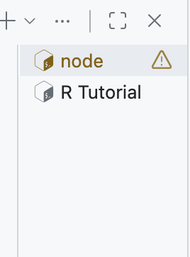
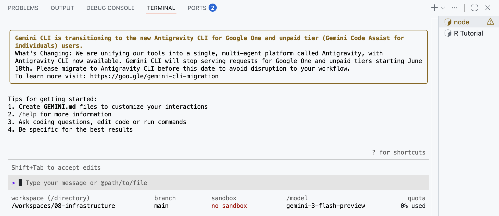
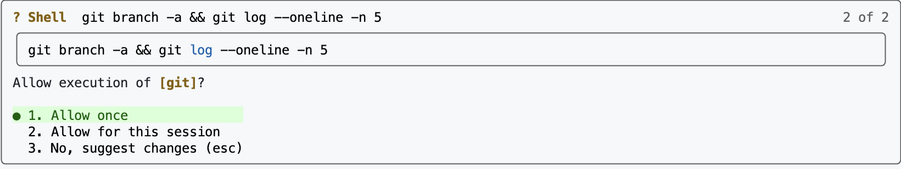
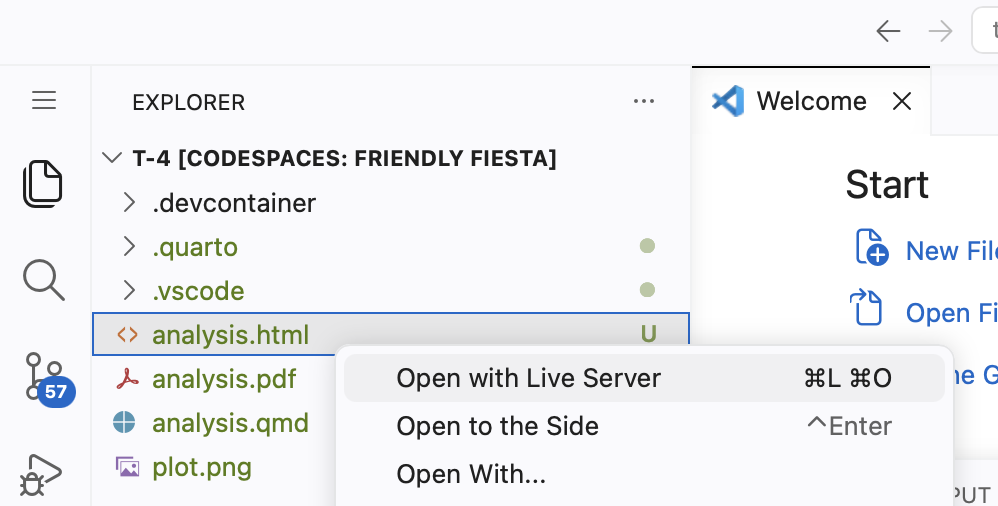

```{r setup, include = FALSE}
library(learnr)
library(tutorial.helpers)
library(knitr)

knitr::opts_chunk$set(echo = FALSE)
knitr::opts_chunk$set(out.width = '90%')
options(tutorial.exercise.timelimit = 60,
        tutorial.storage = "local")
```

```{r info-section, child = system.file("child_documents/info_section.Rmd", package = "tutorial.helpers")}
```

## Introduction
###

This tutorial introduces the [Gemini CLI](https://github.com/google-gemini/gemini-cli) for doing AI-assisted data science work in GitHub Codespaces. You will set up and use the Gemini CLI --- a terminal-based AI assistant that can read your files, run commands in the terminal, and write new files --- to create and render project files and handle Git operations.

### Exercise 1

You must do this tutorial in a Codespace created from a GitHub repo named `08-ai`. If you haven't already done this, follow these steps:

1. Create a GitHub Repo: go to the [codespace-starter repo](https://github.com/ppbds-student/codespace-starter). Click the green "Use this Template" drop-down button and select "Create a new repository". Name the repo `08-ai`. Then click "Create repository".

2. Create a Codespace from `08-ai`: from this repo's page, click the green "Code" drop down button, select the "Codespaces" tab, and click "Create Codespace on main".

Copy and paste the URL for your `08-ai` repository.

```{r introduction-1}
question_text(NULL,
	answer(NULL, correct = TRUE),
	allow_retry = TRUE,
	try_again_button = "Edit Answer",
	incorrect = NULL,
	rows = 5)
```

###

Your answer should look something like:

````
https://github.com/ppbds-student/08-ai
````

###

The `codespace-starter` repo includes a `.devcontainer/devcontainer.json` file that tells GitHub exactly what to install when a Codespace starts. The Gemini CLI is already listed there, which is why you'll be able to run `gemini` immediately without installing anything yourself.

### Exercise 2

Copy and paste the URL for your Codespace.


```{r introduction-2}
question_text(NULL,
	answer(NULL, correct = TRUE),
	allow_retry = TRUE,
	try_again_button = "Edit Answer",
	incorrect = NULL,
	rows = 5)
```

###

Your answer should look something like:

````
https://congenial-chainsaw-wv757pv4pp67cpw.github.dev/
````

###

There are three main ways to interact with AI: a *chat interface* (like gemini.google.com), a *command-line tool* running in your terminal, and *an AI built into your editor* (like GitHub Copilot). This tutorial uses the command-line approach --- you'll run Gemini directly in the VS Code terminal, where it can read your files and take actions on your behalf. Feel free to close the Copilot sidebar.

### Exercise 3

At the Terminal, run `pwd`. CP/CR.

```{r introduction-3}
question_text(NULL,
	answer(NULL, correct = TRUE),
	allow_retry = TRUE,
	try_again_button = "Edit Answer",
	incorrect = NULL,
	rows = 6)
```

###

Your answer should look like:

````
@ppbds-student ➜ /workspaces/08-ai (main) $ pwd
/workspaces/08-ai
@ppbds-student ➜ /workspaces/08-ai (main) $
````

Gemini CLI can see exactly what you can see. Because it runs in the same directory (`/workspaces/08-ai`), any files here are directly accessible to it --- a key difference from a chat interface, where you'd have to manually paste file contents for the AI to read them.

### Exercise 4

Now, run `ls -a`. CP/CR.

```{r introduction-4}
question_text(NULL,
	answer(NULL, correct = TRUE),
	allow_retry = TRUE,
	try_again_button = "Edit Answer",
	incorrect = NULL,
	rows = 5)
```

###

Your answer should look like:

````
@ppbds-student ➜ /workspaces/08-ai (main) $ ls -a
.  ..  .devcontainer  .git
@ppbds-student ➜ /workspaces/08-ai (main) $
````

###

The `.git` directory tells both you and Gemini that this is a Git repository. When Gemini sees it, Gemini knows it can run `git` commands --- like adding files to Git, reading the commit history, and pushing to GitHub.

## Gemini CLI
###

The [Gemini CLI](https://github.com/google-gemini/gemini-cli) is a free, open AI assistant built by Google that runs in your terminal. Unlike a web chat interface, it can take actions on your behalf: reading files, running terminal commands, and writing new files. Each time it wants to take an action, it asks for your permission first --- so you always stay in control.

### Exercise 1

Start the Gemini CLI by running `gemini` in the bash Terminal. First it will ask you if you wish to connect your Codespace to Gemini. Press `y` to allow it. Next, it will ask whether you trust the current working directory --- again, press `y`. 

CP/CR the first several lines of terminal output --- enough to show the authentication prompt and the `>` prompt that appears after you successfully log in.

```{r gemini-cli-1}
question_text(NULL,
	answer(NULL, correct = TRUE),
	allow_retry = TRUE,
	try_again_button = "Edit Answer",
	incorrect = NULL,
	rows = 10)
```

###

You may notice that VS Code renames the terminal tab from "bash" to "node" once Gemini starts. This is because the Gemini CLI is built on [Node.js](https://nodejs.org/en/about), and VS Code detects this and updates the tab name.


```{r}

```

### Exercise 2

It will then ask you to authenticate with your Google account.

You will see a URL printed in the terminal. Open that URL in your browser, sign in with your Google account, and copy the authorization code that appears on the page. Paste it back into the terminal and press `Enter`.

```{r}
include_graphics("images/gemini-CLI-auth-link.png")
```


```{r gemini-cli-2}
question_text(NULL,
	answer(NULL, correct = TRUE),
	allow_retry = TRUE,
	try_again_button = "Edit Answer",
	incorrect = NULL,
	rows = 5)
```

###

Your terminal should look something like this:

```{r}

```

###

This uses [OAuth 2.0](https://oauth.net/2/), the same standard behind "Sign in with Google" buttons --- you grant a temporary permission token rather than sharing your password. The token is saved in this Codespace, but each new Codespace requires a fresh sign-in.

### Exercise 3

You are now inside the Gemini CLI interactive session. The `>` prompt means Gemini is waiting for your input. Type `/help` and press `Enter` to see the list of available commands.

CP/CR.

<!-- HK: The actual /help output has dozens more commands than the expected answer shows. The output will vary depending on the Gemini CLI version. -->

```{r gemini-cli-3}
question_text(NULL,
	answer(NULL, correct = TRUE),
	allow_retry = TRUE,
	try_again_button = "Edit Answer",
	incorrect = NULL,
	rows = 18)
```

###

You should see something like:

````
> /help

Available commands:
  /help              Show this help message
  /quit or /exit     Exit the Gemini CLI
  /model             Show or change the current model
  /stats session     Show usage statistics for this session
  /stats model       Show model token limits and current usage
  /clear             Clear the current conversation history
  /chat              List and restore saved chats
...
>
````

###

Slash commands control the program itself, not Gemini --- the command `/help` tells the *program* to print its options, while a plain sentence talks to *Gemini*. For factual session data like usage statistics, always use slash commands rather than asking Gemini, which will only guess.

<!-- HK: /model actually opens a menu to pick a model, not just prints the current one. DK: Add some words about You may see something different. Don't worry about it if so. -->

### Exercise 4

Type `/model` to see which Gemini model is currently active. CP/CR.

```{r gemini-cli-4}
question_text(NULL,
	answer(NULL, correct = TRUE),
	allow_retry = TRUE,
	try_again_button = "Edit Answer",
	incorrect = NULL,
	rows = 4)
```

###

Your output should look something like:

````
> /model
Current model: gemini-2.5-pro
>
````

###

The Gemini model family has several tiers: **Pro** for complex reasoning and coding tasks, **Flash** for speed and lower usage. You can switch mid-session with `/model model-name` if you want to save your daily limit for simpler work or use a more powerful model.

### Exercise 5

Ask Gemini to describe what files are in the repository. Type something like:

```
Please explain the contents of this repository. Run ls -a to check the contents.
```

Gemini will display a **tool authorization prompt** before running commands. It should look something like this:

```{r}

```

Press `1` or hit enter where it says allow once to allow the command to run. You could press `2` to allow Gemini to run the same command without asking again in this session. CP/CR the authorization prompt and Gemini's response.


```{r gemini-cli-5}
question_text(NULL,
	answer(NULL, correct = TRUE),
	allow_retry = TRUE,
	try_again_button = "Edit Answer",
	incorrect = NULL,
	rows = 15)
```

###

The tool authorization prompt is a deliberate safety feature --- an AI that could silently run commands in your terminal without asking would be a significant security risk.

### Exercise 6

Ask Gemini to create an `analysis.qmd` file. Tell it you want:

- A YAML header with the title `"Exploring Storms"` and your name as author
- `execute: echo: false` in the YAML
- A setup chunk loading `library(tidyverse)` wrapped in `suppressPackageStartupMessages()`
- A plot using the `storms` dataset from **dplyr** --- for example, a line chart showing the number of named storms per year

Press `y` when Gemini asks to write the file. CP/CR the tool authorization and Gemini's explanation of what it created.

```{r gemini-cli-6}
question_text(NULL,
	answer(NULL, correct = TRUE),
	allow_retry = TRUE,
	try_again_button = "Edit Answer",
	incorrect = NULL,
	rows = 12)
```

###

Your output should look something like:

````
> Create an analysis.qmd with a title, author, execute echo false, suppressPackageStartupMessages tidyverse, and a ggplot2 plot using a built-in dataset.

╔ Tool Use: write_file ════════════════════╗
║  Path: analysis.qmd                      ║
╚══════════════════════════════════════════╝

Allow this tool call? [y/n/a]: y

✔ Created analysis.qmd

I've created `analysis.qmd` with:
- YAML header titled "Exploring Storms" and `execute: echo: false`
- Setup chunk using `suppressPackageStartupMessages(library(tidyverse))`
- A line chart showing the number of named storms per year using the `storms` dataset

>
````

###

When you ask Gemini to create a file, it generates the entire contents in one step and writes it for you. Instead of typing the YAML header, chunk settings, and library calls yourself, you describe what you want and refine the result --- editing is almost always faster than composing from scratch.

### Exercise 7

Still inside Gemini, ask it to render `analysis.qmd` for you. Type something like:

```
Render analysis.qmd using quarto render and tell me what files were created afterward.
```

Gemini will issue two tool calls: one to render the document and one to list the resulting files. Press `y` for each. CP/CR the output.

```{r gemini-cli-7}
question_text(NULL,
	answer(NULL, correct = TRUE),
	allow_retry = TRUE,
	try_again_button = "Edit Answer",
	incorrect = NULL,
	rows = 15)
```

###

Your output should look something like:

````
> Render analysis.qmd using quarto render and tell me what files were created afterward.

╔ Tool Use: run_shell ═══════════════════════════════╗
║  Command: quarto render analysis.qmd               ║
╚════════════════════════════════════════════════════╝

Allow this tool call? [y/n/a]: y

[Quarto rendering output...]
Output created: analysis.html

╔ Tool Use: run_shell ════════════╗
║  Command: ls                    ║
╚════════════════════════════════╝

Allow this tool call? [y/n/a]: y

Output: .gitignore  analysis.html  analysis.qmd

Quarto rendered `analysis.qmd` successfully. New files: `analysis.html` (the rendered output) and `analysis_files/` (supporting assets, which your `.gitignore` will exclude from Git).

>
````

###

Gemini ran two commands to answer one question, using the result of each step to decide what to do next. This is what makes it an AI *agent* --- it takes actions and reasons about results, rather than just producing text.

### Exercise 8

Let's view the rendered file in a browser. In the File Explorer (the file tree on the left side of VS Code), find `analysis.html`. Right-click it and select **"Open with Live Server"**.

```{r}

```

This opens `analysis.html` in a new browser tab served through your Codespace. The URL will look something like `https://[codespace-name]-5500.app.github.dev/analysis.html`.

Copy/paste that URL below.

```{r gemini-cli-8}
question_text(NULL,
	answer(NULL, correct = TRUE),
	allow_retry = TRUE,
	try_again_button = "Edit Answer",
	incorrect = NULL,
	rows = 3)
```

###

Your URL should look something like:

````
https://congenial-chainsaw-wv757pv4pp67cpw-5500.app.github.dev/analysis.html
````

Keep this tab open. Every time `analysis.html` is updated on disk --- whether by Gemini or by running `quarto render` yourself --- the tab will automatically refresh.

###

Live Server is a VS Code extension that hosts HTML files so they can be viewed in a browser and reloads the page whenever a file changes. This is necessary in a Codespace because the files live on a remote computer and cannot be opened directly in a browser.

### Exercise 9

Ask Gemini to add a second plot to `analysis.qmd` using the `storms` dataset. Tell it to visualize something different from the first plot --- for example, a boxplot showing the distribution of wind speeds by storm category. Ask it to include a meaningful title and subtitle, then re-render the file.

After Gemini finishes, check your Live Server tab --- it should have refreshed automatically to show both plots. Open a new R Terminal. 

<!-- AR: show image of creating the new R Terminal -->

Then, in the new R Terminal, run:

```
tutorial.helpers::show_file("analysis.qmd", chunk = "Last")
```

CP/CR.

```{r gemini-cli-9}
question_text(NULL,
	answer(NULL, correct = TRUE),
	allow_retry = TRUE,
	try_again_button = "Edit Answer",
	incorrect = NULL,
	rows = 20)
```

###

Your answer will vary, but it should show **ggplot2** code using the `storms` dataset --- something like a boxplot of wind speed by storm category. The chunk should not have `#| echo: true` --- since you set `execute: echo: false` in the YAML header, all chunks use that setting by default.

###

When Gemini adds a plot and re-renders, two things happen automatically: Quarto updates `analysis.html`, and Live Server detects the change and refreshes your browser. This loop --- ask Gemini, render, view --- is the same workflow you would use throughout a real project.

### Exercise 10

Ask Gemini to create a `.gitignore` file suitable for a Quarto R project. Type something like:

```
Create a .gitignore file for a Quarto R project in VS Code. Include patterns for Quarto output directories.
```

This time, Gemini will ask permission to **write a file** rather than run a command. Press `y` to authorize it. CP/CR the tool authorization prompt and Gemini's summary of what it created.

```{r gemini-cli-10}
question_text(NULL,
	answer(NULL, correct = TRUE),
	allow_retry = TRUE,
	try_again_button = "Edit Answer",
	incorrect = NULL,
	rows = 12)
```

###

Your output should look something like:

````
> Create a .gitignore file for a Quarto R project.

╔ Tool Use: write_file ════════════════════╗
║  Path: .gitignore                        ║
╚══════════════════════════════════════════╝

Allow this tool call? [y/n/a]: y

✔ Created .gitignore

I've created a `.gitignore` that covers:
- `*_files/` — Quarto's output asset directories
- `*_cache/` — cached computation results
- `/.quarto/` — Quarto's internal build directory

>
````

###

A `.gitignore` tells Git to ignore certain files entirely --- they won't appear in `git status` and can never be accidentally committed. The guiding principle: if a file can be *regenerated* from your source, it doesn't belong in the commit history.

### Exercise 11

Ask Gemini to show you the contents of the `.gitignore` it just created. Type something like:

```
Show me the contents of .gitignore.
```

Press `y` to authorize the shell command. CP/CR.

```{r gemini-cli-11}
question_text(NULL,
	answer(NULL, correct = TRUE),
	allow_retry = TRUE,
	try_again_button = "Edit Answer",
	incorrect = NULL,
	rows = 12)
```

###

Your output should look something like:

````
> Show me the contents of .gitignore.

╔ Tool Use: run_shell ══════════════════════╗
║  Command: cat .gitignore                  ║
╚═══════════════════════════════════════════╝

Allow this tool call? [y/n/a]: y

# Quarto
*_files/
*_cache/

>
````

###

Asking Gemini to read back a file it just created is a quick way to verify the contents without leaving Gemini. The underlying command is the same `cat` you would run yourself --- Gemini just runs it on your behalf and shows you the result.


### Exercise 12

Before moving on, let's deliberately quit and restart Gemini to see what happens to the conversation history. Type `/quit`.

Now run `gemini` to start a fresh session. Once you're at the `>` prompt, ask:

```
What have we done in this project so far?
```

Without reading any files, Gemini will have no memory of the previous session. Press `y` to let it read the repo and watch it reconstruct the context from the filesystem.

CP/CR Gemini's full response.

```{r gemini-cli-12}
question_text(NULL,
	answer(NULL, correct = TRUE),
	allow_retry = TRUE,
	try_again_button = "Edit Answer",
	incorrect = NULL,
	rows = 15)
```

###

Gemini's **conversation history** is gone the moment you type `/quit`, but the **files on disk** are permanent --- this is why it can pick up where you left off after a restart just by reading the files. The `/chat save <name>` command lets you preserve a conversation so you can resume it later with `/chat resume <name>`.

## Git with Gemini
###

Now that the project has real files, let's save the work with Git. Rather than just telling you the commands, we'll use Gemini to explain the Git workflow. Using AI to understand what you are doing --- not just to do it --- is a powerful learning strategy.

### Exercise 1

Ask Gemini to check the Git status and explain what the output means:

```
Run git status and explain what each part of the output means.
```

<!-- HK: The expected answer shows analysis.html as untracked but it won't show up because the .gitignore Gemini creates ignores *.html files. Students might be confused why their output looks different. DK: Good point! Please fix. -->

Press `y`, 1, or hit Enter on allow once to allow the shell command. CP/CR the full response including Gemini's explanation.

```{r git-with-gemini-1}
question_text(NULL,
	answer(NULL, correct = TRUE),
	allow_retry = TRUE,
	try_again_button = "Edit Answer",
	incorrect = NULL,
	rows = 18)
```

###

Your answer should look something like:

````
> Run git status and explain what each part of the output means.

╔ Tool Use: run_shell ══════════════════╗
║  Command: git status                  ║
╚═══════════════════════════════════════╝

Allow this tool call? [y/n/a]: y

Output:
On branch main
Your branch is up to date with 'origin/main'.

Untracked files:
  (use "git add <file>..." to include in what will be committed)
        .gitignore
        analysis.html
        analysis.qmd

nothing added to commit but untracked files present

Here's what this means:
- "On branch main" — you are working on the main branch.
- "Your branch is up to date" — your local branch matches the GitHub copy.
- "Untracked files" — Git has noticed these files but is not monitoring them yet. They will not be included in any commit until you explicitly add them with `git add`.

>
````

###

`git status` shows your branch, **staged** changes (added to the next commit), and **untracked** files (noticed by Git but not yet included). Smart commit in `codespace-starter` handles staging automatically --- just press the "Commit" button.

### Exercise 2

Ask Gemini to explain the difference between `git add` and `git commit`, and to provide the exact command to commit all three files with a good message:

```
Explain the difference between git add and git commit. Then give me the exact command to commit .gitignore, analysis.qmd, and analysis.html with a descriptive message.
```

CP/CR Gemini's full response.

```{r git-with-gemini-2}
question_text(NULL,
	answer(NULL, correct = TRUE),
	allow_retry = TRUE,
	try_again_button = "Edit Answer",
	incorrect = NULL,
	rows = 20)
```

###

Gemini should explain that `git add` moves files into the **staging area**, a holding zone where you prepare which changes to include before committing. `git commit` then takes everything in the staging area and permanently records it in the project's history. A typical response will include commands like:

```
git add .gitignore analysis.qmd analysis.html
git commit -m "initial version with analysis and gitignore"
```

###

The two-step design lets you choose exactly which files go into each commit --- useful when you want to record related changes separately with different messages. In `codespace-starter`, the Source Control sidebar handles both steps at once, but knowing they are separate matters when collaborating on larger projects.

### Exercise 3

Open the Source Control sidebar (the branch icon in the Activity Bar). You should see `.gitignore`, `analysis.qmd`, and `analysis.html` listed as changes. Type a commit message in the message box at the top, then click the **Commit** button. Because smart commit is enabled in the devcontainer, clicking Commit will stage and commit all changes in one step --- no `git add` required.

Then, in a separate bash Terminal, run:

```
git log --oneline
```

CP/CR.

```{r git-with-gemini-3}
question_text(NULL,
	answer(NULL, correct = TRUE),
	allow_retry = TRUE,
	try_again_button = "Edit Answer",
	incorrect = NULL,
	rows = 6)
```

###

Your answer should look something like:

````
@ppbds-student ➜ /workspaces/08-ai (main) $ git log --oneline
a3b8c21 (HEAD -> main) initial version with analysis and gitignore
e3b01ee Initial commit
@ppbds-student ➜ /workspaces/08-ai (main) $
````

The `(HEAD -> main)` indicator confirms your local branch is current, but the missing `origin/main` means this commit hasn't been pushed to GitHub yet. Pushing is what sends it there and makes it visible to others.

### Exercise 4

Ask Gemini to improve the storms-per-year chart. Type something like:

```
Update the storms-per-year chart in analysis.qmd to be a stacked area chart showing the count of each storm type per year. Filter to just tropical depressions, tropical storms, and hurricanes. Use a color scale that goes from light blue for tropical depressions through orange for tropical storms to dark red for hurricanes. Re-render the file when done.
```

Press `y` to authorize each tool call. Once the Live Server tab has refreshed and you are happy with the result, ask Gemini to handle the entire Git workflow:

```
Please commit analysis.qmd and analysis.html with a good message, and push to GitHub.
```

Press `y` to authorize each tool call as Gemini works through the steps. CP/CR the complete output.

```{r git-with-gemini-4}
question_text(NULL,
	answer(NULL, correct = TRUE),
	allow_retry = TRUE,
	try_again_button = "Edit Answer",
	incorrect = NULL,
	rows = 20)
```

###

Your output should look something like:

````
> Please commit analysis.qmd and analysis.html with a good message, and push to GitHub.

╔ Tool Use: run_shell ═══════════════════════════════════════╗
║  Command: git add analysis.qmd analysis.html               ║
╚════════════════════════════════════════════════════════════╝
Allow this tool call? [y/n/a]: y

╔ Tool Use: run_shell ══════════════════════════════════════════════╗
║  Command: git commit -m "convert to stacked area chart by storm type" ║
╚══════════════════════════════════════════════════════════════════╝
Allow this tool call? [y/n/a]: y

╔ Tool Use: run_shell ════════════════════════╗
║  Command: git push origin main              ║
╚═════════════════════════════════════════════╝
Allow this tool call? [y/n/a]: y

✔ Done! Your changes have been committed and pushed to GitHub.

>
````

###

Gemini issued three separate tool calls --- `git add`, `git commit`, and `git push` --- mapping directly to the three stages of staging, recording, and sharing. In Exercise 3 you ran these yourself using the Source Control sidebar; here you delegated them to gemini.

### Exercise 5

Still in Gemini, type `/stats session` and then `/stats model`. CP/CR both outputs.

```{r git-with-gemini-5}
question_text(NULL,
	answer(NULL, correct = TRUE),
	allow_retry = TRUE,
	try_again_button = "Edit Answer",
	incorrect = NULL,
	rows = 18)
```

###

Your output should look something like:

````
> /stats session

Session Statistics:
  Messages:           14
  Tool calls made:    10
  Tool calls allowed: 10
  Input tokens:       ~18,400
  Output tokens:      ~5,100
  Total tokens:       ~23,500

> /stats model

Model: gemini-2.5-pro
  Context window:    1,000,000 tokens
  Free tier limit:   1,000,000 tokens/day
  Used today:        ~23,500 tokens
  Remaining:         ~976,500 tokens

>
````

###

AI models have **context windows** --- a limit on how much text they can process in one session. Gemini's are very large (up to 1 million tokens), but `/stats` lets you track usage in real time; on the free tier, your daily limit resets every day.


## Summary
###

This tutorial introduced the [Gemini CLI](https://github.com/google-gemini/gemini-cli) as a tool for AI-assisted data science in GitHub Codespaces. You authenticated with your Google account, used Gemini to create and render a Quarto analysis file, and delegated a complete Git workflow --- staging, committing, and pushing --- to the CLI.

### Exercise 1

Quit Gemini with `/quit` if you haven't already. From the bash Terminal, run `quarto render analysis.qmd` to regenerate the HTML. Then, in the R Terminal, run:

```
tutorial.helpers::show_file("analysis.qmd")
```

CP/CR.

```{r summary-1}
question_text(NULL,
	answer(NULL, correct = TRUE),
	allow_retry = TRUE,
	try_again_button = "Edit Answer",
	incorrect = NULL,
	rows = 30)
```

###

Your answer should show the full contents of `analysis.qmd`, including a YAML header with `execute: echo: false`, a setup chunk using `suppressPackageStartupMessages(library(tidyverse))`, and at least two ggplot2 code chunks creating plots.

### Exercise 2

Publish your rendered QMD to GitHub Pages. In the bash Terminal, run:

```
quarto publish gh-pages analysis.qmd
```

Respond with `Y` when prompted. Copy/paste the resulting URL below.

```{r summary-2}
question_text(NULL,
	answer(NULL, correct = TRUE),
	allow_retry = TRUE,
	try_again_button = "Edit Answer",
	incorrect = NULL,
	rows = 3)
```

###

Your URL should look something like:

```
https://ppbds-student.github.io/08-ai/
```

GitHub Pages takes a minute or two to deploy after `quarto publish` runs. If the link doesn't load immediately, wait and refresh.

### Exercise 3

Commit and push any remaining uncommitted files. Copy/paste the URL to your GitHub repo.

```{r summary-3}
question_text(NULL,
	answer(NULL, correct = TRUE),
	allow_retry = TRUE,
	try_again_button = "Edit Answer",
	incorrect = NULL,
	rows = 3)
```

###

Other AI coding tools include [Claude Code](https://claude.ai/claude-code) (Anthropic), [GitHub Copilot](https://github.com/features/copilot) (Microsoft), and [Cursor](https://cursor.sh/) (Anysphere). The workflow is the same across all of them: describe what you want, review the result, and iterate.

```{r download-answers, child = system.file("child_documents/download_answers.Rmd", package = "tutorial.helpers")}
```
