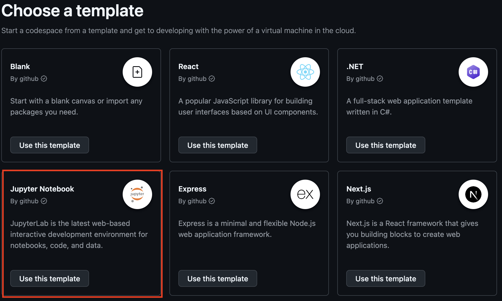
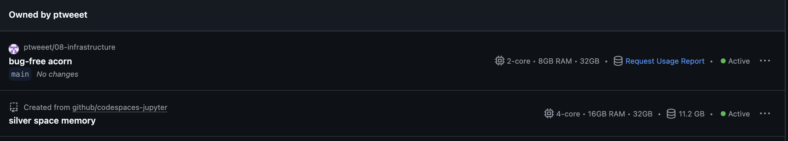
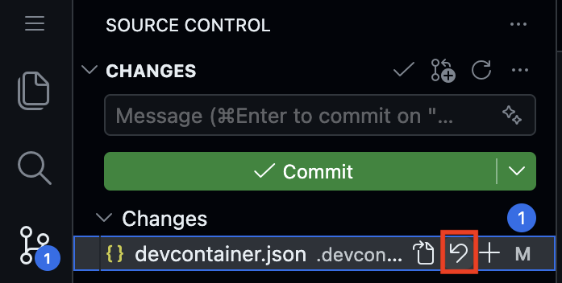
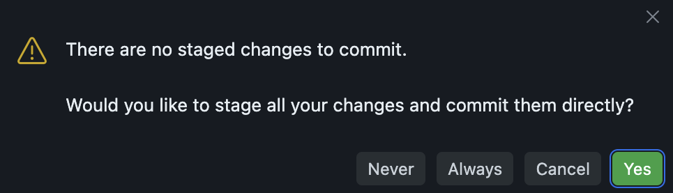
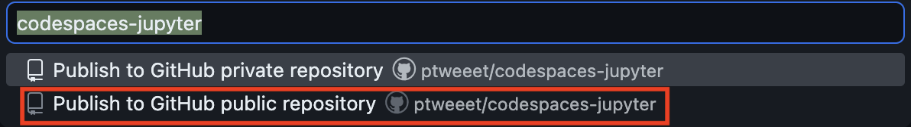
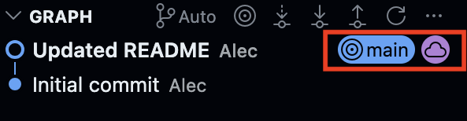

```{r setup, include = FALSE}
library(learnr)
library(tutorial.helpers)
library(knitr)

knitr::opts_chunk$set(echo = FALSE)
knitr::opts_chunk$set(out.width = '90%')
options(tutorial.exercise.timelimit = 60,
        tutorial.storage = "local")
```

```{r info-section, child = system.file("child_documents/info_section.Rmd", package = "tutorial.helpers")}
```

## Introduction
###

This tutorial explores devcontainers --- configuration files that define how a GitHub Codespace is set up. You will examine a `devcontainer.json` file to understand how it specifies the starting image, installed packages, VS Code extensions, and startup commands that make a Codespace ready to use the moment it opens. You will also compare two different Codespace configurations side by side.

### Exercise 1

You must do this tutorial in a Codespace created from a GitHub repo named `09-infrastructure`. If you haven't already done this, follow these steps:

1. Create a GitHub Repo: go to the [codespace-starter repo](https://github.com/ppbds-student/codespace-starter). Click the green "Use this Template" drop-down button and select "Create a new repository". Name the repo `09-infrastructure`. Then click "Create repository".

2. Create a Codespace from `09-infrastructure`: from this repo's page, click the green "Code" drop down button, select the "Codespaces" tab, and click "Create Codespace on main".

Copy and paste the URL for your `09-infrastructure` repository.

```{r introduction-1}
question_text(NULL,
	answer(NULL, correct = TRUE),
	allow_retry = TRUE,
	try_again_button = "Edit Answer",
	incorrect = NULL,
	rows = 5)
```

###

Your answer should look something like:

````
https://github.com/ppbds-student/09-infrastructure
````

###

The `codespace-starter` repo includes a `.devcontainer/devcontainer.json` file that tells GitHub exactly what to install when a Codespace starts. This is what ensures everyone who opens a Codespace from the same repo gets the same tools, extensions, and settings.

### Exercise 2

Copy and paste the URL for your Codespace.

```{r introduction-2}
question_text(NULL,
	answer(NULL, correct = TRUE),
	allow_retry = TRUE,
	try_again_button = "Edit Answer",
	incorrect = NULL,
	rows = 5)
```

###

Your answer should look something like:

````
https://congenial-chainsaw-wv757pv4pp67cpw.github.dev/
````

###

Every Codespace runs on a remote computer provided by GitHub. The URL you just pasted is a unique address for your specific machine --- a different person opening a Codespace from the same repo would get a different URL, but the same setup.

### Exercise 3

At the Terminal, run `pwd`, then `ls -a`. CP/CR.

```{r introduction-3}
question_text(NULL,
	answer(NULL, correct = TRUE),
	allow_retry = TRUE,
	try_again_button = "Edit Answer",
	incorrect = NULL,
	rows = 6)
```

###

Your answer should look like:

````
@ppbds-student ➜ /workspaces/09-infrastructure (main) $ pwd
/workspaces/09-infrastructure
@ppbds-student ➜ /workspaces/09-infrastructure (main) $ ls -a
.  ..  .devcontainer  .git
@ppbds-student ➜ /workspaces/09-infrastructure (main) $
````

###

The `.devcontainer` directory tells GitHub Codespaces how to set up this Codespace. The `.git` directory confirms this repo is tracked by Git.

### Exercise 4

Run `cat .devcontainer/devcontainer.json`. CP/CR.

```{r introduction-4}
question_text(NULL,
	answer(NULL, correct = TRUE),
	allow_retry = TRUE,
	try_again_button = "Edit Answer",
	incorrect = NULL,
	rows = 15)
```

###

Your output will show the full `devcontainer.json` for the `codespace-starter` template. You will explore each part of this file in the Codespace Starter Devcontainer section. Keep this Codespace open --- you will need it alongside a second Codespace in the next section.

## Jupyter Notebook Devcontainer
###

A **devcontainer** is a way to describe a Codespace's setup in a file. Instead of documenting setup steps in a README and hoping every collaborator follows them correctly, a `devcontainer.json` file captures the entire setup --- starting image, packages, extensions, and startup commands --- so that any Codespace opened from the repo starts in an identical, ready-to-use state. In this section you will examine the devcontainer for GitHub's Jupyter Notebook template, which sets up a Codespace for doing data science with Python and Jupyter Notebooks.

### Exercise 1

Go to https://github.com/codespaces/templates. Then press the "Use This Template" button for the Jupyter Notebook notebook template. This will open a new Codespace using this template. Copy and paste its URL.

```{r}

```

```{r devcontainers-1}
question_text(NULL,
	answer(NULL, correct = TRUE),
	allow_retry = TRUE,
	try_again_button = "Edit Answer",
	incorrect = NULL,
	rows = 5)
```

###

The Jupyter Notebook template is a pre-built Codespace for Python data science using Jupyter notebooks --- similar to how `codespace-starter` is set up for R, Quarto, and running tutorials.

### Exercise 2

Now, you should have two Codespaces open. Go to https://github.com/codespaces. Then copy and paste the two table rows corresponding to your open Codespaces.

```{r}

```

```{r devcontainers-2}
question_text(NULL,
	answer(NULL, correct = TRUE),
	allow_retry = TRUE,
	try_again_button = "Edit Answer",
	incorrect = NULL,
	rows = 5)
```

###

The github.com/codespaces page is where you manage all your active Codespaces. Each one uses hours and storage from your GitHub monthly limit, so stop or delete ones you're not using.

### Exercise 3

Select the `devcontainer.json` file within the `.devcontainer` directory in the File Explorer. Find the line beginning with "image", copy and paste.

```{r devcontainers-3}
question_text(NULL,
	answer(NULL, correct = TRUE),
	allow_retry = TRUE,
	try_again_button = "Edit Answer",
	incorrect = NULL,
	rows = 5)
```

###

Your answer should look like this:

```
"image": "mcr.microsoft.com/devcontainers/universal:2",
```

###

The `image` field tells GitHub which pre-built setup to use --- think of it as choosing a computer that already has certain software installed. `mcr.microsoft.com/devcontainers/universal:2` is Microsoft's general-purpose setup with Python and several other programming languages pre-installed.

### Exercise 4

In the same file, find the chunk of code beginning with `"vscode": {` copy and paste this chunk, ending with the bracket which closes the starting bracket on the first line.


```{r devcontainers-4}
question_text(NULL,
	answer(NULL, correct = TRUE),
	allow_retry = TRUE,
	try_again_button = "Edit Answer",
	incorrect = NULL,
	rows = 5)
```

###

Your answer should look like this:

```
"vscode": {
      "extensions": [
        "ms-toolsai.jupyter",
        "ms-python.python"
      ]
    }
```

###

This block lists which VS Code extensions to pre-install. `ms-toolsai.jupyter` enables Jupyter notebooks; `ms-python.python` adds Python code completion and error highlighting.

### Exercise 5

Find the line beginning with `"updateContentCommand"` in `devcontainer.json`. Copy and paste it. Then navigate to `requirements.txt` in the File Explorer and copy and paste the entire file.

```{r devcontainers-5}
question_text(NULL,
	answer(NULL, correct = TRUE),
	allow_retry = TRUE,
	try_again_button = "Edit Answer",
	incorrect = NULL,
	rows = 15)
```

###

Your answer should look like this:

```
"updateContentCommand": "python3 -m pip install -r requirements.txt",

ipywidgets==8.1.8
matplotlib==3.8.4
pandas==2.2.2
torch==2.8.0
torchvision==0.23.0
tqdm==4.66.4
pillow>=12.1.1
fonttools>=4.60.0
filelock>=3.20.3
Pygments==2.20.0
```

###

`updateContentCommand` runs when the Codespace is first created and again whenever the repo's files change --- so if someone pushes a new `requirements.txt`, the packages update automatically. `pandas` and `matplotlib` are the core packages: the Python equivalents of the tidyverse tools you've been using in R.

### Exercise 6

Use AI to update the devcontainer so it installs and configures the environment for using R instead of Python. Some ways you can do this include:

1. Use the Copilot chat sidebar.

2. Copy and paste the entire document to an AI chatbot.

3. Use the gemini CLI in a bash Terminal.

Copy and paste your new `devcontainer.json`.

```{r devcontainers-6}
question_text(NULL,
	answer(NULL, correct = TRUE),
	allow_retry = TRUE,
	try_again_button = "Edit Answer",
	incorrect = NULL,
	rows = 5)
```

###

My new file looks like this:

```
{
  "image": "mcr.microsoft.com/devcontainers/universal:2",
  "hostRequirements": {
    "cpus": 4
  },
  "waitFor": "onCreateCommand",
  "updateContentCommand": "Rscript -e \"if (!requireNamespace('remotes', quietly=TRUE)) install.packages('remotes', repos='https://cloud.r-project.org')\"",
  "postCreateCommand": "",
  "customizations": {
    "codespaces": {
      "openFiles": []
    },
    "vscode": {
        "extensions": [
        "ms-toolsai.jupyter",
        "Ikuyadeu.r"
      ]
    }
  }
}
```

###

Describing what you want in plain English works just as well for configuration files like `devcontainer.json` as it does for analysis code. Once comfortable, you can publish your own repo as a template and reuse it for future projects.

### Exercise 7

Since the rest of this Codespace still uses Python, let's revert any changes we've made to `devcontainer.json`. Go to the Source Control side bar and press the revert button on the right.

```{r}

```

Run `git status` in a bash Terminal. CP/CR.

```{r devcontainers-7}
question_text(NULL,
	answer(NULL, correct = TRUE),
	allow_retry = TRUE,
	try_again_button = "Edit Answer",
	incorrect = NULL,
	rows = 5)
```

###

You should see something like this:

```
@ppbds-student ➜ /workspaces/codespaces-jupyter (main) $ git status
On branch main
nothing to commit, working tree clean
@ppbds-student ➜ /workspaces/codespaces-jupyter (main) $
```

This indicates that Git doesn't detect any changes to the repository.

###

Until you commit, changes exist only in your local files and can be discarded at any time. The revert button works here precisely because `devcontainer.json` was never added to Git or committed --- once a change is committed, undoing it requires a new commit rather than a simple discard.


### Exercise 8

Replace the first paragraph of `README.md` with:

```
This is YOUR NAME's new python Codespace!
```

Save the changes. In the Source Control side bar, write a commit message like "Updated README". Then, press the "Commit Button". A pop-up will appear:

```{r}

```

Press "Yes".

Run `git log --oneline` to view the Git history. CP/CR.

```{r devcontainers-8}
question_text(NULL,
	answer(NULL, correct = TRUE),
	allow_retry = TRUE,
	try_again_button = "Edit Answer",
	incorrect = NULL,
	rows = 5)
```

###

Your output should look something like this:

```
@ppbds-student ➜ /workspaces/codespaces-jupyter (main) $ git log --oneline
bf71a79 (HEAD -> main) Updated README
7c6c35a Initial commit
@ppbds-student ➜ /workspaces/codespaces-jupyter (main) $
```

###

This pop-up doesn't appear when we use Codespaces started with `codespace-starter` because that template enables smart commit, a VS Code feature that automatically includes all changed files when the "Commit" button is pressed. The pop-up appeared in this Codespace because the devcontainer.json does not enable this feature.

### Exercise 9

Let's continue our tour of this repo. Navigate to `.gitignore` in the File Explorer.

Copy and paste the entire file.

```{r devcontainers-9}
question_text(NULL,
	answer(NULL, correct = TRUE),
	allow_retry = TRUE,
	try_again_button = "Edit Answer",
	incorrect = NULL,
	rows = 5)
```

###

It should look something like this:

```
notebooks/data
notebooks/cifar_net.pth
.ipynb_checkpoints/
```

###

Each line excludes files that shouldn't be tracked in Git:

- `notebooks/data` ignores the data directory (which may contain large files unsuitable for GitHub)

- `notebooks/cifar_net.pth` ignores a saved PyTorch model file (also large and can be recreated by running the training code again)

- `.ipynb_checkpoints/` ignores the auto-save folder that Jupyter creates whenever you run a notebook --- these are temporary files that don't need to be saved to Git.

###

### Exercise 10

Navigate to the `data` directory and open atlantis.csv. Paste the top 5 lines.

```{r devcontainers-10}
question_text(NULL,
	answer(NULL, correct = TRUE),
	allow_retry = TRUE,
	try_again_button = "Edit Answer",
	incorrect = NULL,
	rows = 5)
```

###

Your answer should look something like this.

```
year,population
2000,12400
2001,12800
2002,13800
2003,13600
```

###

CSV (comma-separated values) is a plain-text format where each row is a record and each column is separated by a comma --- `atlantis.csv` contains simulated year-by-year population data for a fictional city.

### Exercise 11

Navigate to the `notebooks` directory, then `populations.ipynb`. Double click the heading of the document to open the editor for that section. Copy and paste all of the text.

```{r devcontainers-11}
question_text(NULL,
	answer(NULL, correct = TRUE),
	allow_retry = TRUE,
	try_again_button = "Edit Answer",
	incorrect = NULL,
	rows = 5)
```

###

Your answer should look something like this:

```
# Population Data from CSV

This notebooks reads sample population data from `data/atlantis.csv` and plots it using Matplotlib. Edit `data/atlantis.csv` and re-run this cell to see how the plots change!
```

###

A `.ipynb` file is a Jupyter notebook --- like a Quarto document, it mixes text, code, and output in runnable cells. `populations.ipynb` reads population data from `atlantis.csv` and plots it with matplotlib, the same read-then-visualize workflow you've used in R.

### Exercise 12

Go to the Source Control side bar and press the "Publish Branch" button.

You may be asked to sign into GitHub. If so, select "Yes" then your GitHub account. This happens because we created this Codespace directly from a template. We have a local Git repository in the Codespace, but do not yet have a Git Repository on GitHub. Press the "Publish Branch" button again.

Run `git log --oneline`. CP/CR.

Now you can name the GitHub repository and then select if you'd like to make it private or public. Name it `codespaces-jupyter` and choose public.

```{r}

```


```{r devcontainers-12}
question_text(NULL,
	answer(NULL, correct = TRUE),
	allow_retry = TRUE,
	try_again_button = "Edit Answer",
	incorrect = NULL,
	rows = 5)
```

###

Your log should look like this:

```
@ppbds-student ➜ /workspaces/codespaces-jupyter (main) $ git log --oneline
bf71a79 (HEAD -> main, origin/main) Updated README
7c6c35a Initial commit
@ppbds-student ➜ /workspaces/codespaces-jupyter (main) $
```

Also notice how the Graph section of the Source Control side bar shows the same information.

```{r}

```


###

`(HEAD -> main, origin/main)` on the same commit means your local branch and GitHub are up to date with each other. The Source Control graph shows the same thing --- a purple cloud icon means the commit has been pushed to GitHub.

### Exercise 13

Go to GitHub. In the upper-right corner, click your profile picture, then select "Your repositories". Click the repository named `codespaces-jupyter`. Paste the URL of the repo.


```{r devcontainers-13}
question_text(NULL,
	answer(NULL, correct = TRUE),
	allow_retry = TRUE,
	try_again_button = "Edit Answer",
	incorrect = NULL,
	rows = 5)
```

###

Your URL should look something like this:

```
https://github.com/ppbds-student/codespaces-jupyter
```
###

Codespaces started from `codespace-starter` are backed by an existing GitHub repo, so pushing just sends commits to a remote that already exists. This Codespace was created directly from a template, so there was no GitHub repo yet --- "Publish Branch" is what creates it.

### Exercise 14

If you haven't already, stop the Jupyter Notebook Codespace. Open the Command Palette with `Ctrl+Shift+P` (or `Cmd+Shift+P` on Mac), type `>stop`, and select **"Codespaces: Stop Current Codespace"**.

Then go to https://github.com/codespaces. Find the row for the Jupyter Notebook Codespace and copy and paste it.

```{r devcontainers-14}
question_text(NULL,
	answer(NULL, correct = TRUE),
	allow_retry = TRUE,
	try_again_button = "Edit Answer",
	incorrect = NULL,
	rows = 5)
```

###

Stopped Codespaces don't use compute hours but still occupy storage --- they can be restarted at any time. Deleting a Codespace frees the storage entirely but cannot be undone.

## New Devcontainer
###

In the previous section you explored a devcontainer someone else wrote. Now you will build one from scratch. You will open a blank Codespace with no configuration at all, manually create the devcontainer files, use AI to draft the JSON, replace it with a clean version, and rebuild the container to see the new environment take effect.

### Exercise 1

Go to https://github.com/codespaces/templates. Click "Use This Template" for the **Blank** template. This will open a new blank Codespace. You should now have two Codespaces open: the one running this tutorial and the new blank one.

Copy and paste the URL of the new blank Codespace.

```{r new-devcontainer-1}
question_text(NULL,
	answer(NULL, correct = TRUE),
	allow_retry = TRUE,
	try_again_button = "Edit Answer",
	incorrect = NULL,
	rows = 3)
```

###

Without a `.devcontainer` directory, GitHub falls back to a generic default setup with no customization. This is the starting point for any brand-new project where you want to configure the Codespace from scratch.

### Exercise 2

In the blank Codespace, open the File Explorer. Right-click in the file tree and select **"New Folder"**. Name it `.devcontainer`. Then right-click the new folder and select **"New File"**. Name it `devcontainer.json`.

In the bash Terminal, run:

```
ls .devcontainer/
```

CP/CR.

```{r new-devcontainer-2}
question_text(NULL,
	answer(NULL, correct = TRUE),
	allow_retry = TRUE,
	try_again_button = "Edit Answer",
	incorrect = NULL,
	rows = 4)
```

###

Your output should look like:

````
devcontainer.json
````

###

GitHub Codespaces looks for a file named exactly `devcontainer.json` inside a directory named exactly `.devcontainer` at the root of the repo. The leading dot makes `.devcontainer` a hidden directory --- it won't appear in `ls` without the `-a` flag, but it is visible in VS Code's File Explorer by default.

### Exercise 3

Open an AI chatbot --- ChatGPT, Gemini, Claude, or any other. Ask it:

```
Write a devcontainer.json for an R data science project.
```

CP/CR the AI's full response.

```{r new-devcontainer-3}
question_text(NULL,
	answer(NULL, correct = TRUE),
	allow_retry = TRUE,
	try_again_button = "Edit Answer",
	incorrect = NULL,
	rows = 20)
```

###

AI tends to produce longer `devcontainer.json` files than needed, adding optional fields like `postCreateCommand` or `features` as a precaution. Reviewing and simplifying the output is a normal part of using AI for technical setup work.

### Exercise 4

Open `.devcontainer/devcontainer.json` in the editor. Replace all of its contents with the following:

```
{
  "name": "R Dev Container",
  "image": "ghcr.io/rocker-org/devcontainer/tidyverse:4",
  "customizations": {
    "vscode": {
      "extensions": [
        "REditorSupport.r"
      ]
    }
  }
}
```

Save the file. Then in the **R Terminal**, run:

```
tutorial.helpers::show_file(".devcontainer/devcontainer.json", chunk = "Last")
```

CP/CR.

```{r new-devcontainer-4}
question_text(NULL,
	answer(NULL, correct = TRUE),
	allow_retry = TRUE,
	try_again_button = "Edit Answer",
	incorrect = NULL,
	rows = 12)
```

###

This file is simpler than what the AI produced --- fewer fields means fewer things that can go wrong. Good devcontainers are minimal: only add what the project actually needs.

### Exercise 5

Click the blue connection indicator in the bottom-left corner of VS Code (it shows text like **"Codespaces: ..."**). From the menu that appears, select **"Rebuild Container"**, then **"Full Rebuild"**. Wait for the rebuild to complete --- the window will reload when the new container is ready.

Once the Codespace has reloaded, in the bash Terminal run:

```
R --version
```

CP/CR.

```{r new-devcontainer-5}
question_text(NULL,
	answer(NULL, correct = TRUE),
	allow_retry = TRUE,
	try_again_button = "Edit Answer",
	incorrect = NULL,
	rows = 6)
```

###

Your output should begin with something like:

````
R version 4.4.0 (2024-04-24) -- "Puppy Cup"
````

###

A full rebuild constructs the container from scratch using the updated `devcontainer.json`, which is slower but guarantees the Codespace matches the configuration exactly. Because the Rocker image already has R pre-installed, R is available the moment the rebuild finishes.

### Exercise 6

Find the line beginning with `"image"`. Copy and paste it.

```{r new-devcontainer-6}
question_text(NULL,
	answer(NULL, correct = TRUE),
	allow_retry = TRUE,
	try_again_button = "Edit Answer",
	incorrect = NULL,
	rows = 3)
```

###

Your answer should look like:

```
"image": "ghcr.io/rocker-org/devcontainer/tidyverse:4",
```

###

`ghcr.io/rocker-org/devcontainer/tidyverse:4` is a pre-built image from the [Rocker Project](https://rocker-project.org/) that comes with R 4.x, the tidyverse, and common data science packages already installed --- no install scripts needed.

### Exercise 7

Find the `"customizations"` block. Copy and paste the entire block, from the `"customizations": {` line through its closing `}`.

```{r new-devcontainer-7}
question_text(NULL,
	answer(NULL, correct = TRUE),
	allow_retry = TRUE,
	try_again_button = "Edit Answer",
	incorrect = NULL,
	rows = 8)
```

###

Your answer should look like:

```
"customizations": {
  "vscode": {
    "extensions": [
      "REditorSupport.r"
    ]
  }
}
```

###

The `customizations` block holds tool-specific settings --- each tool reads only its own key. The `vscode` key contains settings only VS Code reads, so the same `devcontainer.json` can also work with other editors.

### Exercise 8

Find the line containing `"REditorSupport.r"`. Copy and paste it.

```{r new-devcontainer-8}
question_text(NULL,
	answer(NULL, correct = TRUE),
	allow_retry = TRUE,
	try_again_button = "Edit Answer",
	incorrect = NULL,
	rows = 3)
```

###

Your answer should look like:

```
"REditorSupport.r"
```

###

Extension IDs follow the format `publisher.extension-name`. `REditorSupport.r` provides colored code, code completion, and inline R output --- the same extension you've been using throughout this course.

### Exercise 9

In the blank Codespace, go to the Source Control sidebar. Write a commit message like **"add R devcontainer"** and press the **Commit** button. Then press **"Publish Branch"**. Name the repository `r-devcontainer` and choose public.

```{r}

```

Run `git log --oneline`. CP/CR.

```{r new-devcontainer-9}
question_text(NULL,
	answer(NULL, correct = TRUE),
	allow_retry = TRUE,
	try_again_button = "Edit Answer",
	incorrect = NULL,
	rows = 5)
```

###

Your log should look like this:

```
main $ git log --oneline
abc1234 (HEAD -> main, origin/main) add R devcontainer
def5678 Initial commit
main $
```

###

`(HEAD -> main, origin/main)` on the same commit means your local branch and GitHub are up to date with each other.

### Exercise 10

Go to GitHub. In the upper-right corner, click your profile picture, then select **"Your repositories"**. Click the repository named `r-devcontainer`. Paste the URL of the repo.

```{r new-devcontainer-10}
question_text(NULL,
	answer(NULL, correct = TRUE),
	allow_retry = TRUE,
	try_again_button = "Edit Answer",
	incorrect = NULL,
	rows = 5)
```

###

Your URL should look something like this:

```
https://github.com/ppbds-student/r-devcontainer
```

###

This Codespace was created directly from a template, so there was no GitHub repo yet --- "Publish Branch" is what creates it.

### Exercise 11

If you haven't already, stop the blank Codespace. Open the Command Palette with `Ctrl+Shift+P` (or `Cmd+Shift+P` on Mac), type `>stop`, and select **"Codespaces: Stop Current Codespace"**.

Then go to https://github.com/codespaces. Find the row for the blank Codespace and copy and paste it.

```{r new-devcontainer-11}
question_text(NULL,
	answer(NULL, correct = TRUE),
	allow_retry = TRUE,
	try_again_button = "Edit Answer",
	incorrect = NULL,
	rows = 5)
```

###

Stopped Codespaces don't use compute hours but still occupy storage --- they can be restarted at any time. Deleting a Codespace frees the storage entirely but cannot be undone.

## Codespace Starter Devcontainer
###

You have examined two devcontainer files so far: one for a generic Python Codespace and one you wrote from scratch for a minimal R setup. Now you will look at the devcontainer behind the Codespace you are working in right now. The `codespace-starter` template uses a custom image built specifically for this course and a detailed `settings` block that configures VS Code's behavior. Many of the behaviors you may have noticed --- auto-save, plots appearing inside the editor, the Git commit button working without an extra confirmation step --- are controlled here.

### Exercise 1

In the File Explorer, navigate to `.devcontainer/devcontainer.json`. Copy and paste the entire file.

```{r codespace-starter-1}
question_text(NULL,
	answer(NULL, correct = TRUE),
	allow_retry = TRUE,
	try_again_button = "Edit Answer",
	incorrect = NULL,
	rows = 30)
```

###

Standard JSON doesn't allow comments, but `devcontainer.json` uses **JSONC** (JSON with Comments), which does. The comments here explain *why* each setting exists --- useful for instructors and future maintainers.

### Exercise 2

Find the line beginning with `"image"`. Copy and paste it.

```{r codespace-starter-2}
question_text(NULL,
	answer(NULL, correct = TRUE),
	allow_retry = TRUE,
	try_again_button = "Edit Answer",
	incorrect = NULL,
	rows = 3)
```

###

Your answer should look like:

```
"image": "ghcr.io/ppbds/devcontainers/student:0.2.1",
```

###

`codespace-starter` uses a custom PPBDS image **locked** to version `0.2.1`, so every student gets the exact same setup regardless of when they open the Codespace. It pre-installs everything the course needs: Quarto, `gh`, `tutorial.helpers`, `vscode.tutorials`, `gemini`, and `claude`.

### Exercise 3

Find the `"extensions"` array. Copy and paste the entire block, from the line containing `"extensions": [` through the closing `]`.

```{r codespace-starter-3}
question_text(NULL,
	answer(NULL, correct = TRUE),
	allow_retry = TRUE,
	try_again_button = "Edit Answer",
	incorrect = NULL,
	rows = 12)
```

###

Your answer should look like:

```
"extensions": [
  "reditorsupport.r",
  "quarto.quarto",
  "PPBDS.vscode-r-tutorials",
  "google.gemini-cli-vscode-ide-companion",
  "ritwickdey.LiveServer",
  "tomoki1207.pdf"
],
```

###

Each extension serves a specific role: `reditorsupport.r` provides R language support, `quarto.quarto` enables Quarto document rendering, `PPBDS.vscode-r-tutorials` powers the tutorial panel you are using right now, `google.gemini-cli-vscode-ide-companion` is a sidebar companion for the Gemini CLI, `ritwickdey.LiveServer` lets you preview HTML files in the browser, and `tomoki1207.pdf` adds a PDF viewer directly inside VS Code.

### Exercise 4

Find the line containing `"r.rterm.linux"`. Copy and paste it.

```{r codespace-starter-4}
question_text(NULL,
	answer(NULL, correct = TRUE),
	allow_retry = TRUE,
	try_again_button = "Edit Answer",
	incorrect = NULL,
	rows = 3)
```

###

Your answer should look like:

```
"r.rterm.linux": "/home/rstudio/.cargo/bin/arf",
```

###

`arf` is a fast replacement for the default R Terminal: it starts more quickly and handles pasted multi-line code more reliably. The path is written out directly here so VS Code always knows where to find it.

### Exercise 5

Find the line containing `"r.plot.useHttpgd"`. Copy and paste it.

```{r codespace-starter-5}
question_text(NULL,
	answer(NULL, correct = TRUE),
	allow_retry = TRUE,
	try_again_button = "Edit Answer",
	incorrect = NULL,
	rows = 3)
```

###

Your answer should look like:

```
"r.plot.useHttpgd": true,
```

###

By default, R opens plots in a separate window that would be invisible in a Codespace. Setting this to `true` sends plots to the `httpgd` tool instead, which streams them into a panel inside VS Code.

### Exercise 6

Find the line containing `"git.enableSmartCommit"`. Copy and paste it.

```{r codespace-starter-6}
question_text(NULL,
	answer(NULL, correct = TRUE),
	allow_retry = TRUE,
	try_again_button = "Edit Answer",
	incorrect = NULL,
	rows = 3)
```

###

Your answer should look like:

```
"git.enableSmartCommit": true,
```

###

Smart commit automatically includes all changed files in the commit when you click the Commit button in the Source Control sidebar --- you do not need to run `git add` separately. This is why clicking Commit in the `codespace-starter` Codespace works without an extra confirmation step, while the Jupyter Notebook template required one.

### Exercise 7

Find the line containing `"files.autoSave"`. Copy and paste it.

```{r codespace-starter-7}
question_text(NULL,
	answer(NULL, correct = TRUE),
	allow_retry = TRUE,
	try_again_button = "Edit Answer",
	incorrect = NULL,
	rows = 3)
```

###

Your answer should look like:

```
"files.autoSave": "afterDelay",
```

###

With `"afterDelay"`, VS Code automatically saves open files a short time after you stop typing. This prevents the most common beginner mistake in coding environments: running code that still reflects the last-saved version rather than the current edits, because the file was never manually saved.

### Exercise 8

Find the line containing `"editor.wordWrap"`. Copy and paste it.

```{r codespace-starter-8}
question_text(NULL,
	answer(NULL, correct = TRUE),
	allow_retry = TRUE,
	try_again_button = "Edit Answer",
	incorrect = NULL,
	rows = 3)
```

###

Your answer should look like:

```
"editor.wordWrap": "on",
```

###

Word wrap causes long lines to wrap to the next line visually rather than extending off the right edge of the screen. Without it, long comment blocks or URLs in code appear truncated, and students on small screens may not notice that content is hidden to the right.

### Exercise 9

Find the line containing `"workbench.editor.enablePreview"`. Copy and paste it.

```{r codespace-starter-9}
question_text(NULL,
	answer(NULL, correct = TRUE),
	allow_retry = TRUE,
	try_again_button = "Edit Answer",
	incorrect = NULL,
	rows = 3)
```

###

Your answer should look like:

```
"workbench.editor.enablePreview": false,
```

###

By default, VS Code opens files in "preview" mode --- clicking a second file replaces the first tab, so beginners often think their file disappeared. Setting this to `false` means every file opens in a permanent tab.


## Summary
###

This tutorial explored devcontainers as a way to define and share consistent Codespace setups. You examined a `devcontainer.json` file in depth --- its starting image, VS Code extensions, and startup commands --- and compared two Codespace configurations side by side: the R-focused `codespace-starter` and the Python-focused Jupyter template.

### Exercise 1

Go to https://github.com/codespaces. Stop any Codespaces you are no longer using by clicking the three-dot menu next to each one and selecting "Stop codespace". Paste the URL of your `codespaces-jupyter` GitHub repository below.

```{r summary-1}
question_text(NULL,
	answer(NULL, correct = TRUE),
	allow_retry = TRUE,
	try_again_button = "Edit Answer",
	incorrect = NULL,
	rows = 3)
```

###

Your URL should look something like:

```
https://github.com/ppbds-student/codespaces-jupyter
```

Stopping Codespaces when you are done with them conserves your free monthly compute hours. Deleted Codespaces cannot be recovered, but stopped ones can be restarted at any time.

### Exercise 2

Commit and push any remaining uncommitted files in your `09-infrastructure` Codespace. Copy/paste the URL to your `09-infrastructure` GitHub repo.

```{r summary-2}
question_text(NULL,
	answer(NULL, correct = TRUE),
	allow_retry = TRUE,
	try_again_button = "Edit Answer",
	incorrect = NULL,
	rows = 3)
```

###

Because `devcontainer.json` is committed to the repo, the Codespace configuration travels with the code --- anyone who forks your repo gets the exact same setup. This is the same principle behind `renv.lock` and `requirements.txt`: capture your setup in Git so it can be reproduced by anyone.

```{r download-answers, child = system.file("child_documents/download_answers.Rmd", package = "tutorial.helpers")}
```
